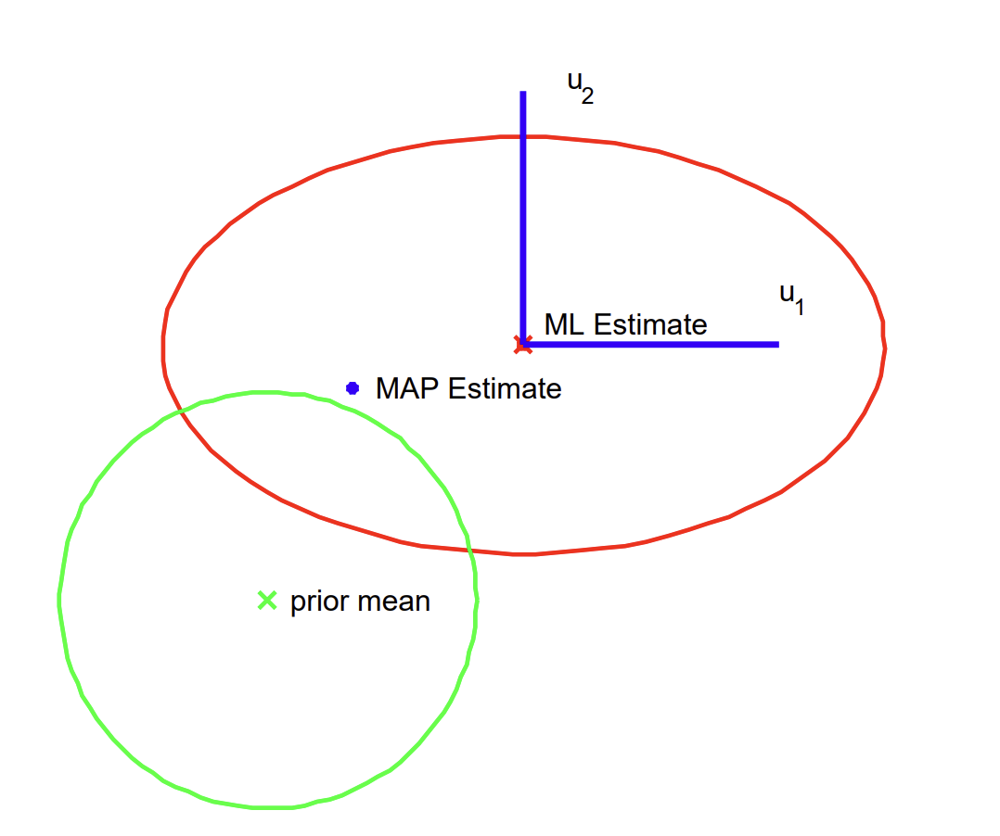
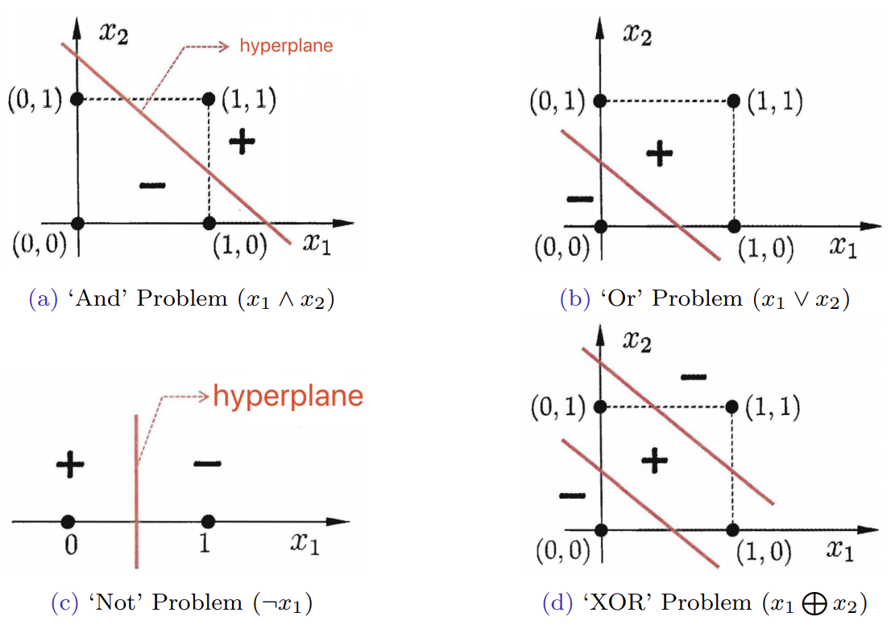
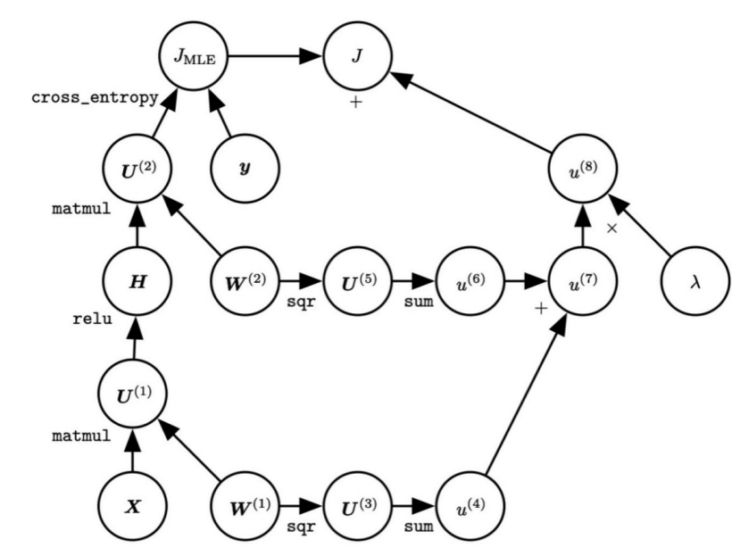
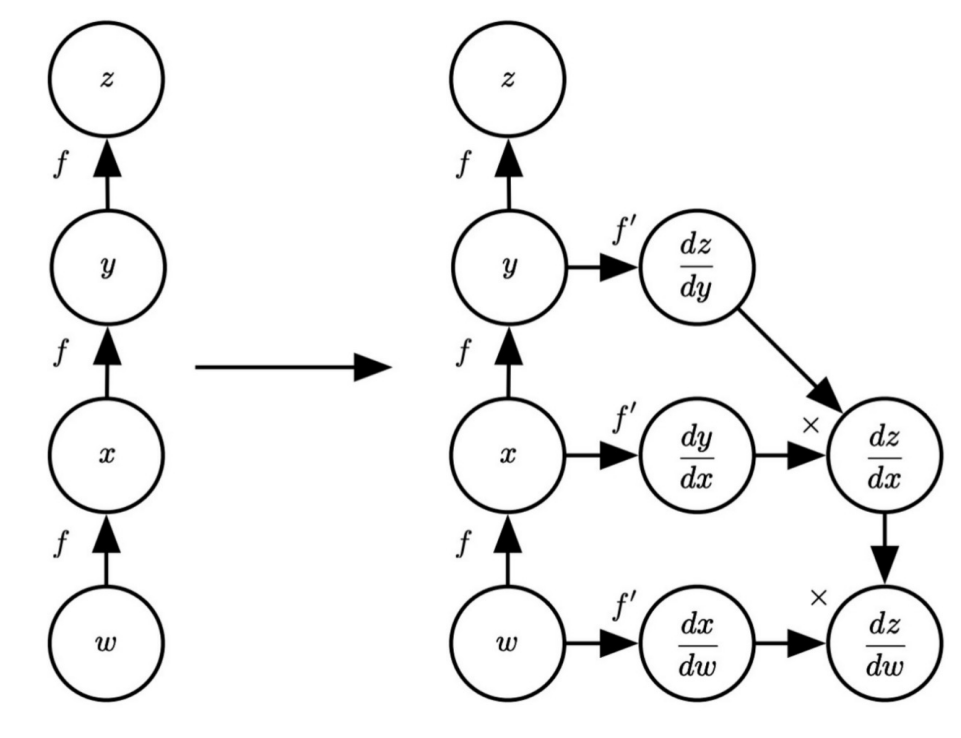

# 05: Linear Regression

## 1. Notations & Math Basics

### 1.1 Linear Functions and Affine Functions

*   **Linear Function**: Satisfies superposition (homogeneity + additivity).
    $$ f(\alpha x + \beta y) = \alpha f(x) + \beta f(y) $$
    The form is usually an inner product: $f(x) = a^\top x$.
*   **Affine Function**: A linear function plus a bias term (offset).
    $$
    f(x) = a^\top x + b
    $$
    *Note: In machine learning, we usually convert an affine function into a linear-function form by extending the feature vector (adding one dimension with value 1).*

### 1.2 Matrix Calculus

Common derivative formulas:
$$
df = (\nabla f)^\top dx, \quad \nabla f = \frac{df}{dx}
$$

$$
\nabla _{x}f=\left(\frac{\partial u}{\partial x}\right)\frac{\partial f}{\partial u}
$$

1. **Vector with respect to vector**: If $f(w) = X^\top w$ ($X$ is independent of $w$), then:
   $$
   \frac{d(X^\top w)}{dw} = X
   $$
2. **Scalar with respect to vector**: If $f(w) = y^\top X w$, then:
   $$
   \frac{d(y^\top X w)}{dw} = X^\top y
   $$
3. **Quadratic form with respect to vector**: If $f(w) = w^\top A w$ ($A$ is symmetric), then:
   $$
   \frac{d(w^\top X w)}{dw} = (X+X^\top)w
   $$

   *   Special derivation case: For $w^\top X^\top X w$ in linear regression, let $A = X^\top X$ (a symmetric matrix), so the derivative is $2X^\top X w$.

$$
\frac{\partial (\mathbf{a}^T \mathbf{X}^{-1} \mathbf{a})}{\partial \mathbf{X}} = -\mathbf{X}^{-1} \mathbf{a} \mathbf{a}^T \mathbf{X}^{-1}
$$

## 2. Linear Regression Modeling 

### 2.1 Deterministic Perspective

*   **Hypothesis**:
    $$
    f_w(x) = w_0 + w_1 x_1 + \dots + w_d x_d = w^\top x
    $$
    where $x = [1, x_1, \dots, x_d]^\top$ is the augmented feature vector.
*   **Loss Function**: Measures the prediction error of a single sample.
    $$
    L(f_w(x_i), y_i) = (f_w(x_i) - y_i)^2 \quad (\text{Squared Error Loss})
    $$
*   **Cost Function**: The average loss over all samples (empirical risk).
    $$
    J(w) = \frac{1}{m} \sum_{i=1}^m (w^\top x_i - y_i)^2
    $$

### 2.2 Probabilistic Perspective

Assume the relationship between input $x$ and output $y$ contains observation noise $\epsilon$:
$$
y = w^\top x + \epsilon, \quad \text{where } \epsilon \sim \mathcal{N}(0, \sigma^2)
$$
This means that given $x$ and $w$, $y$ follows a normal distribution:
$$
p(y|x, w) = \mathcal{N}(w^\top x, \sigma^2) = \frac{1}{\sqrt{2\pi}\sigma} \exp\left( -\frac{(y - w^\top x)^2}{2\sigma^2} \right)
$$

#### MLE Derivation

We need to find $w$ that maximizes the probability (likelihood) of observing the data.、

* The parameter $\mathbf{w}$ can be learned by **maximum log-likelihood estimation (MLE)**, given the training dataset $D = \{(\mathbf{x}_i, y_i)\}_{i=1}^m$, as follows

$$
\mathbf{w}_{MLE} = \arg \max_{\mathbf{w}} \log \mathcal{L}(\mathbf{w}; D), 
$$

$$
\begin{aligned} \log \mathcal{L}(\mathbf{w}; D) &= \log \left( \prod_{i=1}^m p(y_i | \mathbf{x}_i, \mathbf{w}) \right) = \sum_{i=1}^m \log \mathcal{N}(\mathbf{w}^\top \mathbf{x}_i, \sigma^2) \\ 
&= \sum_{i=1}^m \left[ -\log(\sigma(2\pi)^{\frac{1}{2}}) - \frac{1}{2\sigma^2} (y_i - \mathbf{w}^\top \mathbf{x}_i)^2 \right] \\
&= -m \log(\sigma(2\pi)^{\frac{1}{2}}) - \frac{1}{2\sigma^2} \sum_{i=1}^m (y_i - \mathbf{w}^\top \mathbf{x}_i)^2. \end{aligned}
$$

* Removing the constants w.r.t. $\mathbf{w}$,

$$
\mathbf{w}_{MLE} = \arg \min_{\mathbf{w}} \frac{1}{2} \sum_{i=1}^m (y_i - \mathbf{w}^\top \mathbf{x}_i)^2,
$$

1.  **Maximization**:
    Maximizing $\log L$ is equivalent to minimizing $\sum (y_i - w^\top x_i)^2$.
    **Conclusion**: Under the Gaussian noise assumption, maximum likelihood estimation (MLE) is equivalent to least squares (Least Squares).

## 3. Learning of Linear Regression 

Define the data matrix $X \in \mathbb{R}^{m \times (d+1)}$ and the target vector $y \in \mathbb{R}^m$.
$$
J(w) = \sum_{i=1}^m (x_i^\top w - y_i)^2 = \| Xw - y \|_2^2 = (Xw - y)^\top (Xw - y)
$$

### 3.1 Analytical Solution / Closed-form

**Detailed derivation**:

1. Expand the objective function:
   $$
   \begin{aligned}
   J(w) &= (w^\top X^\top - y^\top)(Xw - y) \\
   &= w^\top X^\top X w - w^\top X^\top y - y^\top X w + y^\top y
   \end{aligned}
   $$
   Note that $w^\top X^\top y$ is a scalar, so its transpose equals itself, i.e. $w^\top X^\top y = (w^\top X^\top y)^\top = y^\top X w$.
   $$
   J(w) = w^\top X^\top X w - 2y^\top X w + y^\top y
   $$
   
2. Differentiate with respect to $w$ and set it to 0:
   $$
   \begin{aligned}
   \nabla_w J(w) 
   &= \frac{\partial (w^\top X^\top X w)}{\partial w} - \frac{\partial (2y^\top X w)}{\partial w} \\
   &=	 2X^\top X w - 2X^\top y = 0
   \end{aligned}
   $$
   Solve the equation:
   $$
    X^\top X w = X^\top y 
   $$
   If $X^\top X$ is invertible, then:
   $$
   w^* = (X^\top X)^{-1} X^\top y
   $$
   

### 3.2 Gradient Descent

When the feature dimension $d$ is very large, computing $(X^\top X)^{-1}$ has complexity $O(d^3)$, which is too expensive, so an iterative method is used instead.

*   **Update rule**:
    $w \leftarrow w - \eta \nabla J(w)$
*   **Gradient**:
    $$
    \nabla J(w) = X^\top (Xw - y)
    $$
*   **Complexity comparison**:
    
    *   Analytical solution: $O(d^3 + md^2)$, suitable for small $d$.
    *   Gradient descent: $O(T \cdot md)$, suitable for large $d$ ($T$ is the number of iterations).

## 4. Extensions

### 4.1 Multiple-output Linear Regression (Multiple Outputs)

*   **Scenario**: Target $Y \in \mathbb{R}^{m \times h}$ (each sample has $h$ outputs).
*   **Parameters**: $W \in \mathbb{R}^{(d+1) \times h}$.
*   **Loss function**: Trace of the error matrix.
    $$
    J(W) = \text{trace}((XW - Y)^\top (XW - Y))
    $$
*   **Analytical solution**:
    $$
    W^* = (X^\top X)^{-1} X^\top Y
    $$

- **Prediction**: 
  $$
  Y_{pred} = X W^*
  $$
  

### 4.2 Linear Regression for Classification (Classification)

*   **Binary classification**: $y_i \in \{-1, +1\}$.
    *   Training: Treat it as a regression problem and solve for $w^*$.
    *   Prediction: 

$$
y_{pred} = \text{sgn}(x_{new}^\top w^*)
$$

*   **Multi-class classification**: $Y$ uses One-hot encoding.
    *   Training: Solve for $W^*$.
    *   Prediction: 

$$
y_{pred} = \arg\max_{k} (x_{new}^\top W^*)_k
$$

## 5. Variants of Linear Regression

### 5.1 Ridge Regression - $L_2$ Regularization

**Motivation**:

1.  Solve the problem that $X^\top X$ may be non-invertible (singular matrix), e.g. because of feature multicollinearity.
2.  Prevent overfitting (large parameter values make the model sensitive to small input changes).

**Objective function**:
$$
J(w) = (Xw - y)^\top (Xw - y) + \lambda \|w\|^2
$$
*(Note: Usually the bias $w_0$ is not regularized; let $I_d$ be an identity matrix whose first diagonal element is 0.)*

$\hat{I_d} \in \mathbb{R}^{(d+1) \times (d+1)}$ is defined by setting ${I_{d+1}}_{0,0} = 0$

**Analytical solution derivation**:

1.  Differentiate:
    $$
    \nabla_w J(w) = 2X^\top X w - 2X^\top y + 2\lambda \hat{I_d} w = 0
    $$
    
2.  Rearrange:
    $$
    (X^\top X + \lambda \hat{I_d}) w = X^\top y
    $$
3.  Result:
    $$
    w^* = (X^\top X + \lambda \hat{I_d})^{-1} X^\top y
    $$
    *Property: As long as $\lambda > 0$, $(X^\top X + \lambda I)$ is always invertible.*

**Probabilistic perspective (MAP)**:
Assume the parameter $w$ follows a zero-mean **Gaussian** prior: $p(w) \sim \mathcal{N}(0, \tau^2 I)$.
$$
\begin{aligned}
\mathbf{w}_{MAP} &= \arg \max_{\mathbf{w}} \left[ \sum_{i=1}^m \log p(y_i|\mathbf{x}_i, \mathbf{w}) + \log p(\mathbf{w}) \right] \\
&= \arg \max_{\mathbf{w}} \left[ \sum_{i=1}^m \log \mathcal{N}(\mathbf{x}_i^\top \mathbf{w}, \sigma^2) + \log \mathcal{N}(\mathbf{w}|\mathbf{0}, \tau^2\mathbf{I}) \right] \\
&\equiv \arg \min_{\mathbf{w}} \left[ \sum_{i=1}^m (\mathbf{x}_i^\top \mathbf{w} - y_i)^2 + \lambda\|\mathbf{w}\|_2^2 \right] \\
&= (\lambda I + X^\top X)^{-1} X^\top y \quad (\text{where } \lambda = \frac{\sigma^2}{\tau^2})
\end{aligned}
$$

### 5.2 Lasso Regression - $L_1$ Regularization

**Characteristics**: Produces sparse solutions (some $w_j$ become 0), so it can be used for feature selection.
**Probabilistic perspective**:
Assume the parameter $w$ follows a Laplacian prior (Laplacian Prior):
$$
p(w) = Lap(w|0, b) = \frac{1}{2\lambda} \exp\left(-\frac{\|w\|_1}{b}\right)
$$
**Objective function**:
$$
\begin{aligned}\mathbf{w}_{MAP}&=\arg \max _{\mathbf{w}}\left[\sum _{i=1}^{m}\log p(y_{i}|\mathbf{x}_{i},\mathbf{w})+\log p(\mathbf{w})\right]\\ &=\arg \max _{\mathbf{w}}\left[\sum _{i=1}^{m}\log \mathcal{N}(\mathbf{w}^{\top }\mathbf{x}_{i},\sigma ^{2})+\text{Lap}(\mathbf{w}|\mathbf{0},b)\right]\\ 

&= argmax _{\mathbf{w}}\left[-\frac{1}{2\sigma ^{2}}\sum _{i=1}^{m}(y_{i}-\mathbf{w}^{\top }\mathbf{x}_{i})^{2}-\frac{1}{b}\|\mathbf{w}\|_{1}\right]\\ &\equiv \arg \min _{\mathbf{w}}\left[\sum _{i=1}^{m}(y_{i}-\mathbf{w}^{\top }\mathbf{x}_{i})^{2}+\lambda \|\mathbf{w}\|_{1}\right] \quad (\text{where } \lambda = \frac{\sigma^2}{b})
\end{aligned}
$$

*Note: Since $|w|$ is not differentiable at 0, there is no closed-form solution. Usually, coordinate descent or a transformation into a linear programming problem is used.*

### 5.3 Polynomial Regression

**Core idea**: Linear models cannot handle nonlinear data (such as the XOR problem). Basis Expansion, a low-dimensional nonlinear problem is mapped into a high-dimensional linear space.

*   **Mapping**: 

$$
\phi(x) = [1, x_1, \dots, x_d, \dots, x_i x_j, \dots, x_i x_j x_k, \dots]^\top
$$

$$
w = [w_0, w_1, \dots, w_d, \dots, w_{ij}, \dots, w_{ijk}, \dots]^\top
$$

*   **Model**: 

$$
\begin{aligned}
f(x) &= w_0 + \sum_{i=1}^d w_ix_i + \sum_{i=1}^d \sum_{j=i}^d w_{ij} x_i x_j +\cdots\\
&= w^\top \phi(x) 
\end{aligned}
$$

* For $X = [x_1, \dots, x_m]$, the design matrix becomes $P(X) = [\phi(x_1)^\top; \dots; \phi(x_m)^\top] \in \mathbb{R}^{m \times |w|}$.

  > For Ridge regression,
  > $$
  > \hat{w} = (P^\top P + \lambda I)^{-1} P^\top y
  > $$
  >
  > $$
  > f_w(P(X_{new})) = P\hat{w}
  > $$

* **Essence**: It is still linear in the parameters $w$, so it still belongs to the linear regression family.

### 5.4 Robust Linear Regression

**Motivation**: Least squares ($L_2$ Loss) is very sensitive to outliers (Outliers), because squared errors amplify their influence.
**Methods**:

1. **$L_1$ Loss (Least Absolute Deviations)**:
   $$
   J(w) = \sum_{i=1}^{m} |x_i^\top w - y_i|
   $$
   Corresponds to noise following a Laplace distribution.
   $$
   \begin{aligned}
   W_{MLE} &= \arg \max_w log \mathcal{L}(w; D) \\
   &= \arg \max_w \sum_{i=1}^m \log p(y_i | x_i, w) \\
   &= \arg \max_w \sum_{i=1}^m \log \text{Lap}(y_i | x_i^\top w, b) \\
   &= \arg \max_w \sum_{i=1}^m \left[ -\log(2b) - \frac{|y_i - x_i^\top w|}{b} \right] \\
   &= \arg \min_w \frac{1}{b} \sum_{i=1}^m |y_i - x_i^\top w| \\
   \end{aligned}
   $$
   It’s non-differentiable, but it can be a linear program
   $$
   min _{w,t} \sum_{i=1}^{m} t_{i} \\	
   \text { s.t. } -t_{i} \leq y_{i}-x_{i}^{\top} w \leq t_{i}, \quad i=1, \ldots, m
   $$

**Solving $L_1$ regression**:
Since it is not differentiable, it can be transformed into **Iteratively Reweighted Least Squares, IRLS**:

Since
$$
|a| = min_{\mu > 0} \frac{1}{2} (\frac{a^2}{\mu} + \frac{1}{2} \mu)
$$
Then
$$
min_w min _{\mu_i > 0} \sum_{i=1}^m \frac{1}{2} \left( \frac{(x_i^\top w - y_i)^2}{\mu_i} + \mu_i \right)
$$

- Given $w$, the optimal $\mu_i$ is $\mu_i = |x_i^\top w - y_i|$.
- Given $\mu_i$, the optimal $w$ is the solution to:

$$
w^{(k+1)} = \arg\min_w \sum \frac{1}{2} \frac{(x_i^\top w - y_i)^2}{\mu_i}, \quad \text{where } \mu_i = |x_i^\top w^{(k)} - y_i|
$$

## 6. Summary: Correspondence between Priors and Regularization

| Likelihood distribution $p(y|x,w)$ | Prior distribution $p(w)$ | Regression method | Loss function + regularization term |
| :--------------------------------- | :------------------------ | :---------------- | :---------------------------------- |
| Gaussian                           | Uniform                   | Least Squares     | $L_2$ Loss                          |
| Gaussian                           | Gaussian                  | Ridge             | $L_2$ Loss + $L_2$ Reg              |
| Gaussian                           | Laplace                   | Lasso             | $L_2$ Loss + $L_1$ Reg              |
| Laplace                            | Uniform                   | Robust            | $L_1$ Loss                          |

# 06: Logistic Regression

## 1. Review

Before entering logistic regression, briefly review the key points of linear regression for comparison.

*   **Linear hypothesis**: $f_w(x) = w^\top x$ (including the bias term $w_0$ in the augmented vector).
*   **Optimization objective**: Minimize the residual sum of squares (RSS) or mean squared error (MSE).
    $$ J(w) = \frac{1}{2m} \sum_{i=1}^m (w^\top x_i - y_i)^2 $$
*   **Solution methods**:
    *   ==Closed-form: $w^* = (X^\top X)^{-1}X^\top y$==
    *   ==Gradient Descent: $w \leftarrow w - \eta X^\top(Xw - y)$==
*   **Probabilistic perspective**: Assume the noise follows a Gaussian distribution, $y = w^\top x + \epsilon, \epsilon \sim \mathcal{N}(0, \sigma^2)$. Then MLE is equivalent to least squares.

## 2. Classification and Representation

### 2.1 Why not use linear regression for classification?

For binary classification $y \in \{0, 1\}$:

1.  **Output range**: The output range of linear regression $f_w(x) = w^\top x$ is $(-\infty, +\infty)$, while what we need is a probability value in $[0, 1]$.
2.  **Sensitive to outliers**: Introducing a very large positive sample (outlier) can significantly change the regression line, shifting the decision boundary and misclassifying normal samples.
3.  **Property mismatch**: What we want is the “probability” of belonging to the positive class.

### 2.2 Hypothesis Representation

To restrict the output to $[0, 1]$, introduce the **Sigmoid function** (or Logistic function):
$$
 g(z) = \frac{1}{1 + e^{-z}} 
$$
**Logistic regression model**:
$$
f_w(x) = g(w^\top x) = \frac{1}{1 + e^{-w^\top x}}
$$
**Parameter explanation**:

*   $w$: Weight vector (including bias $w_0$).
*   $x$: Feature vector (augmented with $x_0=1$).

**Probabilistic interpretation**:
The model output is interpreted as the conditional probability that $y=1$ given input $x$:
$$
 f_w(x) = P(y=1 | x; w) 
$$
Since there are only two classes, $P(y=0 | x; w) = 1 - f_w(x)$.

### 2.3 Decision Boundary

*   When $f_w(x) \geq 0.5$, predict $y=1$. That is, $w^\top x \geq 0$.
*   When $f_w(x) < 0.5$, predict $y=0$. That is, $w^\top x < 0$.
*   **Decision boundary**: Defined by the equation $w^\top x = 0$.
    *   It can be linear (a linear decision boundary).
    *   If polynomial features are introduced (such as $x_1^2, x_1 x_2$), the decision boundary can be nonlinear (circle, ellipse, etc.).

## 3. Cost Function

### 3.1 Why not use mean squared error (MSE)?

If the Sigmoid function is directly substituted into the MSE formula:
$$
 J(w) = \frac{1}{2m} \sum_{i=1}^m (\frac{1}{1 + e^{-w^\top x_i}} - y_i)^2 
$$
Because of the nonlinearity of the Sigmoid function, $J(w)$ becomes **non-convex (Non-convex)** with respect to $w$. It has many local minima, which is unfavorable for gradient descent.

> Consider the loss for a single example where \(y=0\): \(L(z) = \frac{1}{2}(g(z) - 0)^2\), where \(z = \mathbf{w}^\top \mathbf{x}\) and \(g(z) = \frac{1}{1+e^{-z}}\).
>
> 1. **First Derivative:**
>    \(L'(z) = g(z) g'(z)\)
> 2. **Second Derivative:**
>    \(L''(z) = (g'(z))^2 + g(z)g''(z)\)
>    Using \(g'(z) = g(z)(1-g(z))\) and \(g''(z) = g'(z)(1-2g(z))\):
>    \(L''(z) = g'(z) [g(z)(1-g(z)) + g(z)(1-2g(z))] = g'(z) [2g(z) - 3g(z)^2]\)
> 3. **Finding Negative Regions:**
>    \(L''(z) < 0\) when \(2g(z) - 3g(z)^2 < 0 \implies g(z) > \frac{2}{3}\).
>
> Since the second derivative can be **negative** (e.g., when \(z\) is large), the Hessian is not PSD everywhere. Thus, the \(\ell _{2}\) loss for logistic regression is **non-convex**.

### 3.2 Cross-Entropy Loss

We use the cross-entropy loss function derived from maximum likelihood estimation. For a single sample $(x, y)$:
$$
\begin{aligned}
\text{cost}(f_w(x), y (x)) 
&= H (y, f_w(x)) \\ 
&= -y \log(f_w(x)) - (1-y) \log(1 - f_w(x)) \\
&= \begin{cases} -\log(f_w(x)) & \text{if } y=1 \\ -\log(1 - f_w(x)) & \text{if } y=0 \end{cases}
\end{aligned} 
$$

*   **ground-truth posterior: ** $y = P(y=1|x)$
*   **predicted posterior:** $f_w(x) = P(y=1|x; w)$
*   **Intuition**:
    *   If $y=1$, when the prediction $f_w(x) \to 1$, the loss $\to 0$; when $f_w(x) \to 0$, the loss $\to \infty$ (very large penalty).
    *   If $y=0$, when the prediction $f_w(x) \to 0$, the loss $\to 0$; when $f_w(x) \to 1$, the loss $\to \infty$.

> **Exercise: Which states are true?**
>
> - If \(f_{\mathbf{w}}(\mathbf{x}) = y\), then \(\text{cost}(y(\mathbf{x}), f_{\mathbf{w}}(\mathbf{x})) = 0\) for both \(y = 0\) and \(y = 1\)
> - If \(y = 0\), then \(\text{cost}(y(\mathbf{x}),f_{\mathbf{w}}(\mathbf{x}))\rightarrow \infty \) as \(f_{\mathbf{w}}(\mathbf{x})\rightarrow 1\)
> - If \(y = 0\), then \(\text{cost}(y(\mathbf{x}),f_{\mathbf{w}}(\mathbf{x}))\rightarrow \infty \) as \(f_{\mathbf{w}}(\mathbf{x})\rightarrow 0\)
> - Regardless whether \(y = 0\) or \(y = 1\), if \(f_{\mathbf{w}}(\mathbf{x}) = 0.5\), then \(\text{cost}(y(\mathbf{x}), f_{\mathbf{w}}(\mathbf{x})) > 0\)
>
> **Answer**: 1, 2, 4 

**Overall cost function**:
$$
J(w) = -\frac{1}{m} \sum_{i=1}^m \left[ y_i \log(f_w(x_i)) + (1 - y_i) \log(1 - f_w(x_i)) \right] 
$$
*This function is convex with respect to $w$ (Convex), ensuring that gradient descent can converge to the global optimum.*

## 4. Solving by GDM

For the average gradient over all $m$ samples:
$$
\frac{\partial J(w)}{\partial w} = \frac{1}{m} \sum_{i=1}^m (f_w(x_i) - y_i) x_i
$$
**Update formula**:
$$
 w := w - \eta \frac{1}{m} \sum_{i=1}^m (f_w(x_i) - y_i) x_i 
$$
where $\eta$ is the learning rate.
*Note: This has exactly the same form as the update rule for linear regression. The only difference is the definition of $f_w(x)$: linear regression uses $w^\top x$, while logistic regression uses Sigmoid.*

> Proof:
>
> We need to compute $\frac{\partial J(w)}{\partial w_j}$.
> For the loss of a single sample, 
> $$
> L = -y \log(a) - (1-y) \log(1-a)
> $$
> where $a = f_w(x) = g(z)$ and $z = w^\top x$.
>
> Using the chain rule: $\frac{\partial L}{\partial w_j} = \frac{\partial L}{\partial a} \cdot \frac{\partial a}{\partial z} \cdot \frac{\partial z}{\partial w_j}$
>
> 1. **First part** $\frac{\partial L}{\partial a}$:
>    $$
>    \begin{aligned}
>    \frac{\partial L}{\partial a} 
>    &= -\frac{y}{a} - \frac{1-y}{1-a} \cdot (-1) \\
>    &= \frac{a(1-y) - y(1-a)}{a(1-a)} \\
>    &= \frac{a-ay-y+ay}{a(1-a)} = \frac{a-y}{a(1-a)}
>    \end {aligned}
>    $$
>
> 2. **Second part** $\frac{\partial a}{\partial z}$ (Sigmoid derivative):
>    $$
>    \frac{\partial a}{\partial z} = a(1-a)
>    $$
>
> 3. **Third part** $\frac{\partial z}{\partial w_j}$:
>    $$
>    z = w_0 x_0 + \dots + w_j x_j + \dots \implies \frac{\partial z}{\partial w_j} = x_j
>    $$
>
> **Combine**:
> $$
> \frac{\partial L}{\partial w_j} = \left( \frac{a-y}{a(1-a)} \right) \cdot (a(1-a)) \cdot x_j = (a - y) x_j = (f_w(x) - y)x_j
> $$
>

## 5. Multi-class Classification

When $y \in \{1, \dots, C\}$.

### 5.1 One-vs-All / One-vs-Rest

*   **Method**: Train $C$ binary logistic regression models. For class $j$, set samples of that class as positive examples ($y=1$), and all other classes as negative examples ($y=0$).
*   **Model**: Obtain $f_{w^{(1)}}, \dots, f_{w^{(C)}}$.
*   **Prediction**: Choose the class with the largest probability.
    $$
    \hat{y} = \arg\max_{j} f_{w^{(j)}}(x)
    $$

### 5.2 Softmax Regression

Directly handles multi-class classification.

*   **Hypothesis function**:
    $$
    f_W^{(j)}(x) = P(y=j | x; W) = \frac{e^{w_j^\top x}}{\sum_{c=1}^C e^{w_c^\top x}}
    $$
    where $W = [w_1, \dots, w_C]$ is the parameter matrix.
*   **Cost function**:
    $$
     J(W) = -\frac{1}{m} \sum_{i=1}^m \sum_{j=1}^C I(y_i = j) \log \left( \frac{e^{w_j^\top x_i}}{\sum_{c=1}^C e^{w_c^\top x_i}} \right) 
    $$
    where $I(\cdot)$ is the indicator function; it is 1 when the condition is true and 0 otherwise.
*   **Gradient**:
    $$
    \begin{aligned}\nabla _{w_{j}}J(W)&=\nabla _{w_{j}}\left[-\frac{1}{m}\sum _{i=1}^{m}\sum _{k=1}^{C}I(y_{i}=k)\log \left(\frac{e^{w_{k}^{T}x_{i}}}{\sum _{c=1}^{C}e^{w_{c}^{T}x_{i}}}\right)\right]\\ &=-\frac{1}{m}\sum _{i=1}^{m}\nabla _{w_{j}}\left[\sum _{k=1}^{C}I(y_{i}=k)(w_{k}^{T}x_{i})-\log \left(\sum _{c=1}^{C}e^{w_{c}^{T}x_{i}}\right)\right]\\ &=-\frac{1}{m}\sum _{i=1}^{m}\left[\nabla _{w_{j}}\left(\sum _{k=1}^{C}I(y_{i}=k)w_{k}^{T}x_{i}\right)-\nabla _{w_{j}}\left(\log \sum _{c=1}^{C}e^{w_{c}^{T}x_{i}}\right)\right]\\ &=-\frac{1}{m}\sum _{i=1}^{m}\left[I(y_{i}=j)x_{i}-\frac{1}{\sum _{c=1}^{C}e^{w_{c}^{T}x_{i}}}\cdot e^{w_{j}^{T}x_{i}}x_{i}\right]\\ &=-\frac{1}{m}\sum _{i=1}^{m}\left[I(y_{i}=j)-P(y=j|x_{i};W)\right]x_{i}\\ &=\frac{1}{m}\sum _{i=1}^{m}\left[P(y=j|x_{i};W)-I(y_{i}=j)\right]x_{i}\end{aligned}
    $$

## 6. Regularized Logistic Regression

To prevent overfitting (Overfitting), add a regularization term to the cost function.

### 6.1 Cost Function ($L_2$ Regularization)

$$
\begin{aligned}
J_{reg}(w) 
&= J(w) + \frac{\lambda}{2m} \sum_{j=1}^d w_j^2 \\
&= -\frac{1}{m} \sum_{i=1}^m \left[ y_i \log(f_w(x_i)) + (1 - y_i) \log(1 - f_w(x_i)) \right] + \frac{\lambda}{2m} \sum_{j=1}^d w_j^2
\end{aligned}
$$

*   **Note**: Usually the bias term $w_0$ is not regularized, so the summation starts from $j=1$.
*   $\lambda$: Regularization parameter. Larger $\lambda$ means heavier penalty and a simpler model (risk of underfitting); smaller $\lambda$ means a more complex model (risk of overfitting).

### 6.2 Gradient Descent Update

* For $w_0$ (not regularized):
  $$
  \begin {aligned}
  w_0 &← w_0 -  \frac{\eta}{m} \sum_{i=1}^m (f_w(x_i) - y_i) x_{i, 0}, \text{ where } x_{i}(0) = 1, \forall i \\
  w_j &← w_j -  \frac{\eta}{m} \left[  \sum_{i=1}^m (f_w(x_i) - y_i) x_{i, j} + \lambda w_j \right], \text{ for } j = 1, \dots, d
  \end{aligned}
  $$
  
* For $w_j$ ($j = 1, \dots, d$):
  $$
  \begin{aligned}
  w_j &:= w_j - \eta \left[ \frac{1}{m} \sum_{i=1}^m (f_w(x_i) - y_i) x_{i,j} + \frac{\lambda}{m} w_j \right] \\
  &:= w_j (1 - \eta \frac{\lambda}{m}) - \eta \frac{1}{m} \sum_{i=1}^m (f_w(x_i) - y_i) x_{i,j}
  \end{aligned}
  $$
  *(The factor $1 - \eta \frac{\lambda}{m}$ is usually smaller than 1, reflecting the effect of weight decay.)*

> Proof:
> $$
> \begin{aligned}\frac{\partial J(w)}{\partial w_{0}}&=\frac{\partial }{\partial w_{0}}\left[\frac{1}{2m}\sum _{i=1}^{m}(f_{w}(x_{i})-y_{i})^{2}\right]\\ &=\frac{1}{2m}\sum _{i=1}^{m}2(f_{w}(x_{i})-y_{i})\cdot \frac{\partial f_{w}(x_{i})}{\partial w_{0}}\\ &=\frac{1}{m}\sum _{i=1}^{m}(f_{w}(x_{i})-y_{i})\cdot 1\quad (\text{因为\ }x_{i,0}=1)\end{aligned}
> $$
>
> $$
> \begin{aligned}\frac{\partial J(w)}{\partial w_{j}}&=\frac{\partial }{\partial w_{j}}\left[\frac{1}{2m}\sum _{i=1}^{m}(f_{w}(x_{i})-y_{i})^{2}+\frac{\lambda }{2m}\sum _{j=1}^{d}w_{j}^{2}\right]\\ &=\frac{1}{m}\sum _{i=1}^{m}(f_{w}(x_{i})-y_{i})\cdot \frac{\partial f_{w}(x_{i})}{\partial w_{j}}+\frac{\lambda }{m}w_{j}\\ &=\frac{1}{m}\sum _{i=1}^{m}(f_{w}(x_{i})-y_{i})x_{i,j}+\frac{\lambda }{m}w_{j}\\ &=\frac{1}{m}\left[\sum _{i=1}^{m}(f_{w}(x_{i})-y_{i})x_{i,j}+\lambda w_{j}\right]\end{aligned}
> $$

## 7. Probabilistic Perspective

Logistic regression can be derived from a probabilistic modeling perspective.

### 7.1 Assumption

Assume $y$ follows a **Bernoulli Distribution**:
$$
\mu = f_w(x) = \text{Sigmoid}(w^\top x) \\
y | x; w \sim \text{Bernoulli}(\mu)
$$
The probability mass function is:
$$
P(y | x; w) = \mu^y (1-\mu)^{1-y}
$$

### 7.2 Maximum Likelihood Estimation (MLE)

The likelihood function $L(w)$ is the product of the probabilities of all samples:
$$
L(w) = \prod_{i=1}^m P(y_i | x_i; w) = \prod_{i=1}^m (f_w(x_i))^{y_i} (1 - f_w(x_i))^{1-y_i}
$$
Log-Likelihood:
$$
\log L(w) = \sum_{i=1}^m [ y_i \log(f_w(x_i)) + (1-y_i) \log(1 - f_w(x_i)) ]
$$
Maximizing the log-likelihood $\max_w \log L(w)$ is equivalent to minimizing the negative log-likelihood, i.e. minimizing the cross-entropy cost function $J(w)$.
$$
\max_w L(w) \iff \min_w J(w)
$$

### 7.3 Regularization and Priors (Priors)

*   **$L_2$ regularization**: Corresponds to maximum a posteriori estimation (MAP) under the assumption that the parameter $w$ follows a **Gaussian Prior** $w \sim \mathcal{N}(0, \tau^2 I)$.

$$
\max_w \mathcal L (w) + \log \mathcal N(w|0, \tau^2 I) \equiv min_w J(w) + \frac{\lambda}{2m} \sum_{j=1}^d w_j^2
$$

*   **$L_1$ regularization**: Corresponds to MAP under the assumption that the parameter $w$ follows a **Laplace Prior** $w \sim \text{Laplace}(0, b)$.

$$
\max_w \mathcal L (w) + \log \text{Laplace}(w|0, b) \equiv min_w J(w) + \lambda \sum_{j=1}^d |w_j|
$$

## 8. Summary: Linear Regression vs Logistic Regression

| Property                | Linear Regression (Linear Regression)         | Logistic Regression (Logistic Regression)                    |
| :---------------------- | :-------------------------------------------- | :----------------------------------------------------------- |
| **Task**                | Regression (predict continuous values)        | Classification (predict discrete values/probabilities)       |
| **Hypothesis function** | $f_w(x) = w^\top x$                           | $f_w(x) = \frac{1}{1+e^{-w^\top x}}$                         |
| **Output range**        | $(-\infty, +\infty)$                          | $[0, 1]$                                                     |
| **Cost function**       | Mean squared error (MSE)                      | Cross-Entropy (Cross-Entropy)                                |
| $J(w)$                  | $\frac{1}{2m}\sum_{i=1}^m (f_w(x_i) - y_i)^2$ | $-\frac{1}{m} \sum_{i=1}^m [y_i \log(f_w(x_i)) + (1-y_i) \log(1 - f_w(x_i))]$ |
| **Convexity**           | Always convex                                 | Convex under cross-entropy (non-convex under MSE)            |
| **Solution method**     | Analytical solution or gradient descent       | Gradient descent (no closed-form solution)                   |
| **Probabilistic model** | Gaussian distribution $y\|x\sim \mathcal{N}$  | Bernoulli distribution $y\|x \sim \text{Bernoulli}$          |

# 07: Support Vector Machine

## 1. Motivation

### 1.1 Review of the Classification Problem

Given a training dataset $D = \{(x_i, y_i)\}_{i=1}^m$, where $x_i \in \mathbb{R}^n$ and $y_i \in \{-1, +1\}$.
The hypothesis function is a sign function:
$$
y = \text{Sgn}(f_w(x)) = \text{Sgn}(w^\top x + b)
$$
Requirements:

*   If $y_i = +1$, then $w^\top x_i + b > 0$
*   If $y_i = -1$, then $w^\top x_i + b < 0$

### 1.2 Why do we need SVM?

For linearly separable data, infinitely many hyperplanes can perfectly separate positive and negative samples.

*   **Logistic Regression**: The loss function is convex but not strictly convex (unless regularization is used), so it may converge to any solution that separates the data, depending on initialization and stopping time.
*   **Intuition**: We want the decision boundary to be as far away as possible from both classes of data points (i.e. in the “middle”), which gives stronger generalization ability.

**Core idea**: **Maximize the margin (Large Margin)**. That is, find a hyperplane such that the distance from the closest positive and negative samples to the hyperplane is maximized.

## 2. Derivation I: Large Margin - Geometric Perspective

### 2.1 Geometric Basics

**Lemma 1**: The vector $w$ is orthogonal to the hyperplane $f_{w,b}(x) = w^\top x + b = 0$.
*Proof*:

1. Take any two points $x_1, x_2$ on the hyperplane.
2. They satisfy $w^\top x_1 + b = 0$ and $w^\top x_2 + b = 0$.
3. Subtracting the two equations gives $w^\top (x_1 - x_2) = 0$.
4. $x_1 - x_2$ is a vector lying in the hyperplane, so $w$ is orthogonal to the hyperplane.

**Derivation 1**: The distance $r$ from any point $x$ to the hyperplane $w^\top x + b = 0$.

1. Let $x_p$ be the projection of $x$ onto the hyperplane.
2. $x$ can be written as $x_p$ plus a distance along the normal vector $w$:
   $$
    x = x_p + r \frac{w}{\|w\|} 
   $$
   where $|r|$ is the distance, and $\frac{w}{\|w\|}$ is the unit normal vector.
3. Left-multiply both sides by $w^\top$ and add $b$:
   
   $$
   w^\top x + b = w^\top (x_p + r \frac{w}{\|w\|}) + b
   $$
   
   $$
   w^\top x + b = (w^\top x_p + b) + r \frac{w^\top w}{\|w\|}
   $$
4. Since $x_p$ lies on the hyperplane, $w^\top x_p + b = 0$. Also, $w^\top w = \|w\|^2$.
   $$
   w^\top x + b = r \frac{\|w\|^2}{\|w\|} = r \|w\|
   $$
5. Solving for the distance (taking absolute value):
   $$
   \text{distance} = |r| = \frac{f_{w,b}(x)}{\|w\|}
   $$

### 2.2 Definition of Margin (Margin)

For all training samples, we only consider hyperplanes that classify correctly, i.e. $y_i(w^\top x_i + b) > 0$.
The **geometric margin** $\gamma$ from the sample set to the hyperplane is defined as the minimum distance among all sample points:
$$
\gamma = \min_i \frac{y_i(w^\top x_i + b)}{\|w\|}
$$

### 2.3 Constructing the Optimization Objective

Our goal is to maximize this minimum margin:
$$
\max_{w,b} \left( \min_i \frac{y_i(w^\top x_i + b)}{\|w\|} \right)
$$
**Scaling invariance (Scaling Constraint)**:
The hyperplane $w^\top x + b = 0$ and $c w^\top x + c b = 0$ are the same plane. We can scale $(w, b)$ to fix the numerator.
Let the **functional margin** of the points closest to the hyperplane be 1, i.e.:
$$
\min_i y_i(w^\top x_i + b) = 1
$$
This means that for all $i$, $y_i(w^\top x_i + b) \geq 1$, and equality holds for at least one point.

The optimization problem becomes:
$$
\max_{w,b} \frac{1}{\|w\|} \quad \text{s.t.} \quad y_i(w^\top x_i + b) \geq 1, \forall i
$$
This is equivalent to minimizing $\|w\|^2$ (for easier differentiation, usually written as $\frac{1}{2}\|w\|^2$):

$$
\begin{aligned}
\min_{w,b} \quad & \frac{1}{2} \|w\|^2 \\
\text{s.t.} \quad & y_i(w^\top x_i + b) \geq 1, \quad i = 1, \dots, m
\end{aligned}
$$
This is the primal optimization problem of **Hard Margin SVM**.

## 3. Derivation II: Hinge Loss Perspective

### 3.1 Logistic Regression vs SVM Loss Functions

*   **Logistic regression**: Uses log loss (Log Loss).
    $$
    f_{\mathbf{w},b}(\mathbf{x})=\frac{1}{1+\exp (-\mathbf{w}^{\top }\mathbf{x}-b)}=g(z)
    $$
    
    $$
    \begin{aligned}
    J(w)
    &= -\delta _{y=1}\log (f_{\mathbf{w},b}(\mathbf{x}))-\delta _{y=-1}\log (1-f_{\mathbf{w},b}(\mathbf{x})) \\
    
    &= \sum \log(1 + e^{-y_i(w^\top x_i + b)}) \\
    \end{aligned}
    $$

*   Regularized Logistic Regression:
    $$
    J(\mathbf{w},b)=\frac{1}{m}\sum _{i=1}^{m}\left[\delta _{y_{i}=1}(-\log (f_{\mathbf{w},b}(\mathbf{x}_{i})))+\delta _{y_{i}=-1}(-\log (1-f_{\mathbf{w},b}(\mathbf{x}_{i})))\right]+\frac{\lambda }{2m}\sum _{j=1}^{n}w_{j}^{2}
    $$

*   **SVM**: Uses **Hinge Loss**.
    $$
    \begin{aligned}
    J(\mathbf{w},b)
    &=\frac{1}{m}\sum _{i}^m[\delta _{y_{i}=1}\text{cost}_{1}(\mathbf{w}^{\top }\mathbf{x}_{i}+b)+\delta _{y_{i}=-1}\text{cost}_{-1}(\mathbf{w}^{\top }\mathbf{x}_{i}+b)]+\frac{\lambda }{2m}\sum _{j=1}^{n}w_{j}^{2} \\
    
    &\equiv C\sum _{i}^m[\delta _{y_{i}=1}\text{cost}_{1}(\mathbf{w}^{\top }\mathbf{x}_{i}+b)+\delta _{y_{i}=-1}\text{cost}_{-1}(\mathbf{w}^{\top }\mathbf{x}_{i}+b)]+\frac{1}{2}\sum _{j=1}^{n}w_{j}^{2}, \\
    
    &\text{where\ }C
    = \frac{1}{\lambda }. 
    \end{aligned}
    $$

    $$
    \text{Loss}(z) = \max(0, 1 - z), \quad \text{where } z = y_i(w^\top x_i + b)
    $$

    *   If $y_i(w^\top x_i + b) \geq 1$ (correct classification with enough margin), the loss is 0.
    *   If $y_i(w^\top x_i + b) < 1$, the loss increases linearly with the distance.
    *   non-smooth →

    $$
    \begin{aligned}
    \min _{\mathbf{w},b}&\frac{1}{2}\sum _{j=1}^{n}w_{j}^{2}
    \\
    \text{s.t.\ }&\mathbf{w}^{\top }\mathbf{x}_{i}+b\ge 1,\text{   if\ }y_{i}
    = 1;\\ 
    &\mathbf{w}^{\top }\mathbf{x}_{i}+b\le -1,\text{if\ }y_{i} = -1. \\
    \end{aligned}
    $$

    - Since $p_i=\frac{\mathbf{w}^{\top }\mathbf{x}_{i}+b}{\|\mathbf{w}\|}$, we have $\mathbf{w}^{\top }\mathbf{x}_{i}+b = p_i \|\mathbf{w}\|$, so

    $$
    \begin{aligned}
    &\min  _{\mathbf{w},b}\frac{1}{2}\sum _{j=1}^{n}w_{j}^{2} \\
    &\text{s.t.\ }y_i  p_i \|\mathbf{w}\| \ge 1, \forall i
    \end{aligned}
    $$

    - Thus, we prefer **large margin**.

## 4. Lagrange Duality & KKT 

To solve the constrained optimization problem above, we use the Lagrange multiplier method.

### 4.1 General Form

Primal problem (Primal):
$$
\min_x f(x) \quad \text{s.t.} \quad h_i(x) \leq 0, \ l_j(x) = 0
$$
Lagrangian function:
$$
L(x, u, v) = f(x) + \sum u_i h_i(x) + \sum v_j l_j(x)
$$
Dual function:
$$
g(u, v) = \min_x L(x, u, v)
$$
Dual problem (Dual):
$$
\max_{u, v} g(u, v) \quad \text{s.t.} \quad u \geq 0
$$

### 4.2 KKT Conditions (Karush-Kuhn-Tucker Conditions)

For a convex optimization problem, the optimum must satisfy the KKT conditions:

1. **Stationarity**:
   $$
   \nabla_x L = 0
   $$
2. **Complementary Slackness**:
   $$
   u_i h_i(x) = 0
   $$
3. **Primal Feasibility**:
   $$
   h_i(x) \leq 0, l_j(x) = 0
   $$
4. **Dual Feasibility**:
   $$
   u_i \geq 0
   $$

## 5. Hard Margin SVM

### 5.1 Constructing the Lagrangian

Primal problem:
$$
\min_{w,b} \frac{1}{2}\|w\|^2 \quad \text{s.t.} \quad 1 - y_i(w^\top x_i + b) \leq 0, \quad \forall i
$$
Introduce Lagrange multipliers $\alpha_i \geq 0$:
$$
L(w, b, \alpha) = \frac{1}{2}\|w\|^2 + \sum_{i=1}^m \alpha_i \left( 1 - y_i(w^\top x_i + b) \right)
$$

### 5.2 Solving the Dual Problem

**Step 1: Minimize $L(w, b, \alpha)$ with respect to $w, b$ (differentiate and set to 0)**

1.  With respect to $w$:
    $$
    \frac{\partial L}{\partial w} = w - \sum_{i=1}^m \alpha_i y_i x_i = 0 \implies w = \sum_{i=1}^m \alpha_i y_i x_i
    $$
2.  With respect to $b$:
    $$
    \frac{\partial L}{\partial b} = -\sum_{i=1}^m \alpha_i y_i = 0 \implies \sum_{i=1}^m \alpha_i y_i = 0
    $$

**Step 2: Substitute $w$ and the constraint back into $L$ to obtain $g(\alpha)$**
$$
\begin{aligned}
L(w, b, \alpha) &= \frac{1}{2} (\sum_i \alpha_i y_i x_i)^\top (\sum_j \alpha_j y_j x_j) + \sum_i \alpha_i - \sum_i \alpha_i y_i (w^\top x_i + b) \\
&= \frac{1}{2} \sum_{i,j} \alpha_i \alpha_j y_i y_j x_i^\top x_j + \sum_i \alpha_i - \sum_i \alpha_i y_i w^\top x_i - b \underbrace{\sum_i \alpha_i y_i}_{0} \\
&= \frac{1}{2} \sum_{i,j} \alpha_i \alpha_j y_i y_j x_i^\top x_j + \sum_i \alpha_i - \sum_i \alpha_i y_i (\sum_j \alpha_j y_j x_j)^\top x_i \\
&= \frac{1}{2} \sum_{i,j} \alpha_i \alpha_j y_i y_j x_i^\top x_j + \sum_i \alpha_i - \sum_{i,j} \alpha_i \alpha_j y_i y_j x_i^\top x_j \\
&= \sum_{i=1}^m \alpha_i - \frac{1}{2} \sum_{i=1}^m \sum_{j=1}^m \alpha_i \alpha_j y_i y_j x_i^\top x_j
\end{aligned}
$$

**Step 3: Maximize the dual function (SVM dual problem)**
$$
\begin{aligned}
\max_\alpha \quad & \sum_{i=1}^m \alpha_i - \frac{1}{2} \sum_{i=1}^m \sum_{j=1}^m \alpha_i \alpha_j y_i y_j (x_i^\top x_j) \\
\text{s.t.} \quad & \alpha_i \geq 0, \quad \forall i \\
& \sum_{i=1}^m \alpha_i y_i = 0
\end{aligned}
$$

### 5.3 Interpretation of the Solution and Support Vectors

*   **Support Vectors**: By the complementary slackness condition,
    $$
    \alpha_i (1 - y_i(w^\top x_i + b)) = 0
    $$

    *   If $\alpha_i > 0$, then we must have $1 - y_i(w^\top x_i + b) = 0$, i.e. $y_i(w^\top x_i + b) = 1$. These points lie on the margin boundary and are called support vectors.
    *   If $1 - y_i(w^\top x_i + b) < 0$ (the point is outside the margin and correctly classified), then we must have $\alpha_i = 0$. These points do not affect the model construction.
*   Support set $S = \{i | \alpha_i > 0\}$.

*   **Compute $w$**:
    $$
    w^* = \sum_{i \in S} \alpha_i y_i x_i
    $$
*   **Compute $b$**: For any support vector $x_j$ ($j \in S$), we have $y_j(w^\top x_j + b) = 1$. Multiply both sides by $y_j$ using $y_j^2=1$:
    $$
    w^\top x_j + b = y_j \implies b = y_j - w^\top x_j
    $$
    For numerical stability, usually take the average of $b$ computed from all support vectors:
    $$
    b^* = \frac{1}{|S|} \sum_{j \in S} (y_j - \sum_{i \in S} \alpha_i y_i x_i^\top x_j)
    $$

- **Prediction:**

  Given the optimized parameters $\{\boldsymbol{\alpha}, \mathbf{w}, b\}$, given a new data $x$, its prediction is

$$
\mathbf{w}^{\top }\mathbf{x}+b=\sum _{i}^{m}\alpha _{i}y_{i}\mathbf{x}_{i}^{\top }\mathbf{x}+\frac{1}{|\mathcal{S}|}\sum _{j\in \mathcal{S}}\left(y_{j}-\sum _{i}^{m}\alpha _{i}y_{i}\mathbf{x}_{i}^{\top }\mathbf{x}_{j}\right)\quad
$$

- If $\mathbf{w}^{\top} \mathbf{x}+b>0$, then the predicted class of $\mathbf{x}$ is $+1$, otherwise$-1$

- If and only if $y\left(\mathbf{w}^{\top }\mathbf{x}+b\right)>0$, then your prediction is correct

## 6. Soft-margin SVM (SVM with Slack Variables)

When the data is not linearly separable, introduce slack variables $\xi_i$ to allow a small number of errors.

### 6.1 Primal Problem

$$
\begin{aligned}
\min_{w,b,\xi} \quad & \frac{1}{2} \|w\|^2 + C \sum_{i=1}^m \xi_i \\
\text{s.t.} \quad & y_i(w^\top x_i + b) \geq 1 - \xi_i, \quad \forall i \\
& \xi_i \geq 0, \quad \forall i
\end{aligned}
$$

*   $C$: Penalty coefficient. Larger $C$ gives heavier penalty for errors (closer to hard margin); smaller $C$ gives higher tolerance.

### 6.2 Lagrangian Function

Introduce multipliers $\alpha_i \geq 0$ (for classification constraints) and $\mu_i \geq 0$ (for $\xi_i \geq 0$):
$$
L(w, b, \xi, \alpha, \mu) = \frac{1}{2}\|w\|^2 + C\sum \xi_i + \sum \alpha_i(1 - \xi_i - y_i(w^\top x_i + b)) - \sum \mu_i \xi_i
$$

### 6.3 KKT Derivation and Dual Problem

Stationarity:

1.  $\frac{\partial L}{\partial w} = 0 \implies w = \sum \alpha_i y_i x_i$
2.  $\frac{\partial L}{\partial b} = 0 \implies \sum \alpha_i y_i = 0$
3.  $\frac{\partial L}{\partial \xi_i} = C - \alpha_i - \mu_i = 0 \implies \alpha_i = C - \mu_i$

- **Feasibility:**
  $$
  \alpha _{i}\ge 0,\quad 1-\xi _{i}-y_{i}(\mathbf{w}^{\top }\mathbf{x}_{i}+b)\le 0,\quad \xi _{i}\ge 0,\quad \mu _{i}\ge 0,\quad \forall i
  $$
- **Complementary slackness:**
  $$
  \alpha _{i}(1-\xi _{i}-y_{i}(\mathbf{w}^{\top }\mathbf{x}_{i}+b))=0,\quad \mu _{i}\xi _{i}=0,\quad \forall i
  $$

**Soft-margin dual problem**:
The form is exactly the same as hard-margin SVM; only the constraints change.
$$
\begin{aligned}
\mathcal{L}(\mathbfit{\alpha },\mathbfit{\mu })
&= \frac{1}{2}\|\mathbf{w}\|{}^{2}+\sum _{i}^{m}[\alpha _{i}(1-y_{i}(\mathbf{w}^{\top }\mathbf{x}_{i}+b))]+\sum _{i}^{m}(C-\alpha _{i}-\mu _{i})\xi _{i} \\
&=\sum _{i}^{m}\alpha _{i}-\frac{1}{2}\sum _{i,j}\alpha _{i}\alpha _{j}y_{i}y_{j}\mathbf{x}_{i}^{\top }\mathbf{x}_{j}
\end{aligned}
$$

$$
\begin{aligned}
\max_\alpha \quad & \sum_{i=1}^m \alpha_i - \frac{1}{2} \sum_{i=1}^m \sum_{j=1}^m \alpha_i \alpha_j y_i y_j (x_i^\top x_j) \\
\text{s.t.} \quad & 0 \leq \alpha_i \leq C, \quad \forall i \\
& \sum_{i=1}^m \alpha_i y_i = 0
\end{aligned}
$$

### 6.4 Physical Meaning of $\alpha_i$

*   $\alpha_i = 0$: The sample is correctly classified and outside the margin ($\xi_i=0$).
*   $0 < \alpha_i < C$: The sample lies on the margin boundary ($\xi_i=0$), and is a support vector.
*   $\alpha_i = C$: The sample lies inside the margin ($\xi_i > 0$), and may be misclassified or correctly classified but inside the margin.

## 7. Kernel SVM (SVM with Kernels)

### 7.1 Idea

For **nonlinearly separable** data, map it to a high-dimensional feature space $\phi(x)$ so that it becomes linearly separable in the high-dimensional space.

Predict $y=1$ if 
$$
\begin{aligned}
f_{\mathbf{w},b}(\mathbf{x})
&= [b;\mathbf{w}]^{\top }[1;x_1;x_2;x_1x_2;x_1^2;x_2^2;\dots ] \\
&= \mathbf{w}^{\top }\phi (\mathbf{x})+b \geq 0
\end{aligned}
$$

### 7.2 Kernel Trick

Observe that in the dual problem, data appears only in the form of inner products $x_i^\top x_j$.
Define the kernel function 

$$
k(x_i, x_j) = \phi(x_i)^\top \phi(x_j)
$$

We do not need to compute $\phi(x)$ explicitly; we only need to compute the kernel function.

**Kernelized dual problem**:
$$
\max_\alpha \sum \alpha_i - \frac{1}{2} \sum_{i,j} \alpha_i \alpha_j y_i y_j k(x_i, x_j)\\
\text{s.t. }  \sum_{i=1}^m \alpha_i y_i = 0 \text{, } \alpha_i \geq 0, \forall i
$$
Then
$$
b = \frac{1}{|\mathcal{S}|} \sum_{j \in S} \left( y_j - \sum_{i=1}^m \alpha_i y_i k(x_i, x_j) \right)
$$
**Kernelized prediction**:
$$
w^\top \phi(x) + b = \sum_{i=1}^m \alpha_i y_i k(x_i, x) + b
$$

- Since $\alpha$ is sparse, it’s also called **Sparse Kernel SVM**.

### 7.3 Common Kernel Functions

1.  **Polynomial Kernel**:
    $$
    k(x_i, x_j) = (x_i^\top x_j + 1)^d
    $$
2.  **Gaussian Kernel / Radial Basis Function Kernel (RBF Kernel)**:
    $$
    k(x_i, x_j) = \exp\left( -\frac{\|x_i - x_j\|^2}{2\sigma^2} \right) = \exp(-\gamma \|x_i - x_j\|^2)
    $$
    
    *   This is the most commonly used kernel and corresponds to an infinite-dimensional feature space.
3.  **Sigmoid kernel**:
    $$
    \begin{aligned}
    k(x_i, x_j)
    &= \tanh(\kappa x_i^\top x_j + \theta) \\
    &= \frac1{1 + \exp^(-\frac{x_i^\top x_j +b }{\sigma^2})} 
    \end{aligned}
    $$

## 8. Other Key Points

### 8.1 Multi-class SVM

* **One-vs-Rest (One-vs-All)**: Train $K$ binary classifiers. The $k$-th classifier treats class $k$ as positive and all other classes as negative. During prediction, choose the class with the largest $w^{(k)\top}x + b^{(k)}$.

  *    Train $K$ SVMs, one to distinguish $y = k$ from the rest, for $k = 1, 2, \dots, K$), get $(\mathbf{w}^{(1)}, b^{(1)}), \dots, (\mathbf{w}^{(K)}, b^{(K)})$

  *   Predict the label of $\mathbf{x}$ as
    $$
    \arg \max _{k\in \{1,2,\dots ,K\}}(\mathbf{w}^{(k)})^{\top }\mathbf{x}+b^{(k)}
    $$

* **One-vs-One**: Train $K(K-1)/2$ classifiers and use pairwise voting.

### 8.2 SVM vs Logistic Regression

| Property                 | SVM                                                          | LR                                                           |
| :----------------------- | :----------------------------------------------------------- | :----------------------------------------------------------- |
| **Loss function**        | Hinge Loss (ignores correctly classified samples far from the boundary)   $$\text{loss}(f(\mathbf{x}_{i}),y_{i})=(1-(\mathbf{w}^{\top }\mathbf{x}_{i}+b)y_{i})_{+}$$ | Log Loss (all samples contribute to the loss)   $$\text{loss}(f(\mathbf{x}_{i}),y_{i})=\log (1+e^{-(\mathbf{w}^{\top }\mathbf{x}_{i}+b)y_{i}})$$ |
| **Probability output**   | No direct probability (requires Platt Scaling)               | Has direct probability output                                |
| **Kernel function**      | Easy to combine with kernels (efficient dual form)           | Harder to combine with kernels (large computation)           |
| **Applicable scenarios** | Large $n$ (features), small $m$ (samples)→ linearly separable; Small $n$, large $m$ (requires manual feature engineering)  or nonlinear problems (Kernel) |                                                              |
| **Sparsity**             | The solution is sparse (depends only on support vectors)     | The solution is non-sparse (depends on all data)             |

### 8.3 Practical Advice

*   Use existing libraries (such as libsvm, sklearn).
*   **Feature Scaling**: Before using a Gaussian kernel, normalization/standardization must be performed; otherwise, distance computation will be dominated by large-scale features.
*   **Parameter selection**: Need to tune $C$ (regularization) and kernel parameters (such as $\sigma$ or $\gamma$ for RBF).

# 08: Tree-based Methods 

## 1. Motivation

### 1.1 Parametric Models  (Review)

The models learned previously (linear regression, logistic regression, SVM) are mostly parametric models.

*   **Definition**:
    *   **Training stage**: Define a hypothesis function (model) over the entire input space, and learn a fixed number of parameters from all training data.
    *   **Testing stage**: Use the same model and parameter set for any test input.
*   **Limitations**:
    *   The model form is predetermined by the trainer (e.g., assuming it is linear), and may deviate from the true input-output relationship (Ground-truth).
    *   The decision/prediction process is hard to explain and lacks clear decision steps (black-box nature).

### 1.2 Nonparametric Models

*   **Definition**: They do not rely on strong assumptions about the shape of the relationship among variables. The data itself determines the form of the fitted function.
*   **Typical models**: K-nearest neighbors (KNN), Decision Tree (Decision Tree).
*   **Advantages of decision trees**:
    *   **Hierarchical structure**: A hierarchical nonparametric model.
    *   **Interpretability**: Has a special advantage because its decision process is layered and easy for humans to understand.

### 1.3 KNN

**Model Training**

- **Determine K Value**
  - **Small K:** High variance (overfitting)
  - **Large K:** High bias (underfitting)

- **Select Distance Metric**
  - **Euclidean:** $\sqrt{\sum (x_{i}-x_{j})^{2}}$
  - **Manhattan:** $\sum \vert{}x_i - x_j\vert{}$
  - **Cosine:** $\frac{x_{i}\cdot x_{j}}{\|x_{i}\|\cdot \|x_{j}\|}$

- **Lazy Learning**
  - No explicit parameter training
  - Stores entire dataset

**Prediction Phase**

- **Distance Calculation**
  - Compute distances to all training samples
- **Find K Nearest Neighbors**
  - Sort distances, select K smallest
- **Aggregation**
  - **Classification:** Majority / weighted voting
  - **Regression:** Average / weighted average

## 2. Decision Tree Basics

### 2.1 Definitions and Terminology

*   **Definition**: A hierarchical model for supervised learning that identifies local regions through a series of recursive splits.
*   **Structure**:
    *   **Root**: Contains all training samples.
    *   **Internal Node**: Represents a test on an attribute.
    *   **Branch**: Represents a possible outcome of the test.
    *   **Leaf**: Represents the final class label (classification) or numerical value (regression).
*   **Types**:
    *   **Binary Tree**: Each node has at most two children (e.g. CART algorithm).
    *   **Multi-way Tree**: Each node can have multiple children (e.g. ID3 algorithm).
*   **Depth**: The length of the longest path from root to leaf.
*   **Size**: The total number of nodes in the tree.

### 2.2 Tree Learning Algorithm

* **Strategy**: Greedy Algorithm, with a top-down recursive divide-and-conquer strategy (Divide-and-conquer).

*   **Basic procedure**:
    1. At the start, all training samples are in the root node.
    
    2. Recursively split samples based on selected attributes 
    
       (continuous-valued attributes need to be discretized beforehand).
    
    3. Select test attributes based on heuristics or statistical measures (such as information gain).
    
*   **Stopping conditions**:
    *   All leaf nodes are pure (contain only one class).
    *   The maximum depth is reached.
    *   Some performance criterion is reached.
    *   **Note**: Finding the smallest error-free tree is an NP-complete problem, so heuristic local search must be used.

---

## 3. Classification Tree

### 3.1 Attribute Selection Measure

Which attribute should be selected for splitting at each step? The goal is to reduce impurity (Impurity).

#### 3.1.1 Definition of Impurity (Impurity)

Let $S$ be the set of training instances reaching a node, and $|S|$ be the total number of instances.
Let $S_i$ be the subset of instances in $S$ belonging to class $C_i$ ($i=1, \dots, K$).
The estimated probability that this node belongs to class $C_i$ is:
$$
p_i = P(C_i | x, S) = \frac{|S_i|}{|S|}
$$

*   **Pure Node**: There exists some $i$ such that $p_i = 1$. In this case, no further split is needed.

#### 3.1.2 Entropy / Information

Entropy is a measure of uncertainty in information theory. It represents the minimum number of bits needed to encode the class labels of instances.

*   **Entropy formula for a multi-class node**:
    $$
    Info(S) = - \sum_{i=1}^K p_i \log_2 p_i
    $$

    *   Entropy is maximal when samples are uniformly distributed across classes (most impure).
    *   Entropy is 0 when all samples belong to the same class (purest).
    
*   **Entropy formula for a binary node** ($p$ is the probability of the positive class):
    $$
    Info(S) = -p \log_2 p - (1-p) \log_2 (1-p)
    $$

#### 3.1.3 Information Gain

Measures how much uncertainty (entropy) is reduced after using attribute $A$ to split set $S$.

1.  **Conditional Entropy**:
    Suppose attribute $A$ has $V$ possible values $\{a_1, \dots, a_V\}$, and $S$ is split into $V$ subsets $D_1, \dots, D_V$.
    $$
    Info(S|A) = \sum_{v=1}^V \frac{|D_v|}{|S|} \times Info(D_v)
    $$
    
    *   Explanation: This is the weighted average of the entropy of each subset after splitting, where the weight is the proportion of the subset size in the total size.
    
2.  **Information gain formula**:
    $$
    Gain(A) = Info(S) - Info(S|A)
    $$
    
    *   **Derivation logic**:
        $$
        \text{Gain} = \text{total uncertainty before splitting} - \text{expected uncertainty after splitting}
        $$
    *   **Decision rule**: Choose the attribute with the largest $Gain(A)$ for splitting.

# Example

## 1. Scenario Setup

This is a multi-class problem.

*   **Target label $S$**: Weather condition (3 classes: Sunny, Cloudy, Rainy)
*   **Splitting attribute $A$**: Wind strength (2 classes: Weak, Strong)
*   **Total number of samples**: 14

**Data distribution statistics:**

*   **Overall $S$ (14)**: Sunny=5, Cloudy=5, Rainy=4
*   **Branch $A=Weak$ (8)**: Sunny=4, Cloudy=3, Rainy=1
*   **Branch $A=Strong$ (6)**: Sunny=1, Cloudy=2, Rainy=3

## 2. Detailed Calculation Procedure for Weather

### Step 1: Compute the total entropy before splitting, $Info(S)$

Since this is a three-class problem, the formula contains three terms:
$$
Info(S) = -\sum_{i=1}^{3} p_i \log_2 p_i
$$

$$
\begin{aligned}
p(Sunny) &= 5/14 \approx 0.357 \\
p(Cloudy) &= 5/14 \approx 0.357 \\
p(Rainy) &= 4/14 \approx 0.286 \\
\\
Info(S) &= -(\frac{5}{14}\log_2\frac{5}{14}) -(\frac{5}{14}\log_2\frac{5}{14}) -(\frac{4}{14}\log_2\frac{4}{14}) \\
&\approx 0.530 + 0.530 + 0.517 \\
&= \mathbf{1.577 \text{ bits}}
\end{aligned}
$$

### Step 2: Compute the conditional entropy after splitting, $Info(S|A)$

Formula: 
$$
Info(S|A) = \frac{|D_{Weak}|}{|S|}Info(D_{Weak}) + \frac{|D_{Strong}|}{|S|}Info(D_{Strong})
$$
**1. Compute the entropy of branch "Weak" (weak wind):**
Sample distribution: [4, 3, 1], total count 8
$$
\begin{aligned}
Info(Weak) &= -(\frac{4}{8}\log_2\frac{4}{8}) -(\frac{3}{8}\log_2\frac{3}{8}) -(\frac{1}{8}\log_2\frac{1}{8}) \\
&= 0.5 + 0.531 + 0.375 \\
&= \mathbf{1.406 \text{ bits}}
\end{aligned}
$$

**2. Compute the entropy of branch "Strong" (strong wind):**
Sample distribution: [1, 2, 3], total count 6
$$
\begin{aligned}
Info(Strong) &= -(\frac{1}{6}\log_2\frac{1}{6}) -(\frac{2}{6}\log_2\frac{2}{6}) -(\frac{3}{6}\log_2\frac{3}{6}) \\
&= 0.432 + 0.528 + 0.5 \\
&= \mathbf{1.460 \text{ bits}}
\end{aligned}
$$

**3. Compute the weighted average (conditional entropy):**
$$
\begin{aligned}
Info(S|Wind) &= \frac{8}{14}(1.406) + \frac{6}{14}(1.460) \\
&\approx 0.803 + 0.626 \\
&= \mathbf{1.429 \text{ bits}}
\end{aligned}
$$

### Step 3: Compute information gain $Gain(A)$

Formula: 
$$
Gain(A) = Info(S) - Info(S|A)
$$

$$
\begin{aligned}
Gain(Wind) &= 1.577 - 1.429 \\
&= \mathbf{0.148 \text{ bits}}
\end{aligned}
$$

## 3. Summary

*   In a three-class problem, the theoretical maximum entropy is $\log_2 3 \approx 1.585$.
*   In this example, the initial entropy is 1.577 (very mixed).
*   After splitting by “wind strength”, entropy decreases to 1.429.
*   **The information gain is 0.148**. Although there is gain, the value is small, meaning that “wind strength” alone has difficulty accurately distinguishing these three weather conditions.

#### 3.1.4 Gini Index

Another method for measuring impurity, commonly used in the CART algorithm.

*   **Gini index formula**:
    $$
    Gini(S) = 1 - \sum_{i=1}^K p_i^2
    $$
    
    *   Explanation: It represents the probability that two samples randomly selected from the set belong to different classes.
    
*   **Expected Gini index of attribute A** (similar to conditional entropy):
    $$
    Gini(S|A) = \sum_{v=1}^V \frac{|D_v|}{|S|} Gini(D_v)
    $$
    
*   **Reduction in Gini impurity**:
    $$
    \Delta Gini(A) = Gini(S) - Gini(S|A)
    $$
    
*   **Entropy vs. Gini index**:
    *   Gini is simpler to compute (no logarithm needed).
    *   Gini is more interpretable.
    *   Entropy is more effective when classes are imbalanced.
    *   Entropy is less sensitive to noise.

## 4. Regression Trees

### 4.1 Basic Concepts

*   **Difference**: The target variable is continuous, so entropy or Gini index is no longer used; instead, sum of squared errors (SSE) or mean squared error (MSE) is used.
*   **Prediction value**: The prediction $\bar{y}_c$ of a leaf node $c$ is usually the mean of all target values in that leaf node.
    $$
    \bar{y}_c = \frac{1}{N_c} \sum_{i \in c} y_i
    $$

### 4.2 Loss Function and Construction Algorithm

* **Total MSE of the whole tree**:
  $$
  S _{total} = \sum_{c \in leaves(Tree)}  \frac{1}{N_c} \sum_{i \in c} (y_i - \bar{y}_c)^2
  $$

*   **Total SSE of the whole tree**:
    $$
    S_{total} = \sum_{c \in leaves(Tree)}  \sum_{i \in c} (y_i - \bar{y}_c)^2
    $$
    
*   **Splitting Criterion**:
    Find a split point (e.g., a threshold $w_1$ of variable $x$) that divides a node into a left child $c_L$ and a right child $c_R$, such that the total SSE after the split is minimized (i.e. the reduction in SSE is maximized).

    1.  Compute the SSE before splitting: $S_{parent}$.
    2.  Compute the SSE after splitting ($S_{w1}$):
        $$
        S_{w1} = \underbrace{\sum_{i \in c_L} (y_i - \bar{y}_{c_L})^2}_{\text{left child SSE}} + \underbrace{\sum_{i \in c_R} (y_i - \bar{y}_{c_R})^2}_{\text{right child SSE}}
        $$
    3.  **Optimization objective**: Find $w_1$ that maximizes the error reduction:
        $$
        w_1^* = \arg\max_{w_1} (S_{parent} - S_{w1})
        $$

- **Stop Criterion:**
  1. Pure
  2. $S_{parent} - S_{w1} < \delta$ (the reduction in error is too small)

## 5. Overfitting and Pruning

### 5.1 Overfitting Phenomenon

*   Trees tend to overfit the training data, causing high test error.
*   It appears as a highly non-smooth decision boundary; the model is too complex and memorizes noise.

### 5.2 Pruning

Simplify the model through pruning to improve generalization ability.

*   **General procedure**:
    1.  Split the data into a training set (Training set) and a validation set (Validation set).
    2.  Grow a deep tree on the training set (Overgrown tree).
    3.  **Greedy pruning**: Evaluate the effect of pruning a node (replacing it with a leaf node) on validation accuracy. If pruning improves or does not reduce validation performance, perform the pruning.

*   **Reduced-Error Pruning**:
    *   Operation: Replace an entire subtree with a leaf node.
    *   Rule: If the expected error rate of the subtree on the validation set is higher than that of a single leaf node, replace it.
    *   Result: The tree size decreases, the decision boundary becomes smoother, and test-set accuracy usually improves.

## 6. Ensemble Models

### 6.1 Core Idea

*   **Weakness of a single tree**: A single pruned tree has weak predictive power, while a single deep tree easily overfits.
*   **Ensemble**: Build multiple diverse (Diverse) decision trees and combine their predictions (majority vote for classification, average for regression).
*   **Philosophy**: “Wisdom of the crowd” (Wisdom of the crowd); two heads are better than one.

### 6.2 Bagging (Bootstrap Aggregating)

*   **Mechanism**:
    1.  **Bootstrap sampling**: Randomly sample with replacement from the original data to generate multiple different training datasets. This introduces **data-level randomness**.
    2.  **Model training**: Fit an overgrown tree on each resampled dataset (Overgrown tree).
    3.  **Aggregation**: Aggregate the predictions of all individual trees (voting or averaging).
*   **Effect**: As the number of trees increases, prediction error usually decreases.
*   **Limitation**: Because resampled datasets share many samples, the generated trees may be highly correlated (Correlated), resulting in insufficient diversity.

### 6.3 Random Forest

* **Improvement**: To reduce correlation among trees in Bagging, introduce **feature-level randomness**.

*   **Algorithm procedure**:
    1.  Perform Bootstrap data sampling as in Bagging.
    2.  At each split while constructing the tree, **do not** search for the best split among all $N$ attributes. Instead, restrict the search to a **randomly selected subset of $m$ attributes**.
    
*   **Choice of parameter $m$**:
    *   Regression tree: $m \approx \frac{N}{3}$
    *   Classification tree: $m \approx \sqrt{N}$
    
*   **Performance comparison**:
    $$ \text{Prediction Error: Random Forest} < \text{Bagging} < \text{Single Trees} $$
    
* **Explanation**: Ensemble models let each tree overfit different data subsets and feature subsets, so their bias and variance cancel out, avoiding overfitting to the original fixed dataset.

*   | Aspect                      | Random Forest                                     | Decision Tree                                  |
    | --------------------------- | ------------------------------------------------- | ---------------------------------------------- |
    | **Nature**                  | Ensemble of multiple decision trees               | Single decision tree                           |
    | **Bias-Variance Trade-off** | Lower variance, reduced overfitting               | Higher variance, prone to overfitting          |
    | **Predictive Accuracy**     | Generally higher due to ensemble                  | Prone to overfitting, may vary                 |
    | **Robustness**              | More robust to outliers and noise                 | Sensitive to outliers and noise                |
    | **Training Time**           | Slower due to multiple tree construction          | Faster as it builds a single tree              |
    | **Interpretability**        | Less interpretable due to ensemble                | More interpretable as a single tree            |
    | **Feature Importance**      | Provides feature importance scores                | Provides feature importance, but less reliable |
    | **Usage**                   | Suitable for complex tasks, high-dimensional data | Simple tasks, easy interpretation              |

## 7. Summary: Advantages and Disadvantages of Decision Trees

*   **Advantages**:
    *   Easy to understand and explain (visualizable).
    *   Low requirements for data preprocessing (no normalization needed; can handle missing values).
    *   Can handle numerical and categorical data.
    *   Nonparametric method with high flexibility.
*   **Disadvantages**:
    *   **Overfitting**: Easy to build overly complex trees. Needs pruning or ensemble methods.
    *   **Continuous variables**: When handling continuous variables, discretization (quantization) loses information.
    *   **Instability**: Small changes in data may lead to completely different trees (high variance).

# 09: Neural Networks

## 1. Review: Previous Classification Models 

Before entering neural networks, review two core linear classification models. These models usually assume that the feature vector $\mathbf{x}$ is given.

### 1.1 Logistic Regression

*   **Hypothesis Function**:
    $$
    h_w(\mathbf{x}) = \sigma(\mathbf{w}^\top \mathbf{x}) = \frac{1}{1 + e^{-\mathbf{w}^\top \mathbf{x}}}
    $$
    
    *   $\sigma(\cdot)$: Sigmoid activation function, which compresses the output into the interval $(0,1)$ and represents a probability.
*   **Cost Function**:
    $$
    Cost = -\log \sigma(y \cdot \mathbf{w}^\top \mathbf{x})
    $$
    
    *   This is the negative log-likelihood (Negative Log-Likelihood).
*   **Learning Algorithm**: Gradient descent
    $$
    \mathbf{w} \leftarrow \mathbf{w} - \eta \nabla_\mathbf{w} J(\mathbf{w})
    $$

### 1.2 Support Vector Machine (SVM)

*   **Hypothesis function**:
    $$
    h_w(\mathbf{x}) = \mathbf{w}^\top \mathbf{x} + b
    $$
*   **Cost function (Hinge Loss)**:
    $$
    Cost = \max(0, 1 - y \cdot (\mathbf{w}^\top \mathbf{x} + b))
    $$
*   **Learning algorithm**: Lagrange duality and KKT conditions.

### 1.3 Why introduce neural networks?

*   **Feature extraction difficulty**: Traditional machine learning methods (such as LR and SVM) assume the input $\mathbf{x}$ is already a processed vector. However, in image (Image) or text (Text) tasks, raw data (such as pixels) is hard to classify directly with a linear model.
*   **Hand-crafted features vs learned features**: In the past, people relied on hand-crafted features (SIFT, HOG, etc.). Neural networks combine **feature learning (Feature Learning)** and **classifier learning (Classifier Learning)** to achieve end-to-end learning.

## 2. Perceptron Model

### 2.1 Neuron and M-P Model

*   **Biological inspiration**: The brain has about $10^{11}$ neurons, and each neuron connects to about $10^4$ other neurons.
*   **M-P neuron model (1943)**: Simulates the potential accumulation and threshold firing mechanism of biological neurons.

### 2.2 Perceptron model

A perceptron consists of an input layer and an output layer (threshold logic unit).

*   **Formula**:
    $$
    y = f(\mathbf{w}^\top \mathbf{x} + b) = \text{Sgn}(\mathbf{w}^\top \mathbf{x} + b)
    $$
    
    *   $\text{Sgn}(\cdot)$: Sign function; outputs +1 if greater than 0, otherwise outputs -1.
*   **Objective Function** (based on mean squared error):
    $$
    J(\mathbf{w}) = \frac{1}{2}(y - t)^2 = \frac{1}{2}(\text{Sgn}(\mathbf{w}^\top \mathbf{x} + b) - t)^2
    $$
    
    *   $t$: Ground-truth label.
*   **Learning rule (Gradient Descent)**:
    $$
    \mathbf{w} \leftarrow \mathbf{w} - \eta(y - t)\mathbf{x}
    $$
    
    *   *Note*: Here we assume the gradient of $\text{Sgn}$ is approximately 1 (in fact, $\text{Sgn}$ is not differentiable; this is a heuristic update rule for the perceptron).

### 2.3 Activation Functions

The core of a neuron is a nonlinear activation function. Common types:

1.  **Linear**: $y=z$
2.  **ReLU (Rectified Linear Unit)**: $y = \max(0, z)$ (most commonly used)
3.  **Soft ReLU**: $y = \log(1+e^z)$
4.  **Hard Threshold**: $z>0 \to 1, z \le 0 \to 0$
5.  **Logistic (Sigmoid)**: $y = \frac{1}{1+e^{-z}}$
6.  **Tanh**: $y = \frac{e^z - e^{-z}}{e^z + e^{-z}}$

### 2.4 Logic Gates and the XOR Problem

*   **Capability**: A perceptron can simulate simple Boolean logic gates: AND, OR, NOT.
*   **Limitation**: A perceptron **cannot solve the XOR (exclusive-or) problem**.
    *   Reason: The XOR problem is **non-linearly separable (Non-linearly separable)** in two-dimensional space. A single-layer perceptron can only draw one line (a linear boundary).

## 3. Multi-layer Feedforward NN

### 3.1 Definition and Structure

*   **Structure**: Input layer $\to$ hidden layer(s) $\to$ output layer.
*   **Connection pattern**:
    *   One-way propagation (Feedforward).
    *   Fully connected between layers.
    *   No connections within the same layer, and no skip connections across layers.

### 3.2 Mathematical Expression (Composite Function)

Network computation is essentially function composition:
$$
\begin{aligned}
\mathbf{h}^{(1)} &= f^{(1)}(\mathbf{x}) \\
\mathbf{h}^{(2)} &= f^{(2)}(\mathbf{h}^{(1)}) \\
\dots \\
y &= f^{(L)}(\mathbf{h}^{(L-1)})
\end{aligned}
$$
Abbreviated as: 
$$
y = f^{(L)} \circ \dots \circ f^{(1)}(\mathbf{x})
$$

### 3.3 Solving the XOR Problem (Feature-space Transformation)

A multi-layer network uses hidden layers to transform **non-linearly separable** data in the original space into the hidden-layer space, where it becomes **linearly separable**.

*   **Example**:
    *   Input $\mathbf{x} \in \mathbb{R}^2$.
    *   Hidden layer $\mathbf{h} = g_2(\mathbf{W}\mathbf{x} + \mathbf{c})$.
    *   Output $y = g_1(\mathbf{w}^\top \mathbf{h} + b)$.
    *   With appropriate weights $\mathbf{W}$ and $\mathbf{c}$, the original XOR distribution is twisted/folded so that it can be separated by a straight line in the $\mathbf{h}$ space.

### 3.4 Visualization Intuition

*   The first hidden-layer unit $\sigma(\mathbf{w}_j^\top \mathbf{x})$ acts as a **feature detector (Feature Detector)**.
*   e.g., in handwritten digit recognition (MNIST), hidden-layer neurons may detect specific strokes (horizontal strokes, vertical strokes, arcs).

## 4. Backpropagation 

This is the core algorithm for training neural networks, using the **chain rule (Chain Rule)** to compute gradients.

### 4.1 Basics of the Chain Rule

If $L$ is a function of $y$, and $y$ is a function of $x$, i.e. $L(y(x))$, then:
$$
\frac{d L}{d x} = \frac{d L}{d y} \cdot \frac{d y}{d x}
$$

### 4.2 Detailed Derivation Example (Single Neuron)

Assume the loss function is squared error and contains a Sigmoid activation function:

* **Model**:
  $$
  z = wx + b, y = \sigma(z)
  $$
* **Loss**:
  $$
  L = \frac{1}{2}(y - t)^2
  $$
*   **Goal**: Compute $\frac{\partial L}{\partial w}$ and $\frac{\partial L}{\partial b}$.

**Derivation steps**:

1.  **Decompose the computational graph**:
    $$
    w, x, b \xrightarrow{z=wx+b} z \xrightarrow{y=\sigma(z)} y \xrightarrow{L=\frac{1}{2}(y-t)^2} L
    $$
    
2.  **Compute partial derivatives from back to front**:
    *   The Sigmoid derivative is $\sigma'(z) = \sigma(z)(1-\sigma(z)) = y(1-y)$ (the lecture notes simplify it as $\sigma'(z)$ here).
        $$
        \begin{aligned}
        \frac{\partial L}{\partial z}
        &= \frac{\partial L}{\partial y} \cdot \frac{\partial y}{\partial z}= (y - t) \cdot \sigma'(z) \\
        
        \end{aligned}
        $$
    *   Derivative with respect to weight $w$:
        $$
        \begin{aligned}
        \frac{\partial L}{\partial w}
        &= \frac{\partial L}{\partial z} \cdot \frac{\partial z}{\partial w} =(y - t)\sigma'(z) \cdot x\\
        \end{aligned}
        $$
    *   Derivative with respect to bias $b$:
        $$
        \begin{aligned}
        \frac{\partial L}{\partial b}
        &= \frac{\partial L}{\partial z} \cdot \frac{\partial z}{\partial b}= (y - t)\sigma'(z)
        \end{aligned}
        $$

### 4.3 Backpropagation in Multi-layer Networks

For multi-layer networks, we propagate the error term $\delta$ (i.e. $\frac{\partial L}{\partial z}$) from the output layer toward the input layer.

**Notation**:

*   $L$: Loss function
*   $y_i$: Output of node $i$
*   $z_j$: Weighted input of node $j$, $z_j = \sum_k w_{kj} y_k + b$
*   $w_{ij}$: Weight from $i$ to $j$

$$
\text{Layer: }i → j
$$

**Propagation formulas**:

1.  **Compute the gradient of the current layer**:
    $$
    \frac{\partial L}{\partial z_j} = \frac{\partial L}{\partial y_j} \cdot \frac{d y_j}{d z_j} = \frac{\partial L}{\partial y_j} \cdot \sigma'(z_j)
    $$
    *(For Sigmoid, $\sigma'(z_j) = y_j(1-y_j)$)*
    
2.  **Propagate the gradient back to the previous layer**:
    $$
    \begin{aligned}
    \frac{\partial L}{\partial y_i}
    &= \sum_{j \in \text{Children}(i)} \frac{\partial L}{\partial z_j} \cdot \frac{\partial z_j}{\partial y_i} \\
    &= \sum_{j} w_{ij} \frac{\partial L}{\partial z_j}
    \end{aligned}
    $$
    
3.  **Compute the gradient of the weights**:
    $$
    \frac{\partial L}{\partial w_{ij}} = \frac{\partial L}{\partial z_j} \cdot \frac{\partial z_j}{\partial w_{ij}} = \frac{\partial L}{\partial z_j} \cdot y_i
    $$

### 4.4 Computational Graph

* **Definition**: Nodes represent variables, and edges represent functional operations.

* **Forward Pass**: Compute the value of each node in topological order, $v_i = f(\text{Parents}(v_i))$.

  
  $$
  J=\mathcal{L}_{CE}(relu(XW^{(1)})W^{(2)},y)+\lambda (\|W^{(1)}\|{}_{F}^{2}+\|W^{(2)}\|{}_{F}^{2})
  $$

*   **Backward Pass**: Compute gradients in reverse topological order.
    
    
    $$
    z=f(f(f(w))) \\
    \frac{dz}{dw}=f^{\prime }(y)\cdot f^{\prime }(x)\cdot f^{\prime }(w)
    $$
    
*   $$v_N = 1 \quad (\text{derivative of Loss with respect to itself})$$
    $$
    \begin{aligned}
    \text{forward pass} &\left[ 
        \begin{aligned}
        &\text{For } i = 1, \dots, N \\
        &\quad \text{Compute } v_i \text{ as a function of } \text{Pa}(v_i)
        \end{aligned}
    \right. \\
    \text{backward pass} &\left[ 
        \begin{aligned}
        &\bar{v}_N = 1 \\
        &\text{For } i = N-1, \dots, 1 \\
        &\quad \bar{v}_i = \sum_{j \in \text{Ch}(v_i)} \bar{v}_j \cdot \frac{\partial v_j}{\partial v_i}
        \end{aligned}
    \right.
    \end{aligned}
    $$
    *(where $\overline{v}$ denotes the derivative of Loss with respect to $v$)*

## 5. Computational Cost

Assume the layer dimension is $m \times d$ (input $d$, output $m$).

### 5.1 Forward Pass

* Computation: 
   $$
   y=g_{1}(\mathbf{w}^{\top }\mathbf{h}+b),\quad \mathbf{h}=g_{2}(\mathbf{Wx}+\mathbf{c})
   $$

* where $\mathbf{W} \in \mathbb{R}^{m \times d}, \mathbf{x} \in \mathbb{R}^{d \times 1}, \mathbf{h}, \mathbf{w} \in \mathbb{R}^{m \times 1}$. The cost is:
   $$
   O_{F}=O(md+m)
   $$

### 5.2 Backward Pass

* Computation: Need to compute $\frac{\partial L}{\partial \mathbf{W}}$ and the error passed to the next layer.
  $$
  \frac{dL}{d\mathbf{w}}=\frac{dL}{dy}\cdot \frac{dy}{d\mathbf{w}};\quad \frac{dL}{d\mathbf{W}_{i:}}=\frac{dL}{dy}\cdot \frac{dy}{dh_{i}}\cdot \frac{dh_{i}}{d\mathbf{W}_{i:}},i=1,\dots ,m.
  $$

* Complexity: 
  $$
  \begin{aligned}
  O_{B}
  &= O_{\mathbf{w}}(1+m+m)+O_{\mathbf{W}}(m\times (1+1+d+d)) \\
  &= O(2md+4m) \\
  \end{aligned}
  $$

*   **Conclusion**: The computational cost of backpropagation is about **2 times** that of forward propagation.
    
    *   Total complexity is proportional to the number of connections (number of weights).

## 6. Deep Neural Networks

### 6.1 Meaning of Depth

* **Deep linear networks are ineffective**: A multi-layer linear network is equivalent to a single-layer linear network ($W^{(3)}W^{(2)}W^{(1)}x = W'x$). **Nonlinear activation functions** must be introduced.

*   **Universal Approximation Theorem**: A feedforward neural network with one nonlinear hidden layer can approximate any continuous function to arbitrary accuracy.
    * *If one layer is enough, why make it deep (Deep)?*
    
      > - Shallow net may need (exponentially) more hidden neurons (i.e., very wide hidden layer) - 
      > - Shallow net may over-fit more

### 6.2 Why Deep?

1.  **Parameter efficiency**: For a shallow network to achieve the same performance, it may need exponentially larger width (number of neurons).
2.  **Generalization ability**: Deep networks usually generalize better than extremely wide shallow networks.
3.  **Feature hierarchy**: Deep structures allow learning hierarchical representations from low-level features (edges) to high-level features (shapes, objects).

## 7. Motivation for Introducing Convolutional Neural Networks (CNN)

Although fully connected DNNs are powerful, they face problems when processing high-dimensional images:

*   **Parameter explosion**: For large images, fully connected layers have too many parameters (e.g., a $1000 \times 1000$ image with 100 hidden neurons has $10^8$ parameters).

### 7.1 Solution (Two Core Tricks of CNN)

1.  **Sparse Connection**:
    *   Each output neuron connects only to a small region of the input.
    *   **Receptive Field**: The input region that an output neuron can “see”. As the number of layers increases, the receptive field becomes larger.
2.  **Shared Parameters**:
    *   Use the same weights (convolution kernels/filters) at different positions in the image.
    *   Assume features (such as vertical edges) may appear anywhere in the image and have the same pattern.

*   **Comparison**: A convolution kernel may have only 9 parameters ($3\times3$), while a fully connected layer may have 25 parameters ($5\times5$ input fully connected).
