# 10: CNN

## 1. A Brief History of CNN (History of CNN)

The development of convolutional neural networks has gone through several key stages, from early document recognition to modern deep vision tasks.

*   **1998 (LeNet)**: LeCun, Bottou, Bengio, and Haffner proposed applying gradient-based learning methods to document recognition. This was an early prototype of CNNs and was successfully used for handwritten digit recognition.
*   **2006**: Hinton and Salakhutdinov published work that reignited research in deep learning (Deep Learning).
*   **2012 (AlexNet)**: Krizhevsky, Sutskever, and Hinton achieved a breakthrough in the ImageNet classification competition. This marked the official beginning of the deep convolutional neural network (Deep CNN) era.
*   **Current status**: CNNs are now ubiquitous and widely used in:
    *   Image classification (Classification)
    *   Image retrieval (Retrieval)
    *   Object detection (Detection)
    *   Image segmentation (Segmentation)
    *   Face recognition, video analysis, etc.

## 2. Overview of CNN Architecture

### 2.1 Comparison with Traditional Neural Networks

*   **Linear model**: $f(x) = Wx$
*   **Two-layer neural network**: $f(x) = W_2 \max(0, W_1 x)$
*   **CNN**: A stack of layers, mainly including convolutional layers (Convolutional Layer), activation functions (Activation, such as ReLU), pooling layers (Pooling Layer), and fully connected layers (Fully Connected Layer).

### 2.2 Typical Structure

A typical ConvNet structure is:
$$
Input -> [[CONV -> ReLU] * N -> POOL?] * M -> [FC -> ReLU] * K -> FC
$$

*   **CONV**: Convolutional layer, extracts features.
*   **ReLU**: Activation layer, introduces nonlinearity.
*   **POOL**: Pooling layer, reduces dimensionality.
*   **FC**: Fully connected layer, used for the final classification output.

## 3. Convolutional Layer 

The convolutional layer is the core of CNNs. It extracts features while preserving spatial structure.

### 3.1 Core Concepts

* **Input (Input Volume)**: Suppose the input image size is $32 \times 32 \times 3$ (width $\times$ height $\times$ RGB channels).

*   **Filter (Filter/Kernel)**: Convolution kernel.
    *   **Depth consistency**: The depth (Depth/Channels) of the filter must match the depth of the input data. e.g., if the input has $3$ channels, the filter must also be $5 \times 5 \times \mathbf{3}$.
    
*   **Convolution Operation (Convolution Operation)**:
    *   The filter slides (Slide) over the spatial dimensions (width and height) of the input image.
    *   At each position, compute the **dot product (Dot Product)** between the filter and the corresponding local region of the input image, then add the bias $b$.
    *   **Mathematical expression**: $w^T x + b$.
        *   Here $w$ is the filter parameter, and $x$ is the pixel values in the local receptive field.
        *   The result is a scalar (Scalar).
    
    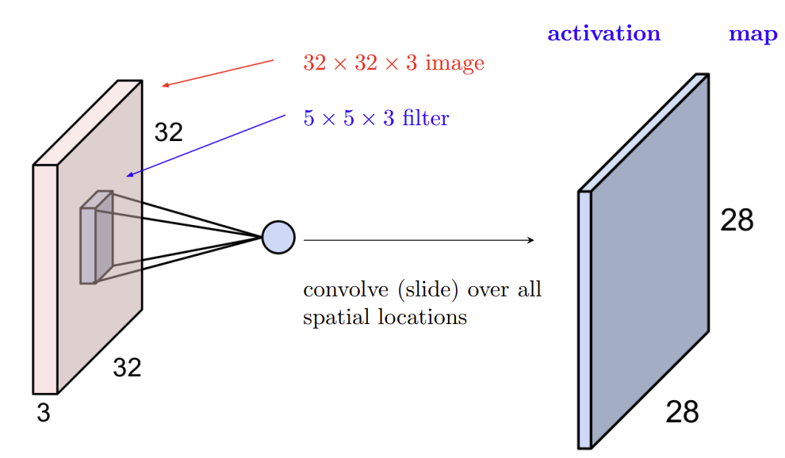

### 3.2 Activation Map (Activation Map)

*   After one filter slides across the entire image and computes values, it produces a two-dimensional **activation map (Activation Map)**.
*   **Multiple filters**: If we have $K$ different filters (e.g., 6 filters), we obtain $K$ activation maps.
*   **Stacking**: Stack these $K$ activation maps along the depth dimension to form the output volume of the layer.
    *   Example: With input $32 \times 32 \times 3$ and 6 filters of size $5 \times 5 \times 3$, the output is $28 \times 28 \times 6$ (assuming no padding and stride 1).

### 3.3 Spatial Dimensions (Spatial Dimensions) - **Key Derivation**

The output activation-map size depends on four hyperparameters:

1.  **Input Size (Input Size)**: $N \times N$
2.  **Filter Size (Filter Size)**: $F \times F$
3.  **Stride (Stride)**: $S$ (the number of pixels the filter moves each time)
4.  **Zero Padding (Zero Padding)**: $P$ (the number of rings of 0s padded around the input boundary)

#### Formula Derivation

Suppose we want to compute the output width/height:

1.  **Total length**: The original input length $N$ plus padding on both sides $2P$, giving total length $N + 2P$.
2.  **Filter coverage**: The filter occupies a length of $F$.
3.  **Sliding distance**: The effective length over which the filter center can move is $(N + 2P) - F$.
4.  **Number of steps**: Each movement is $S$, so the number of sliding steps is $\frac{N + 2P - F}{S}$.
5.  **Number of output points**: The number of steps represents how many movements are made; add the initial position (the first point), so total output points = steps + 1.

#### Core Formula

$$
\text{Output Size} = \frac{N - F + 2P}{S} + 1
$$

*Note*: The result must be an integer. If it is not divisible, the filter configuration does not fit the input size (usually causing an error or requiring padding adjustment).

### 3.4 Meaning of Zero Padding (Padding)

*   **Preserve size**: Without padding, the image becomes smaller after every convolution. Padding can keep the output size equal to the input size.
* **Common setting**: When stride $S=1$, to preserve size ($N_{out} = N_{in}$), set
  $$
  P = \frac{F-1}{2}
  $$

### 3.5 Parameter Count Calculation (Parameter Sharing) - **Key Point**

A convolutional layer uses **parameter sharing**, which greatly reduces the number of parameters.

Assume:

*   Input volume: $W_1 \times H_1 \times C$
*   Number of filters: $K$
*   Filter size: $F \times F$
*   (Note: The depth of each filter is automatically $C$)

#### Parameter-count Formula

1.  **Number of weights in one filter**: $F \times F \times C$
2.  **Number of biases in one filter**: $1$
3.  **Total parameters in one filter**: $(F \times F \times C) + 1$
4.  **Total parameters of the layer (Total Parameters)**:
    $$
    \text{Total Params} = K \times ((F \times F \times C) + 1)
    $$

#### Example

*   **Input**: $32 \times 32 \times 3$
*   **Configuration**: 10 filters of size $5 \times 5$ (Stride=1, Pad=2).
*   **Output size**:
    $$ \frac{32 + 2(2) - 5}{1} + 1 = 32 \implies \text{Output Volume: } 32 \times 32 \times 10 $$
*   **Number of parameters**:
    *   Weights per filter: $5 \times 5 \times 3 = 75$
    *   Add bias: $75 + 1 = 76$
    *   Total parameters ($K=10$): $76 \times 10 = 760$

### 3.6 Summary of the Convolutional Layer)

*   **Input**: $W_1 \times H_1 \times C$
*   **Hyperparameters**: $K$ (number of filters), $F$ (filter size), $S$ (stride), $P$ (padding)
*   **Output**: $W_2 \times H_2 \times K$
    $$
    W_2 = \frac{W_1 - F + 2P}{S} + 1, \\ H_2 = \frac{H_1 - F + 2P}{S} + 1
    $$
* **Number of parameters**:
  $$
  (F \cdot F \cdot C + 1) \cdot K
  $$

## 4. Pooling Layer 

### 4.1 Role

*   **Dimensionality reduction**: Reduce the spatial dimensions (Spatial dimensions) of feature maps.
*   **Reduce computation**: Reduce the parameters and computation of later layers.
*   **Control overfitting**: Improve model robustness.

### 4.2 Mechanism

*   Operates independently on each depth slice (feature map).
*   **No parameters**: Pooling layers usually have no learnable parameters (Weights), only hyperparameters (size and stride).
*   **Max Pooling (Max Pooling)**: The most commonly used pooling method. It takes the maximum value within the filter window.

### 4.3 Size Change

Assume input is $W_1 \times H_1 \times C$, pooling kernel size is $F$, and stride is $S$.

*   **Output**: $W_2 \times H_2 \times C$
    $$
    W_2 = \frac{W_1 - F}{S} + 1, \quad H_2 = \frac{H_1 - F}{S} + 1
    $$
*   *Note*: Pooling layers usually do not use Padding.
*   **Number of parameters**: $0$ 

### 4.4 Common Settings

*   $F=2, S=2$: Halves width and height (most common).
*   $F=3, S=2$: Overlapping Pooling (Overlapping Pooling).

## 5. Fully Connected Layer (Fully Connected Layer)

*   **Position**: Usually located at the end of a CNN.
*   **Connection pattern**: Every neuron in the current layer connects to all outputs of the previous layer (same as in a traditional neural network).
*   **Role**: Maps the distributed features extracted by convolutional layers to the sample-label space (such as classification scores).
*   **Input**: The output of convolution/pooling layers is usually a 3D volume. Before entering the FC layer, it needs to be **flattened (Flatten)** into a 1D vector.
* **Number of parameters**:

  If the input to the FC layer has $N$ neurons and the output has $M$ neurons, then the number of parameters is:
$$
\text{Total Params} = (N +1 ）\times M
$$

# 1: RNN and Transformer

## 1. Sequential Data Analysis

### 1.1 Motivation

*   **Review**: MLP (Multilayer Perceptron) and CNN (Convolutional Neural Network) are mainly used to process tabular data and image data.
*   **Sequential Data**: Data are arranged in sequence form, where **Order** is crucial.
*   **Characteristics**:
    *   Variable length input.
    *   Variable order.
    *   Example: "I visited Paris in 2014" vs "In 2014, I visited Paris".

### 1.2 Typical Tasks

1.  **Time series prediction**: stocks, weather, etc.
2.  **Speech recognition**: Audio $\to$ text.
3.  **Machine translation**: Text $\to$ text.
4.  **Image captioning**: Image $\to$ text.
5.  **Others**: text generation (ChatGPT), video generation (SORA), biological sequence analysis (DNA).

## 2. Recurrent Neural Network (RNN)

### 2.1 Basic Architecture

The core idea of an RNN is to **share parameters** across Time Steps.

#### Core Formula

At time $t$, the RNN processes input $x_t$ and the hidden state $h_{t-1}$ from the previous time step:

$$
\begin{aligned}
h_t &= f_W(h_{t-1}, x_t) \\
\hat{y}_t &= g_{W'}(h_t)
\end{aligned}
$$

*   **$h_t$ (Hidden State)**: The hidden state at the current time step, containing sequence information up to time $t$.
*   **$x_t$ (Input)**: The input vector at the current time step.
*   **$\hat{y}_t$ (Output)**: The predicted output at the current time step.
*   **$W, W'$ (Parameters)**: Weight matrices, **shared across all time steps**.

> Many to many:
>
> 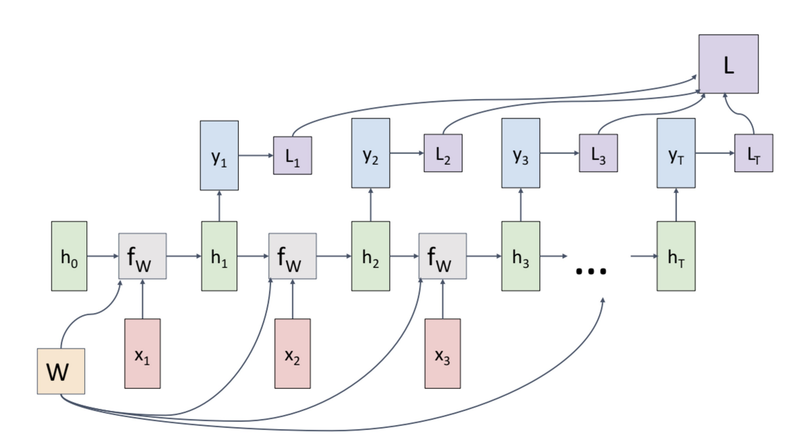

#### Concrete Form (Vanilla RNN)

Tanh is usually used as the activation function:

$$
\begin{aligned}
h_t &= \tanh(W_{hh} h_{t-1} + W_{xh} x_t + b_h) \\
\hat{y}_t &= W_{hy} h_t + b_y
\end{aligned}
$$

**Parameter Explanation**:

*   $W_{hh}$: Weight matrix from hidden layer to hidden layer.
*   $W_{xh}$: Weight matrix from input layer to hidden layer.
*   $W_{hy}$: Weight matrix from hidden layer to output layer (i.e., $W'$ above).
*   $b_h, b_y$: Bias terms.

### 2.2 Loss & Training

For a vanilla RNN, the forward pass is

$$
\begin{aligned}
a_t &= W_{hh}h_{t-1} + W_{xh}x_t + b_h, \\
h_t &= \phi(a_t), \\
o_t &= W_{hy}h_t + b_y, \\
\hat{y}_t &= g(o_t),
\end{aligned}
$$

where:

- $x_t$ is the input at time step $t$.
- $h_t$ is the hidden state.
- $a_t$ is the hidden pre-activation.
- $o_t$ is the output logit.
- $\hat{y}_t$ is the predicted output.
- $\phi$ is usually `tanh` or `ReLU`.
- $g$ is usually `softmax` for classification.

#### Loss Function

*   **Single-step loss**: $L_t(y_t, \hat{y}_t)$, e.g. cross-entropy loss.
*   **Total loss**: The sum of losses over all time steps.
    $$
    E(\theta) = \sum_{t=1}^{T} L(y_t, \hat{y}_t)
    $$
    where $\theta = \{W_{hh}, W_{xh}, W_{hy}, b\}$.

For softmax with cross-entropy loss,

$$
\begin{aligned}
\hat{y}_{t,i}
&= \frac{\exp(o_{t,i})}{\sum_j \exp(o_{t,j})}, \\
L_t
&= -\sum_i y_{t,i}\log \hat{y}_{t,i}.
\end{aligned}
$$

#### Backpropagation Through Time, BPTT

Training an RNN is similar to training a feed-forward neural network, but the network must be unrolled over time.

> For any shared parameter $\theta$,
>
> $$
> \frac{\partial E}{\partial \theta}
> =
> \sum_{t=1}^{T}
> \frac{\partial L_t}{\partial \theta}.
> $$
>
> However, $L_t$ depends not only on $h_t$, but also indirectly on all previous hidden states:
>
> $$
> h_t \leftarrow h_{t-1} \leftarrow h_{t-2} \leftarrow \cdots \leftarrow h_1.
> $$
>
> So gradients must be propagated backward through time.
>

##### Chain-rule view

For a hidden-layer parameter such as $W_{hh}$ or $W_{xh}$,

$$
\begin{aligned}
\frac{\partial L_t}{\partial \theta}
&=
\frac{\partial L_t}{\partial h_t}
\frac{\partial h_t}{\partial \theta} \\
&=
\frac{\partial L_t}{\partial h_t}
\sum_{k=1}^{t}
\left(
\frac{\partial h_t}{\partial h_k}
\frac{\partial h_k}{\partial \theta}
\right).
\end{aligned}
$$

The term $\frac{\partial h_t}{\partial h_k}$ is a product of Jacobians:

$$
\begin{aligned}
\frac{\partial h_t}{\partial h_k}
&=
\frac{\partial h_t}{\partial h_{t-1}}
\frac{\partial h_{t-1}}{\partial h_{t-2}}
\cdots
\frac{\partial h_{k+1}}{\partial h_k} \\
&=
\prod_{j=k+1}^{t}
\frac{\partial h_j}{\partial h_{j-1}}.
\end{aligned}
$$

For a vanilla RNN,

$$
\begin{aligned}
h_j &= \phi(a_j), \\
a_j &= W_{hh}h_{j-1} + W_{xh}x_j + b_h, \\
\frac{\partial h_j}{\partial h_{j-1}}
&=
\operatorname{diag}(\phi'(a_j)) W_{hh}.
\end{aligned}
$$

Therefore,

$$
\begin{aligned}
\frac{\partial h_t}{\partial h_k}
&=
\prod_{j=k+1}^{t}
\operatorname{diag}(\phi'(a_j)) W_{hh}.
\end{aligned}
$$

> ##### Linear case: removing the non-linearity
>
> To isolate the role of $W_{hh}$, suppose there is no non-linearity:
>
> $$
> \begin{aligned}
> h_t
> &= W_{hh}h_{t-1} + W_{xh}x_t.
> \end{aligned}
> $$
>
> Then
>
> $$
> \begin{aligned}
> \frac{\partial h_t}{\partial h_{t-1}}
> &= W_{hh}.
> \end{aligned}
> $$
>
> $$
> \begin{aligned}
> \frac{\partial h_T}{\partial h_1}
> &=
> \frac{\partial h_T}{\partial h_{T-1}}
> \frac{\partial h_{T-1}}{\partial h_{T-2}}
> \cdots
> \frac{\partial h_2}{\partial h_1} \\
> &=
> W_{hh}^{T-1}.
> \end{aligned}
> $$
>
> So the gradient contains the repeated matrix product
>
> $$
> \begin{aligned}
> \frac{\partial L_T}{\partial W}
> &\approx
> \frac{\partial L_T}{\partial h_T}
> W_{hh}^{T-1}
> \frac{\partial h_1}{\partial W}.
> \end{aligned}
> $$
>
> The behavior depends on the largest singular value of $W_{hh}$.
>
> Let $\sigma_{\max}(W_{hh})$ be the largest singular value of $W_{hh}$. Then 
>
> $$
> \begin{aligned}
> \left\| W_{hh}^{T-1} \right\|
> &\approx
> \sigma_{\max}(W_{hh})^{T-1}.
> \end{aligned}
> $$
>
> Therefore,
>
> $$
> \begin{aligned}
> \sigma_{\max}(W_{hh}) > 1
> &\Longrightarrow
> \text{exploding gradients}, \\
> \sigma_{\max}(W_{hh}) < 1
> &\Longrightarrow
> \text{vanishing gradients}.
> \end{aligned}
> $$
>
> With `tanh`, the situation is usually even more prone to vanishing gradients because each step also multiplies by
>
> $$
> \operatorname{diag}\!\left(\tanh'(a_t)\right),
> $$
>
> whose entries are usually less than $1$.

##### 1. Gradient with respect to $W_{hh}$

Since $W_{hh}$ is shared across all time steps,

$$
\begin{aligned}
\frac{\partial E}{\partial W_{hh}}
&=
\sum_{t=1}^{T}
\frac{\partial L_t}{\partial W_{hh}} \\
&=
\sum_{t=1}^{T}
\frac{\partial L_t}{\partial h_t}
\sum_{k=1}^{t}
\left(
\frac{\partial h_t}{\partial h_k}
\frac{\partial h_k}{\partial W_{hh}}
\right).
\end{aligned}
$$

where $\frac{\partial h_t}{\partial h_k} = \prod_{j=k+1}^{t} \frac{\partial h_j}{\partial h_{j-1}}$ is a product term.

Intuitively, $W_{hh}$ affects $L_t$ through every hidden-state transition before time $t$.

Using the local pre-activation

$$
a_k = W_{hh}h_{k-1} + W_{xh}x_k + b_h,
$$

the direct local contribution is

$$
\frac{\partial a_k}{\partial W_{hh}} \sim h_{k-1}.
$$

In implementation form,

$$
\begin{aligned}
\frac{\partial E}{\partial W_{hh}}
&=
\sum_{t=1}^{T}
\delta^a_t h_{t-1}^{T},
\end{aligned}
$$

where $\delta^a_t$ is the backpropagated error at the hidden pre-activation $a_t$.

##### 2. Gradient with respect to $W_{xh}$

Similarly,

$$
\begin{aligned}
\frac{\partial E}{\partial W_{xh}}
&=
\sum_{t=1}^{T}
\frac{\partial L_t}{\partial W_{xh}} \\
&=
\sum_{t=1}^{T}
\frac{\partial L_t}{\partial h_t}
\sum_{k=1}^{t}
\left(
\frac{\partial h_t}{\partial h_k}
\frac{\partial h_k}{\partial W_{xh}}
\right).
\end{aligned}
$$

Using

$$
a_k = W_{hh}h_{k-1} + W_{xh}x_k + b_h,
$$

the direct local contribution is

$$
\frac{\partial a_k}{\partial W_{xh}} \sim x_k.
$$

In implementation form,

$$
\begin{aligned}
\frac{\partial E}{\partial W_{xh}}
&=
\sum_{t=1}^{T}
\delta^a_t x_t^{T}.
\end{aligned}
$$

##### 3. Gradient with respect to $W_{hy}$

The output weight $W_{hy}$ affects the loss at time step $t$ directly through

$$
o_t = W_{hy}h_t + b_y.
$$

Therefore,

$$
\begin{aligned}
\frac{\partial E}{\partial W_{hy}}
&=
\sum_{t=1}^{T}
\frac{\partial L_t}{\partial W_{hy}} \\
&=
\sum_{t=1}^{T}
\frac{\partial L_t}{\partial o_t}
\frac{\partial o_t}{\partial W_{hy}}.
\end{aligned}
$$

Let

$$
\delta^o_t = \frac{\partial L_t}{\partial o_t}.
$$

Then

$$
\begin{aligned}
\frac{\partial E}{\partial W_{hy}}
&=
\sum_{t=1}^{T}
\delta^o_t h_t^T.
\end{aligned}
$$

For softmax with cross-entropy loss,

$$
\begin{aligned}
\delta^o_t
&=
\frac{\partial L_t}{\partial o_t} \\
&=
\hat{y}_t - y_t.
\end{aligned}
$$

##### 4. Gradient with respect to biases

For the output bias,

$$
\begin{aligned}
\frac{\partial E}{\partial b_y}
&=
\sum_{t=1}^{T}
\frac{\partial L_t}{\partial b_y} \\
&=
\sum_{t=1}^{T}
\delta^o_t.
\end{aligned}
$$

For the hidden bias,

$$
\begin{aligned}
\frac{\partial E}{\partial b_h}
&=
\sum_{t=1}^{T}
\frac{\partial L_t}{\partial b_h} \\
&=
\sum_{t=1}^{T}
\delta^a_t.
\end{aligned}
$$

##### 5. Recursive BPTT form

First define the output error:

$$
\begin{aligned}
\delta^o_t
&=
\frac{\partial L_t}{\partial o_t}.
\end{aligned}
$$

The hidden-state error satisfies

$$
\begin{aligned}
\delta^a_t
&=
\frac{\partial E}{\partial a_t} \\
&=
\left(
W_{hy}^{T}\delta^o_t
+
W_{hh}^{T}\delta^a_{t+1}
\right)
\odot \phi'(a_t),
\end{aligned}
$$

with boundary condition

$$
\delta^a_{T+1} = 0.
$$

Then the parameter gradients are

$$
\begin{aligned}
\frac{\partial E}{\partial W_{hy}}
&=
\sum_{t=1}^{T}
\delta^o_t h_t^T, \\
\frac{\partial E}{\partial b_y}
&=
\sum_{t=1}^{T}
\delta^o_t, \\
\frac{\partial E}{\partial W_{hh}}
&=
\sum_{t=1}^{T}
\delta^a_t h_{t-1}^T, \\
\frac{\partial E}{\partial W_{xh}}
&=
\sum_{t=1}^{T}
\delta^a_t x_t^T, \\
\frac{\partial E}{\partial b_h}
&=
\sum_{t=1}^{T}
\delta^a_t.
\end{aligned}
$$

This is the standard BPTT algorithm for a vanilla RNN.

### 2.3 Gradient Problems (Gradient Exploding & Vanishing)

Because BPTT contains the product term $\prod \frac{\partial h_j}{\partial h_{j-1}}$ (usually involving powers of $W_{hh}$):

1.  **Gradient Exploding**: Gradients become extremely large, causing numerical instability.
    *   *Solution*: **Gradient Clipping** (set a threshold and truncate the gradient).
2.  **Gradient Vanishing**: Gradients approach 0, making the network unable to learn Long-term dependencies.
    *   *Solution*: Use **LSTM** or **GRU**.

## 3. Long Short-Term Memory (LSTM)

### 3.1 Overview

*   **Proposed by**: Hochreiter & Schmidhuber (1997).
*   **Purpose**: Mitigate the gradient vanishing problem and capture long-term dependencies.
*   **Core idea**: Introduce a **Cell State ($c_t$)** and **Gating Mechanisms**.

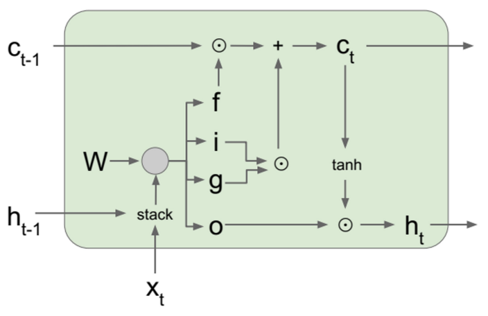

### 3.2 Core Formulas and Structure

At each time step, LSTM maintains two states: $h_t$ (hidden state) and $c_t$ (cell state).

#### Gate Computation

All gate values lie in $(0, 1)$ and are activated by the Sigmoid ($\sigma$) function.

1.  **Forget Gate**: Determines how much old cell-state information to discard.
    $$
    f_t = \sigma(W_f \cdot [h_{t-1}, x_t] + b_f)
    $$
2.  **Input Gate**: Determines how much new information to update into the cell state.
    $$
    i_t = \sigma(W_i \cdot [h_{t-1}, x_t] + b_i)
    $$
3.  **Candidate Cell State**: Creates a new candSidate value vector.
    $$
    \tilde{c}_t = \tanh(W_c \cdot [h_{t-1}, x_t] + b_c)
    $$
4.  **Output Gate**: Determines what value to output based on the current cell state.
    $$
    o_t = \sigma(W_o \cdot [h_{t-1}, x_t] + b_o)
    $$

$$
\left(\begin{matrix}i\\ f\\ o\\ g\end{matrix}\right)=\left(\begin{matrix}\sigma \\ \sigma \\ \sigma \\ \tanh \end{matrix}\right)\left(W\left(\begin{matrix}h_{t-1}\\ x_{t}\end{matrix}\right)+\left(\begin{matrix}b_{i}\\ b_{f}\\ b_{o}\\ b_{g}\end{matrix}\right)\right)
$$

#### State Update

1.  **Update the cell state**: old state $\times$ forget ratio + new candidate value $\times$ input ratio.
    $$
    c_t = f_t \odot c_{t-1} + i_t \odot \tilde{c}_t
    $$
    *(Note: $\odot$ denotes element-wise multiplication / Hadamard Product)*
    *Explanation*: The addition operation ($+$) allows gradients to propagate backward more smoothly, alleviating gradient vanishing.
2.  **Update the hidden state**:
    $$
    h_t = o_t \odot \tanh(c_t)
    $$

### 3.3 Other Variants of RNN (Extensions)

*   **GRU (Gated Recurrent Unit)** (Cho et al., 2014):
    *   Combines the forget gate and input gate into an "update gate".
    *   Has no separate cell state $c_t$; it only has $h_t$.
    *   **Advantage**: Fewer parameters than LSTM and more computationally efficient.
    
    $$
    \left(\begin{matrix}z_{t}\\ r_{t}\\ \end{matrix}\right)=\left(\begin{matrix}\sigma \\ \sigma \\ \end{matrix}\right)\left(W\cdot \left[\begin{matrix}h_{t-1}\\ x_{t}\end{matrix}\right]+\left(\begin{matrix}b_{z}\\ b_{r}\\ \end{matrix}\right)\right)
    $$
    
    $$
    \tilde{h}_{t}=\tanh (W_{h}\cdot [r_{t}\odot h_{t-1},x_{t}]+b_{h})
    $$
    
    $$
    h_{t}=(1-z_{t})\odot h_{t-1}+z_{t}\odot \tilde{h}_{t}
    $$
    
*   **Multi-layer RNNs**: Vertically stack multiple RNN layers to increase model depth.

### 3.4 Limitations of RNNs and Their Variants

1.  **Difficulty with long-term dependencies**: Although LSTM improves this, extremely long sequences remain challenging.
2.  **Limited Parallelization**: $h_{t-1}$ must be computed before $h_t$, making training slow and preventing full use of GPUs.

## 4. Transformer

### 4.1 Overview

*   **Source**: Vaswani et al., "Attention Is All You Need" (NeurIPS 2017).
*   **Core idea**: Completely abandon recurrence and convolution; rely entirely on the **Attention Mechanism**.
*   **Advantages**:
    *   Easier parallelization.
    *   More effective handling of long-term dependencies.
    *   Higher model capacity.

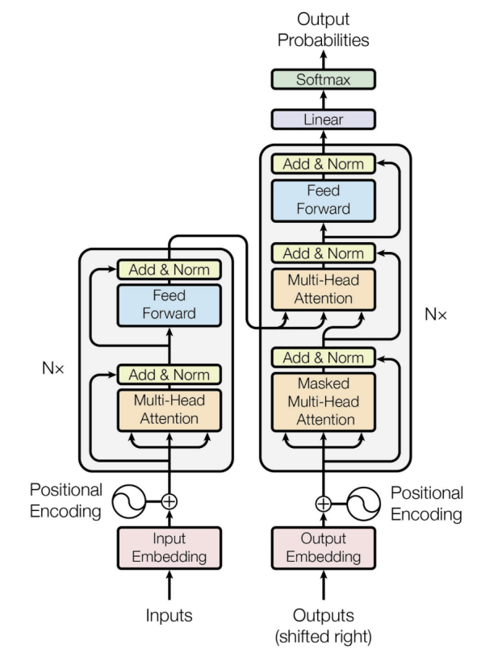

### 4.2 Key Components

1.  **Input Embeddings**: Convert words into vectors.
2.  **Positional Encodings**: Since there is no recurrent structure, the model does not know the order of words; positional information vectors must be explicitly added.

### 4.3 Attention Mechanism - **Core Derivation**

#### Definition

Assume the input matrix is $X \in \mathbb{R}^{n \times d}$ ($n$ is the number of samples/words, and $d$ is the dimension).
Introduce three parameter matrices:

*   $W_Q \in \mathbb{R}^{d \times d'}$
*   $W_K \in \mathbb{R}^{d \times d'}$
*   $W_V \in \mathbb{R}^{d \times d'}$

#### Computing Query, Key, Value

$$
(Q,K,V)=X(W_{Q},W_{K},W_{V})
$$

*   **Q (Query)**: Query vector.
*   **K (Key)**: Key vector, used for matching with queries.
*   **V (Value)**: Value vector, containing the actual content information.

#### Scaled Dot-Product Attention Formula

$$
Z = \text{Attention}(Q, K, V) = \text{softmax} \left( \frac{Q K^\top}{\sqrt{d'}} \right) V
$$

**Detailed step-by-step explanation**:

1.  **Similarity computation ($QK^\top$)**: Compute the dot product between Query and Key. If $Q_i$ and $K_j$ are similar (large dot product), it means the $i$-th word should attend to the $j$-th word. The resulting matrix has dimension $n \times n$.
2.  **Scaling ($\frac{1}{\sqrt{d'}}$)**: Divide by the square root of the dimension to prevent dot products from becoming too large and pushing Softmax into regions with very small gradients.
3.  **Normalization (Softmax)**: Apply Softmax to each row to obtain a probability distribution (weights sum to 1).
    *   **Attention Map**: $A = \text{softmax}(\frac{Q K^\top}{\sqrt{d'}}) \in \mathbb{R}^{n \times n}$.
4.  **Weighted sum ($AV$)**: Use the computed weights to take a weighted sum of Value ($V$), obtaining the final output $Z$.

#### Self-Attention vs Cross-Attention

*   **Self-Attention**: $Q, K, V$ all come from the same input source $X$. It is used to understand relationships within a sequence (such as pronoun coreference).
*   **Cross-Attention**: $Q$ comes from one source (such as the decoder), while $K, V$ come from another source (such as the encoder). It is used for sequence-to-sequence tasks (such as translation).

## 5. Summary

| Feature                    | RNN / LSTM                              | Transformer                                   |
| :------------------------- | :-------------------------------------- | :-------------------------------------------- |
| **Processing method**      | Sequential                              | Parallel                                      |
| **Long-term dependencies** | Weaker (affected by gradient vanishing) | Strong (directly connected through Attention) |
| **Core operation**         | Recursive update of $h_t$               | Matrix multiplication + Softmax               |
| **Positional information** | Implicit in processing order            | Positional encoding must be explicitly added  |
| **Main applications**      | Early NLP, time series                  | Modern NLP (LLMs), vision (ViT)               |

# 12: Over/Under-Fitting and Bias-Variance Trade-off

## 1. Overfitting, Underfitting and Model Complexity

### 1.1 Goal of Learning

The core goal of machine learning is **Prediction**.

*   **Learning process**: Solve for parameters using training data.
    * Linear regression:
      $$
      w_b = (X^T X)^{-1} X^T y
      $$
    * Polynomial regression:
      $$
      w_b = (P^T P)^{-1} P^T y
      $$
*   **Prediction process**: Substitute new data into the model.
    $$
    f_{w,b}(X_{new}) = X_{new} w_b
    $$

### 1.2 Underfitting

*   **Definition**: The model cannot predict the labels of its training data well. In other words, the training error is high.
*   **Main causes**:
    1.  **The model is too simple**: e.g., using a linear model to fit nonlinear data.
    2.  **Insufficient feature information**: Feature engineering is not good enough.
*   **Solutions**:
    *   Try a more complex model (such as increasing the polynomial degree).
    *   Construct features with stronger predictive power.
*   **Behavior**: High Bias, Low Variance.

### 1.3 Overfitting

*   **Definition**: The model performs extremely well on training data but poorly on test data. Its generalization ability is weak.
*   **Main causes**:
    1.  **The model is too complex**: e.g., a decision tree is too deep, a neural network is too deep or too wide, or the polynomial degree is too high (such as a 9th-degree polynomial fitted to a small number of points).
    2.  **Too many features but too few training samples**.
*   **Solutions**:
    *   Increase the amount of training data.
    *   Reduce model complexity (regularization, pruning, etc.).
*   **Behavior**: Low Bias, High Variance.

### 1.4 Relationship between Model Complexity and Fitting

*   **Low complexity (such as linear / degree 1)**: Underfitting; high training error and high test error.
*   **Medium complexity (such as degree 2-4)**: Good fit; moderate training error and low test error.
*   **High complexity (such as degree 9)**: Overfitting; extremely low training error (even 0) and extremely high test error.

## 2. Bias-Variance Trade-off

### 2.1 Experimental Observations

As Model Complexity increases:

1.  **Training Error**: Keeps decreasing and approaches 0.
2.  **Testing Error**: First decreases and then increases (a U-shaped curve).
    *   **Low-complexity region**: High test error $\rightarrow$ high bias, low variance.
    *   **High-complexity region**: High test error $\rightarrow$ low bias, high variance.
    *   **Best point**: The balance point between bias and variance, where test error is minimized.

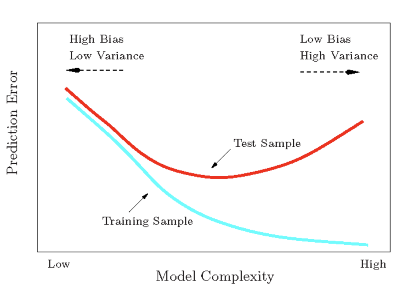

### 2.2 Statistical Analysis - **Core Derivation**

#### 2.2.1 Problem Setup

*   **Training set**: $D = \{(x_i, y_i)\}_{i=1}^n$, sampled independently and identically distributed (i.i.d.) from distribution $P(X, Y)$.
*   **True relationship**:
    $$
    y = t(x) + \epsilon
    $$
    
    *   $t(x)$: Unknown true target function, namely $E[y|x]$.
    *   $\epsilon$: Noise, following the normal distribution $\epsilon \sim \mathcal{N}(0, \sigma^2)$.
* **Model learning**: The hypothesis function learned by algorithm $A$ based on dataset $D$ is
  $$
  h_D(x) = A(D)
  $$

#### 2.2.2 Expected Hypothesis and Expected Test Error

*   **Expected Hypothesis**:
    $$
    \bar{h}(x) = E_{D \sim P^n}[h_D(x)]
    $$
    *Explanation*: This is the average prediction of models trained on infinitely many different training sets.
    
*   **Expected Test Error**:
    We need to evaluate the performance of algorithm $A$ on a specific test sample $(x, y)$ and take the expectation over all possible training sets $D$:
    $$
    E_{(x,y)\sim P, D\sim P^n} \left[ (h_D(x) - y)^2 \right]
    $$

#### 2.2.3 Decomposition Derivation

We decompose the error term $(h_D(x) - y)^2$. To simplify notation, subscripts are omitted, and the expectation is understood to be over $D$ and $(x,y)$.

**Step 1: Introduce $\bar{h}(x)$ for decomposition**
$$
\begin{aligned}
E[(h_D(x) - y)^2] &= E[(h_D(x) - \bar{h}(x) + \bar{h}(x) - y)^2] \\
&= E[\underbrace{(h_D(x) - \bar{h}(x))^2}_{A^2} + \underbrace{(\bar{h}(x) - y)^2}_{B^2} + \underbrace{2(h_D(x) - \bar{h}(x))(\bar{h}(x) - y)}_{2AB}]
\end{aligned}
$$

**Step 2: Analyze the cross-term**
$$
\begin{aligned}
E_{D, (x,y)} [(h_D(x) - \bar{h}(x))(\bar{h}(x) - y)] &= E_{(x,y)} [ E_D [h_D(x) - \bar{h}(x)] \cdot (\bar{h}(x) - y) ] \\
&= E_{(x,y)} [ (\underbrace{E_D[h_D(x)]}_{\bar{h}(x)} - \bar{h}(x)) \cdot (\bar{h}(x) - y) ] \\
&= E_{(x,y)} [ 0 \cdot (\bar{h}(x) - y) ] = 0
\end{aligned}
$$
*Note*: Because $\bar{h}(x)$ is constant (with respect to the expectation over $D$), and $y$ is independent of $D$.

Therefore, the error simplifies to:
$$
E[(h_D(x) - y)^2] = E[(h_D(x) - \bar{h}(x))^2] + E[(\bar{h}(x) - y)^2]
$$
**Step 3: Further decompose the second term $E[(\bar{h}(x) - y)^2]$**
Introduce the true target function $t(x)$:
$$
\begin{aligned}
E[(\bar{h}(x) - y)^2] &= E[(\bar{h}(x) - t(x) + t(x) - y)^2] \\
&= E[(\bar{h}(x) - t(x))^2] + E[(t(x) - y)^2] + 2E[(\bar{h}(x) - t(x))(t(x) - y)]
\end{aligned}
$$

**Step 4: Analyze the new cross-term**
$$
\begin{aligned}
E[(\bar{h}(x) - t(x))(t(x) - y)] &= E_x [ E_{y|x} [ (\bar{h}(x) - t(x))(t(x) - y) ] ] \\
&= E_x [ (\bar{h}(x) - t(x)) (t(x) - \underbrace{E_{y|x}[y]}_{t(x)}) ] \\
&= E_x [ (\bar{h}(x) - t(x)) \cdot 0 ] = 0
\end{aligned}
$$
*Note*: $t(x)$ is the true mean of $y$, namely $t(x) = E[y|x]$.

#### 2.2.4 Final Formula and Explanation

Combining the above steps, the expected test error is decomposed into three terms:

$$
\underbrace{E[(h_D(x) - y)^2]}_{\text{Total Error}} = \underbrace{E_D[(h_D(x) - \bar{h}(x))^2]}_{\text{Variance}} + \underbrace{E_x[(\bar{h}(x) - t(x))^2]}_{\text{Bias}^2} + \underbrace{E_{x,y}[(t(x) - y)^2]}_{\text{Noise}}
$$

1.  **Variance**: $E_D[(h_D(x) - \bar{h}(x))^2]$
    *   **Meaning**: Describes how sensitive the model is to the training dataset $D$. If you switch to another training set, how much do the predictions change?
    *   **Association**: ==High variance $\leftrightarrow$ overfitting==(Over-specialized).
2.  **Bias$^2$**: $E_x[(\bar{h}(x) - t(x))^2]$
    *   **Meaning**: Even with infinite data, the inherent gap between the model's average prediction $\bar{h}(x)$ and the true value $t(x)$. This is determined by the assumptions of the model itself (such as the linear assumption).
    *   **Association**: ==High bias $\leftrightarrow$ underfitting.==
3.  **Noise**: $E_{x,y}[(t(x) - y)^2] = \sigma^2$
    *   **Meaning**: The inherent noise in the data itself.
    *   **Property**: Irreducible Error; this is the upper limit of performance and cannot be removed by optimizing the model.

### 2.3 Practical Application and Analysis

#### 2.3.1 The Trade-off

*   **Model complexity $\uparrow$**:
    *   Variance $\uparrow$ (models trained on different datasets differ more).
    *   Bias $\downarrow$ (average predictions become closer to the true value).
*   **Total error**: First decreases and then increases, so there exists an optimal complexity.

#### 2.3.2 Typical Model Analysis

*   **Decision Trees**:
    *   **Single pruned tree**: High bias, low variance (underfitting).
    *   **Single deep tree**: Low bias, high variance (overfitting).
*   **Random Forests**:
    *   Introduce data randomness (Bagging) and feature randomness.
    *   **Effect**: Significantly reduces **variance**, but does not guarantee reduced bias (bias is usually similar to that of a single tree).
*   **Boosting**: Can reduce bias.

#### 2.3.3 Two Regimes and Countermeasures

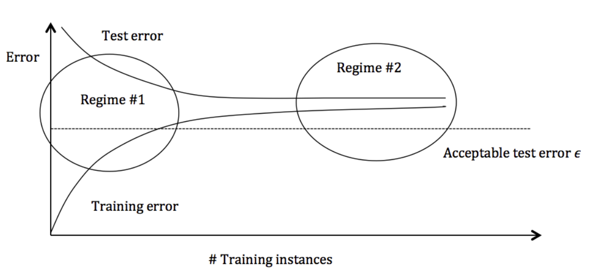

1.  **Regime 1: High Variance / Overfitting**
    *   **Symptoms**: Training error $\ll$ test error; training error is very low, but test error is high.
    *   **Countermeasures**:
        *   Add more training instances.
        *   Reduce model complexity.
2.  **Regime 2: High Bias / Underfitting**
    *   **Symptoms**: The training error itself is already high.
    *   **Countermeasures**:
        *   Add more features.
        *   Use a more complex model (nonlinear models, kernel methods, etc.).

### 2.4 Exercise Calculation

**Problem setup**:

*   True model: $y = t(x) + \epsilon, \quad t(x=5)=9.5, \quad \epsilon \sim \mathcal{N}(0, 0.5)$ (that is, the noise variance is $\sigma^2=0.5$, but in this problem the concrete sample has $\epsilon = 0.5$).
*   Test sample: $(x, y) = (5, 10)$ (because $9.5 + 0.5 = 10$).
*   Predictions of 10 models at $x=5$: $\{9, 11, 23, 6, 8, 12, 10, 4, 13, 7\}$.

**Calculation targets**: Empirical MSE, Bias$^2$, Variance.

**Calculation process**:

1.  **Average prediction ($\bar{h}(x)$)**:
    $$
    \bar{h} = \frac{9+11+23+6+8+12+10+4+13+7}{10} = 10.3
    $$
2.  **Bias$^2$**:
    $$
    (\bar{h}(x) - t(x))^2 = (10.3 - 9.5)^2 = 0.8^2 = 0.64
    $$
3.  **Variance**:
    $$
    \begin{aligned}
    \text{Var}
    &= \frac{1}{10} \sum_{i=1}^{10} (h_i(x) - \bar{h}(x))^2 \\
    &=  \frac{1}{10} [(9-10.3)^2 + \dots + (7-10.3)^2] = 24.81 
    \end{aligned}
    $$
4.  **Empirical MSE**:
    $$
    \begin{aligned}
    \text{MSE}
    &= \frac{1}{10} \sum_{i=1}^{10} (h_i(x) - y)^2 \\
    &=  \frac{1}{10} [(9-10)^2 + (11-10)^2 + \dots] = 24.9 
    \end{aligned}
    $$

**Verification**:
Theoretically, $E[\text{MSE}] \approx \text{Bias}^2 + \text{Variance} + \text{Noise}^2$ (for a single point).
In this sample, the noise contribution is $(t(x)-y)^2 = (9.5-10)^2 = 0.25$.
$$
0.64 (\text{Bias}^2) + 24.81 (\text{Var}) + 0.25 (\text{Noise}) = 25.7
$$

Since this is an empirical estimate (the sample size is only 10), the numerical relation $24.9 \approx 25.7$ has a small discrepancy, which is normal statistical fluctuation.

# 13: Performance Evaluation

## 1. Motivation: Performance Evaluation of Machine Learning Algorithms

### 1.1 Review of the Definition of Machine Learning

According to Tom Mitchell's definition, machine learning contains three elements:

*   **Experience (E)**: Corresponds to training data.
*   **Task (T)**: Corresponds to classification or regression tasks in supervised learning.
*   **Performance Measure (P)**: The core topic of this lecture, namely how to measure the model's performance on task T.

### 1.2 Machine Learning Workflow

A typical learning algorithm usually contains three parts:

1.  **Loss Function**: e.g., mean squared error ($\text{MSE}$) $\frac{1}{n}\sum_{i}^n(f(x_i; w, b) - y_i)^2$.
2.  **Objective Function**: An optimization criterion based on the loss function (e.g., minimizing MSE).
3.  **Optimization Routine**: An algorithm that uses training data to find the optimal solution (e.g., gradient descent).

**Importance of evaluation**:

*   The above steps are only the training process.
*   We need to know the accuracy of the algorithm on **Novel Data**, not just on training data.
*   **Goal**: Use limited data to evaluate the generalization ability of the algorithm.

## 2. Cross-validation

### 2.1 Hyper-parameter Tuning

*   **Parameters**: Variables automatically learned by the learning algorithm from the training set (e.g., $w, b$ in a linear model).
*   **Hyper-parameters**: Variables determined before the learning algorithm runs, usually selected manually.
    *   *Examples*: The degree of polynomial regression, maximum depth of a decision tree, number of trees in a random forest, regularization parameter $C$ in SVM, and learning rate in gradient descent.

**How to choose hyper-parameters? (Model selection problem)**

1.  **Idea 1**: Choose the hyper-parameters that perform best on **all data**.
    *   *Problem*: This leads to overfitting and makes generalization ability impossible to evaluate.
2.  **Idea 2**: Split the data into a **Train** set and a **Test** set.
    *   *Problem*: After the test set is used to choose hyper-parameters, it can no longer serve as "unseen data" for evaluating final performance.
3.  **Idea 3**: Split the data into a **Train** set, a **Validation** set, and a **Test** set.
    *   *Procedure*: Train on Train, choose hyper-parameters on Validation, and evaluate final performance on Test.
    *   *Problem*: Performance is strongly affected by the random data split (one split may make the validation set unrepresentative).

### 2.2 K-fold Cross-validation

To solve the above problems, K-fold cross-validation is introduced.

**Steps**:

1.  Split the training data into $K$ non-overlapping Folds.
2.  Conduct $K$ trials:
    *   Each time, select **1 fold** as the validation set.
    *   Use the remaining **K-1 folds** as the training set.
    *   Train the model and compute the error on the validation set.
3.  Compute the **average result** over the $K$ trials.
4.  Choose the hyper-parameters with the best average performance.

**Advantages and disadvantages**:

*   **Advantages**: The evaluation result is more stable and more thorough than a single split.
*   **Disadvantages**:
    *   High computational cost (the model must be trained $K$ times).
    *   Introduces a new hyper-parameter $K$ (usually set to 5 to 10).
    *   If $K$ is too large $\rightarrow$ the validation set is too small, and the training sets overlap heavily across trials $\rightarrow$ risk of overfitting.
    *   If $K$ is too small $\rightarrow$ insufficient training data $\rightarrow$ risk of underfitting.

---

## 3. Evaluation Metrics for Regression

For regression problems, we mainly focus on the difference between predicted values $\hat{y}_i$ and true values $y_i$.

### 3.1 Mean Square Error, MSE

$$
MSE = \frac{1}{n} \sum_{i=1}^{n} (y_i - \hat{y}_i)^2
$$

*   Penalizes large errors more heavily (because of the squared term).

### 3.2 Mean Absolute Error, MAE

$$
MAE = \frac{1}{n} \sum_{i=1}^{n} |y_i - \hat{y}_i|
$$

*   Reflects the average absolute magnitude of prediction errors.

## 4. Evaluation Metrics for Classification

### 4.1 Confusion Matrix

Take binary classification as an example. Define Class 1 as the Positive class and Class 2 as the Negative class.

|                       |             Predicted Positive              |              Predicted Negative              |
| :-------------------- | :-----------------------------------------: | :------------------------------------------: |
| **Actually Positive** |           **TP** (True Positive)            | **FN** (False Negative)   (Type II Error) |
| **Actually Negative** | **FP** (False Positive)   (Type I Error) |            **TN** (True Negative)            |

### 4.2 Basic Metrics

1.  **Accuracy**:
    $$
    \begin{aligned}
    \text{Accuracy}
    &= \frac{TP + TN}{TP + TN + FP + FN} \\
    \end{aligned}
    $$
    
    *   *Limitation*: Fails on imbalanced datasets.
    
2.  **Precision**: Among samples predicted as positive, how many are truly positive.
    $$
    \begin{aligned}
    \text{Precision}
    &= \frac{TP}{TP + FP} \\
    \end{aligned}
    $$
    
3.  **Recall**: Among truly positive samples, how many are predicted correctly.
    $$
    \begin{aligned}
    \text{Recall}
    &= \frac{TP}{TP + FN} \\
    \end{aligned}
    $$

### 4.3 Cost-sensitive Accuracy

In some scenarios (such as medical diagnosis), different mistakes have different costs (missing a cancer diagnosis vs misdiagnosing a healthy person).
Set a cost matrix or weights: $C_{p,p}$ (benefit/cost of correctly predicting a positive class), $C_{n,p}$ (cost of predicting a negative class as positive), etc.

**Formula**:
$$
\text{Cost-sensitive Acc} = \frac{C_{p,p} \cdot TP + C_{n,n} \cdot TN}{C_{p,p} \cdot TP + C_{n,n} \cdot TN + C_{p,n} \cdot FN + C_{n,p} \cdot FP}
$$

### 4.4 Normalized Rates

Normalize values to the [0, 1] interval:

*   **True Positive Rate (TPR)** / Recall: $TPR = \frac{TP}{TP + FN}$
*   **False Negative Rate (FNR)**: $FNR = \frac{FN}{TP + FN} = 1 - TPR$
*   **True Negative Rate (TNR)**: $TNR = \frac{TN}{FP + TN}$
*   **False Positive Rate (FPR)**: $FPR = \frac{FP}{FP + TN} = 1 - TNR$

**Balanced Accuracy**:
$$
\text{Accuracy}_{bal} = \frac{TPR + TNR}{2} = 1 - \frac{FPR + FNR}{2}
$$

### 4.5 Thresholds and Curves

A classifier usually outputs a score or probability, and a **Threshold ($\tau$)** is set to determine the class.

*   Changing $\tau$ changes the values of TP, FP, TN, and FN, forming a series of **Operating Points**.

#### 4.5.1 Equal Error Rate, EER

* As the threshold ↑, FPR ↓ and FNR ↑.

  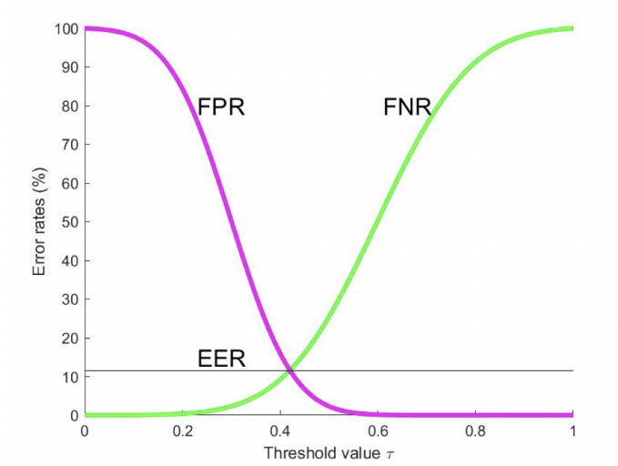

  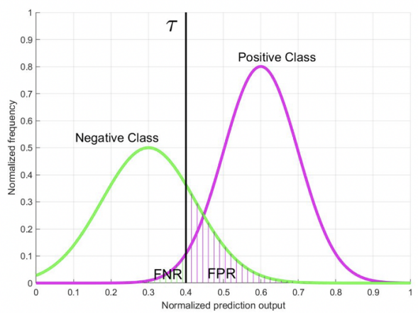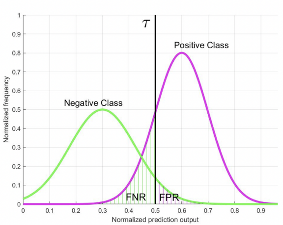

  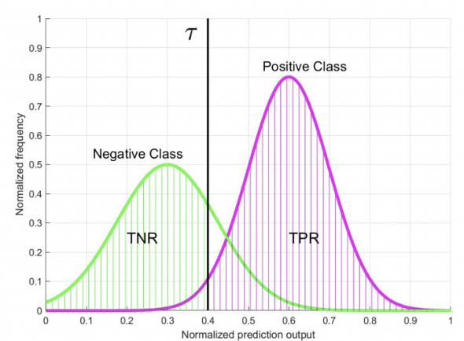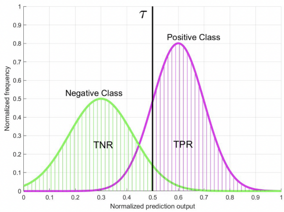

*   **EER**: The error rate when $FPR = FNR$.

#### 4.5.2 Detection Error Trade-off, DET Curve

* **X-axis**: FPR

* **Y-axis**: FNR

* **Characteristic**: The closer the curve is to the lower-left corner, the better.

  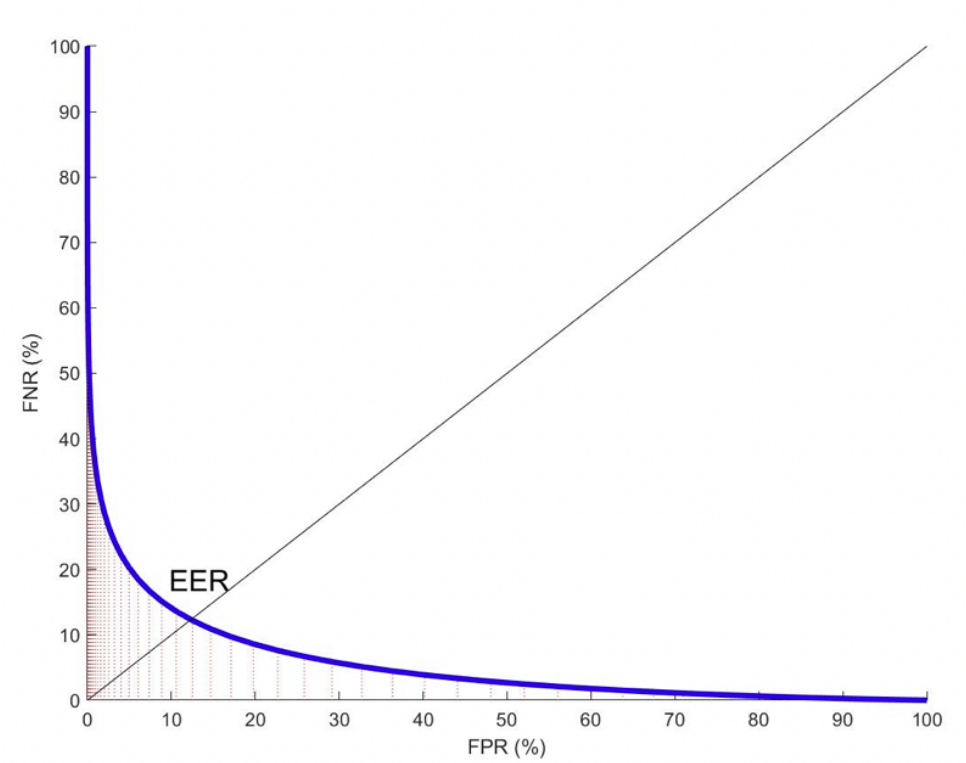

#### 4.5.3 Receiver Operating Characteristic, ROC Curve

* **X-axis**: FPR (False Positive Rate)

* **Y-axis**: TPR (True Positive Rate)

* **Characteristic**: The closer the curve is to the **upper-left corner**, the better.

* **Diagonal line ($y=x$)**: Represents Random Guess.

  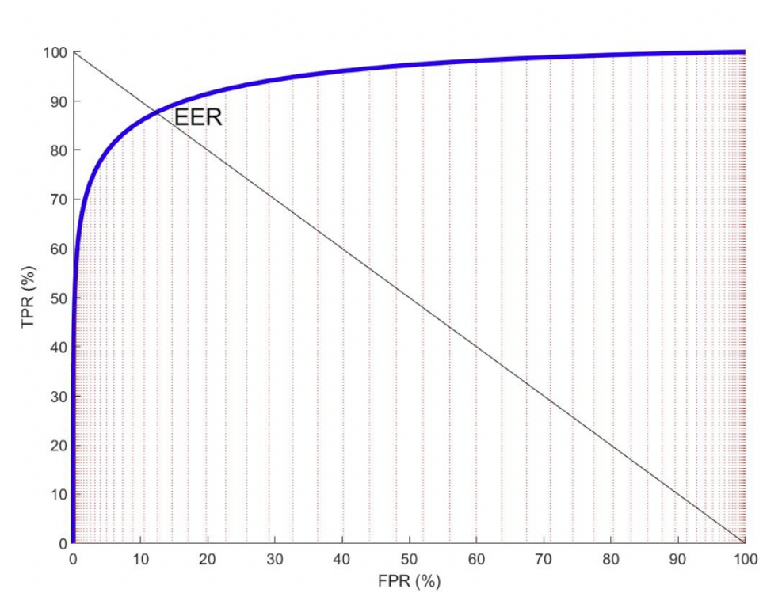

### 4.6 AUC - Area Under Curve

#### 4.6.1 Definition and Properties

*   **Definition**: AUC measures the probability that the classifier ranks a randomly chosen positive sample ahead of a randomly chosen negative sample.
*   **Range**: 0 to 1.
    *   AUC = 1: Perfect classification.
    *   AUC = 0.5: Random guessing.
    *   AUC = 0: Completely wrong predictions (all reversed).
*   **Properties**:
    *   **Scale-invariant**: The range of output values does not affect AUC; only relative ordering matters.
    *   **Threshold-invariant**: No specific threshold needs to be set; it measures overall ranking quality.

#### 4.6.2 Detailed Derivation of the AUC Calculation Formula

Assume we have $m^+$ positive samples and $m^-$ negative samples.
Let $g(x)$ be the score output by the predictor.

Define $e_{ij}$ as the score difference between the $i$-th positive sample and the $j$-th negative sample:
$$ e_{ij} = g(x_i^+) - g(x_j^-) $$

Introduce the **Heaviside step function** $u(e)$:
$$
u(e) = \begin{cases}
1, & \text{if } e > 0 \\
0.5, & \text{if } e = 0 \\
0, & \text{if } e < 0
\end{cases}
$$

**AUC calculation formula**:
$$
AUC = \frac{1}{m^+ m^-} \sum_{i=1}^{m^+} \sum_{j=1}^{m^-} u(e_{ij})
$$
**Explanation**:

1.  Iterate over all positive-negative sample pairs $(x_i^+, x_j^-)$.
2.  If the positive sample has a higher score than the negative sample ($e_{ij} > 0$), assign 1 point.
3.  If the scores are equal, assign 0.5 points.
4.  If the positive sample has a lower score, assign 0 points.
5.  Compute the average score (divide by the total number of pairs $m^+ m^-$).

#### 4.6.3 AUC Calculation Example

**Data**:

*   2 positive samples ($m^+=2$): $x_1^+, x_2^+$
*   2 negative samples ($m^-=2$): $x_1^-, x_2^-$
*   Prediction scores $g(x)$:
    *   $g(x_1^-) = 0.1$
    *   $g(x_2^-) = 0.4$
    *   $g(x_1^+) = 0.35$
    *   $g(x_2^+) = 0.8$

**Calculation steps**:
We need to compute $2 \times 2 = 4$ values of $e_{ij}$:

1.  $e_{11} = g(x_1^+) - g(x_1^-) = 0.35 - 0.1 = 0.25 > 0 \Rightarrow u=1$
2.  $e_{12} = g(x_1^+) - g(x_2^-) = 0.35 - 0.4 = -0.05 < 0 \Rightarrow u=0$
3.  $e_{21} = g(x_2^+) - g(x_1^-) = 0.8 - 0.1 = 0.7 > 0 \Rightarrow u=1$
4.  $e_{22} = g(x_2^+) - g(x_2^-) = 0.8 - 0.4 = 0.4 > 0 \Rightarrow u=1$

**Final AUC**:
$$
AUC = \frac{1}{2 \times 2} (1 + 0 + 1 + 1) = \frac{3}{4} = 0.75
$$
**Area Under the ROC Curve (AUC)**

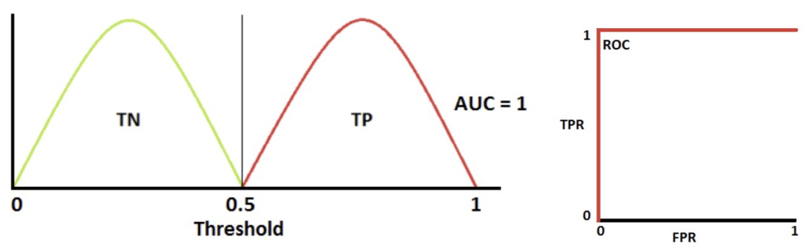

- **In the above case:**

  - All positive outputs are larger than all negative outputs
  - Given the threshold **0.5**, we have **TPR = 1, TNR = 1, FPR = 0, FNR = 0**
  - When the threshold is **lower than 0.5**, we have **TPR = 1, TNR < 1, 0 < FPR < 1, FNR = 0**
  - When the threshold is **larger than 0.5**, we have **0 < TPR < 1, TNR = 1, FPR = 0, FNR > 0**
  - Thus, the ROC curve is plotted at the top-right. It is easy to compute that **AUC = 1**.

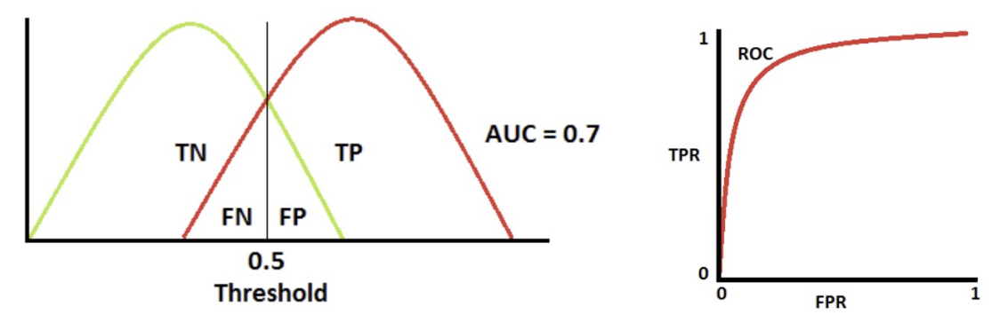

- **In the above case:**
  - We observe that given any threshold, we always have **TPR > FPR**, except for **threshold = 0**, where **TPR = FPR = 1**
  - Thus, the ROC curve is plotted at the top-right. It is easy to know **AUC > 0.5**.

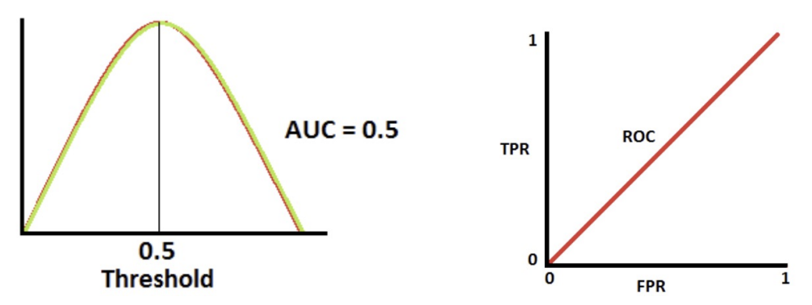

- **In the above case:**

  - Given any threshold, **FPR** is always equivalent to **TPR**

  - Thus, the ROC curve is a line **$y = x$**, and **AUC = 0.5**.

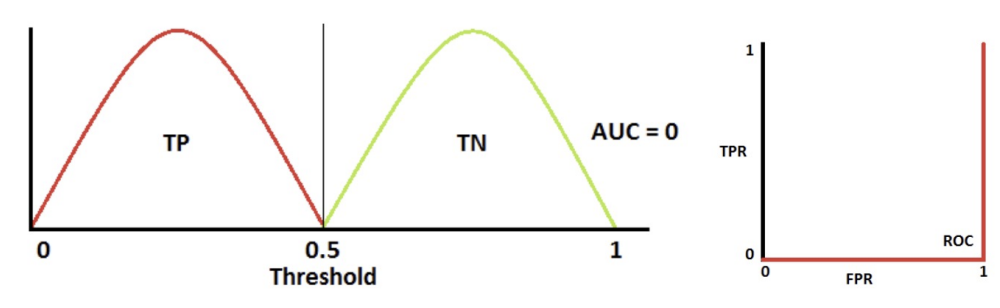

- **In the above case:**
  - All positive outputs are **smaller** than all negative outputs
  - Given the threshold **0.5**, we have **TPR = 0, TNR = 0, FPR = 1, FNR = 1**
  - When the threshold is **lower than 0.5**, we have **TPR > 0, TNR = 0, FPR = 1, FNR < 1**
  - When the threshold is **larger than 0.5**, we have **TPR = 0, TNR > 0, 0 < FPR < 1, FNR > 0**
  - Thus, the ROC curve is plotted at the top-right. It is easy to compute that **AUC = 0**.

### 4.7 Multicategory Evaluation

* The confusion matrix extends to $N \times N$.
  $$
  \begin{array}{c|c|c|c|c}
   & \mathbf{P_{\widehat{1}}} \text{ (predicted)} & \mathbf{P_{\widehat{2}}} \text{ (predicted)} & \dots & \mathbf{P_{\widehat{C}}} \text{ (predicted)} \\ \hline
  \mathbf{P_1} \text{ (actual)} & \color{green}{P_{1,\widehat{1}}} & \color{red}{P_{1,\widehat{2}}} & \dots & \color{red}{P_{1,\widehat{C}}} \\ \hline
  \mathbf{P_2} \text{ (actual)} & \color{red}{P_{2,\widehat{1}}} & \color{green}{P_{2,\widehat{2}}} & \dots & \color{red}{P_{2,\widehat{C}}} \\ \hline
  \vdots & \vdots & \vdots & \ddots & \vdots \\ \hline
  \mathbf{P_C} \text{ (actual)} & \color{red}{P_{C,\widehat{1}}} & \color{red}{P_{C,\widehat{2}}} & & \color{green}{P_{C,\widehat{C}}}
  \end{array}
  $$

*   ROC is complex to define in multiclass classification, and there is no unified standard.

## 5. Computational and Maintainability (Optional)

*   **Computational efficiency**: Fast speed and parallelization.
*   **Software quality**: Flexibility, scalability, modularity, maintainability.
*   **Trade-off**: Excessive pursuit of low-level computational efficiency (such as assembly-level parallelism) may sacrifice code readability and maintainability (such as the loss of object-oriented features). A careful balance is needed between the two.

# 14: Intro to Unsupervised Learning

## 1. Motivation

Why do we need unsupervised learning? The motivation mainly comes from the following two points:

### 1.1 Human Ability

Humans have the natural ability to divide unlabeled data into several groups (that is, clustering), thereby discovering useful structures in data.

*   **Application examples**:
    *   **Speaker diarization**: Distinguish who is speaking and when in an audio recording.
    *   **Image segmentation**: Divide an image into multiple meaningful regions.
    *   **Face clustering**: Group faces according to identity.

### 1.2 Practical Difficulties (Label Scarcity)

In real applications, obtaining enough labels is very difficult:

*   **Expensive**: Some tasks (such as medical image analysis) require expert annotation and have extremely high costs.
*   **Time-consuming**: Supervised learning for deep neural networks requires large-scale labeled databases (e.g., ImageNet contains 1 million labeled images across 1000 categories).

**Conclusion**: Using unlabeled data for machine learning (that is, unsupervised learning) is very useful and necessary.

## 2. Definition

### 2.1 Definition of Unsupervised Learning

*   **Dataset**: A collection of unlabeled samples $D = \{x_i\}_{i=1}^M$.
    *   $x$: Feature vector.
*   **Goal**: Create a model that takes the feature vector $x$ as input and transforms it into another vector or a value for solving practical problems.
*   **Typical applications**:
    *   Anomaly detection
    *   Data compression
    *   Discovery of new species

### 2.2 Supervised Learning vs Unsupervised Learning

| Feature                | Supervised Learning                                          | Unsupervised Learning                                        |
| :--------------------- | :----------------------------------------------------------- | :----------------------------------------------------------- |
| **Training set**       | $D = \{(x_i, y_i)\}_{i=1}^N$ (contains labels $y$)           | $D = \{(x_i)\}_{i=1}^N$ (unlabeled)                          |
| **Goal**               | Fit the relationship from input $x$ to label $y$; labels represent the desired behavior. | Because labels are absent, there is no firm reference point for judging model quality. |
| **Evaluation metrics** | Defined based on labels, such as Accuracy.                   | Defined based on the specific task (such as clustering quality or structure preservation after dimensionality reduction). |

## 3. Main Approaches

This lecture introduces five major approaches to unsupervised learning.

### 3.1 Clustering

*   **Definition**: Group a set of objects so that objects in the same group (called a Cluster) are more similar to each other in some sense than to objects in other groups.
*   **Typical algorithm**: K-means clustering.

### 3.2 Dimensionality Reduction

*   **Principal Component Analysis (PCA)**:
    *   **Definition**: A technique that transforms observations of possibly correlated variables into values of linearly uncorrelated variables called principal components.
    *   **Goal**: Find a new low-dimensional space to represent data points in the original high-dimensional space while preserving the data structure (variance) as much as possible.
    *   **Example**: Find two orthogonal coordinates (PC1 and PC2) to represent data in the original 3D space.

### 3.3 Density Estimation

*   **Background**: In machine learning, we assume the training set $D = \{(x_i)\}_{i=1}^N$ is sampled from some distribution $P(X)$. But in practice, we cannot explicitly write down this underlying distribution.
*   **Task**: Estimate the probability density function (PDF) of this distribution based on observed data.

#### Core Model: Kernel Density Estimation, KDE

**1. Problem setup**:
Let $D = \{(x_i)\}_{i=1}^N$ be a one-dimensional dataset, and assume samples come from a distribution with an unknown probability density function $f$. The task is to model the shape of $f$ based on $D$.

**2. KDE model formula**:
$$
\hat{f}_b(x) = \frac{1}{Nb} \sum_{i=1}^{N} k\left( \frac{x - x_i}{b} \right)
\\ k(z) = \frac{1}{\sqrt{2\pi}} \exp\left( -\frac{z^2}{2} \right)
$$
**3. Detailed explanation of the formula and parameters**:

*   **$\hat{f}_b(x)$**: The estimated probability density at point $x$.
*   **$N$**: Total number of samples.
*   **$x_i$**: The $i$-th observed data point.
*   **$k(\cdot)$**: **Kernel function**. It defines the shape of each data point's contribution to the surrounding density.
    *   The kernel function is usually symmetric and integrates to 1 (i.e., $\int k(z)dz = 1$).
*   **$b$**: **Kernel size** or **Bandwidth**.
    *   This is a **Hyper-parameter**.
    *   $b > 0$.
    *   **Role**: Controls the smoothness of the estimated curve. If $b$ is too small, the curve overfits (many spikes appear); if $b$ is too large, the curve is over-smoothed (details are lost). It is usually tuned using **K-fold cross-validation**.
*   **$\frac{1}{Nb}$**: Normalization coefficient, ensuring that the final $\hat{f}_b(x)$ integrates to 1, thereby forming a valid probability density function.

**4. Gaussian Kernel example**:
$$
k(z) = \frac{1}{\sqrt{2\pi}} \exp\left( -\frac{z^2}{2} \right)
$$
This is the density function of the standard normal distribution.

**5. KDE derivation with the Gaussian Kernel**:
Substitute the Gaussian kernel into the general KDE formula:
$$
\hat{f}_b(x) = \frac{1}{N} \sum_{i=1}^{N} \frac{1}{\sqrt{2\pi b^2}} \exp\left( -\frac{(x - x_i)^2}{2b^2} \right)
$$

*   **Intuition**: This is equivalent to placing a Gaussian distribution (a small bump) with mean $x_i$ and standard deviation $b$ at every data point $x_i$. The final density estimate is the **average** of all these small Gaussian distributions.

### 3.4 Autoencoder

*   **Definition**: An artificial neural network used to learn efficient coding of unlabeled data.

*   **Structure**:
    *   **Input**: Image/data $x$.
    *   **Middle layer**: The activation vector can be viewed as a **Low-dimensional representation** of the input.
    *   **Output**: Reconstructed image/data $\hat{x}$.

*   **Applications**:
    *   Image restoration (recover old/blurring images).
    *   Style transfer.
    *   **DeepFakes**: Generate fake videos (such as face swapping).

    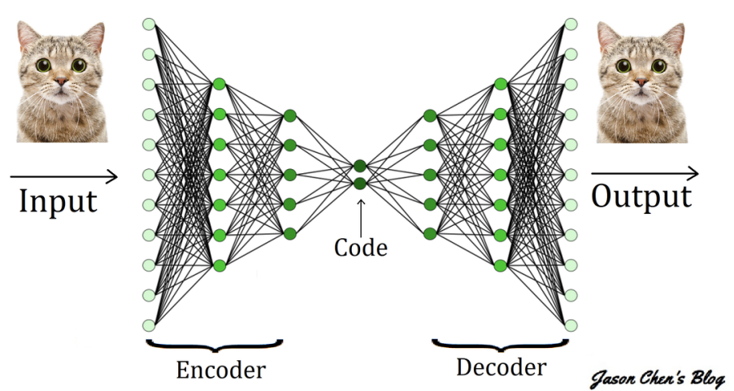

### 3.5 Self-supervised Learning

*   **Definition**: A promising class of methods that build representations by learning encodings of "what makes two things similar or different".
*   **Core mechanism**: Contrastive learning.
*   **Advantages**:
    1.  **Pretraining large-scale deep neural networks (Foundation Models)**:
        *   Use massive data for pretraining to provide good feature representations.
        *   Models can generalize to different downstream tasks.
    2.  **Robustness**:
        *   Insensitive to noisy labels or malicious labels in the training set.
        *   **Security application**: Successfully applied to defense against Backdoor attacks, such as the DBD (De-Backdoor) method.

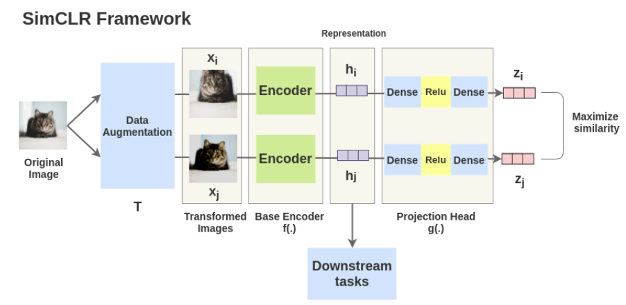

# 15: K-means Clustering

## 1. K-means Clustering

### 1.1 Definition

*   **Basic concept**: K-means clustering is a **Vector Quantization** method that originated in signal processing.
*   **Goal**: Partition $n$ observations (samples) into $K$ Clusters.
*   **Rule**: Each observation belongs to the cluster with the nearest **mean** (cluster center or Cluster Centroid). The cluster center serves as the prototype of that cluster.
*   **Mathematical objective**: Minimize **Within-cluster variances**, usually measured by squared Euclidean distance.

### 1.2 Basic Algorithm

K-means is an iterative algorithm that mainly consists of the following steps:

1.  **Initialization**:
    *   Choose the number of clusters $K$.
    *   Randomly place $K$ feature vectors in the feature space as the initial Centroids $\{c_1, ..., c_K\}$.

2.  **Assignment**:
    *   Compute the distance from each sample $x$ to each centroid $c$ (usually using Euclidean distance).
    *   Assign each sample to the nearest centroid (equivalent to labeling the sample with the centroid ID).

3.  **Update/Refitting**:
    *   For each cluster, compute the **average feature vector** of all samples assigned to that cluster.
    *   Use these average vectors as the new centroid positions.

4.  **Iteration**:
    *   Recompute distances and modify assignments.
    *   Repeat the above process until **convergence** (that is, after centroid positions are recomputed, the sample assignments no longer change).

### 1.3 Optimization Perspective

#### 1.3.1 Objective Function

Given the dataset $\{x_i\}_{i=1}^n$, K-means aims to find cluster centers $c = \{c_j\}_{j=1}^K$ and assignment matrix $r$ by minimizing the sum of squared distances from data points to their assigned cluster centers.

**Objective function $J(c, r)$**:
$$
J(c, r) = \sum_{i=1}^{n} \sum_{k=1}^{K} r_{ik} ||x_i - c_k||^2
$$
**Constraints**:

1.  $r_{ik} \in \{0, 1\}$: $r_{ik}=1$ means sample $x_i$ is assigned to cluster $k$; otherwise it is 0.
2.  $\sum_{k=1}^{K} r_{ik} = 1$: Each sample must belong to exactly one cluster.

#### 1.3.2 Solution Method: Coordinate Descent

This problem can be solved by coordinate descent, namely alternately updating $c$ and $r$.

**Step 1: Assignment - Fix $c$, update $r$**
We need to solve the following subproblem:
$$
\min_{r} \sum_{i=1}^{n} \sum_{k=1}^{K} r_{ik} ||x_i - c_k||^2
$$

$$
\text{s.t. } r_{ik} \in \{0, 1\}^{n\times K}, \sum_{k}^K r_{ik} = 1
$$

*   **Derivation**:
    Since the assignment of each data point $x_i$ is independent, we can minimize separately for each $i$:
    $$
    \min_{r_i} \sum_{k=1}^{K} r_{ik} ||x_i - c_k||^2
    $$
    To minimize the above expression, and since $r_{ik}$ can only be 0 or 1, we should clearly assign $r_{ik}=1$ to the $k$ that minimizes $||x_i - c_k||^2$​.
*   **Optimal solution**:
    $$
    k^* = \arg\min_{1 \le k \le K} ||x_i - c_k||^2
    $$
    
    $$
    r_{ik^*} = 1, \quad \text{others are } 0
    $$
    
    *Explanation*: This is exactly the algorithmic step of "assigning $x_i$ to the nearest cluster".

**Step 2: Refitting - Fix $r$, update $c$**
We need to solve the following subproblem:
$$
\min_{c} \sum_{i=1}^{n} \sum_{k=1}^{K} r_{ik} ||x_i - c_k||^2
$$

*   **Derivation**:
    $c_1, ..., c_K$ can be optimized independently. For a specific cluster center $c_k$, the objective function is:
    $$
    J(c_k) = \sum_{i=1}^{n} r_{ik} ||x_i - c_k||^2
    $$
    This is a convex function with respect to $c_k$. To find the minimum, take the partial derivative with respect to $c_k$ and set it to 0.
    $$
    \begin{aligned}
    \frac{\partial J}{\partial c_k}
    &= \sum_{i=1}^{n} r_{ik} \cdot \frac{\partial}{\partial c_k} (x_i - c_k)^T (x_i - c_k) \\
    &= \sum_{i=1}^{n} r_{ik} \cdot 2(c_k - x_i) = 0
    \end{aligned}
    $$
*   **Optimal solution**:
    $$
    c_k = \frac{\sum_{i=1}^{n} r_{ik} x_i}{\sum_{i=1}^{n} r_{ik}}
    $$
    *Explanation*:
    
    *   The denominator $\sum r_{ik}$ is the number of samples assigned to cluster $k$.
    *   The numerator $\sum r_{ik} x_i$ is the sum of all sample vectors assigned to cluster $k$.
    *   Conclusion: $c_k$ is the **Mean** of all samples in that cluster.

#### 1.3.3 Convergence

*   **Guarantee**:
    *   When the assignment $r$ changes, data points become closer to the new centers, so the objective function $J$ decreases.
    *   When the centers $c$ move to the means, according to the least-squares property, the objective function $J$ decreases.
    *   Since $J$ has a lower bound ($\ge 0$) and decreases monotonically at each step, the algorithm must converge.
*   **Local Minimum**:
    *   The objective function $J$ is **Non-convex**.
    *   K-means **cannot guarantee** convergence to the global optimum and may get trapped in a local optimum.
    *   **Solution**: Run K-means multiple times (using different random initializations) and choose the result with the smallest objective function value.

### 1.4 Application Example

*   **Vector Quantization**: Image compression. Classify many color points into $K$ representative colors, and use centroid colors to replace regional colors.

### 1.5 K-means Variants - Optional

*   **Fuzzy C-means**: Soft clustering; a point can belong to multiple clusters with different probabilities.
*   **Constrained K-means**: Clustering with constraints.
*   **Accelerated K-means**: Accelerated algorithms (such as using the triangle inequality to reduce distance computations).

## 2. Performance Evaluation

Since unsupervised learning has no labels, evaluation is relatively difficult. Metrics are mainly divided into two categories.

### 2.1 Internal Evaluation Metrics

No ground-truth labels are needed; evaluation is based only on the distribution of the data itself.

#### Silhouette Coefficient

For a single sample $i$:

1.  **$a$**: The average distance between sample $i$ and all other points in the **same cluster** (within-cluster compactness).
2.  **$b$**: The average distance between sample $i$ and all points in the **nearest neighboring cluster** (that is, the cluster not containing $i$ that is closest to $i$) (between-cluster separation).

**Formula**:
$$
s = \frac{b - a}{\max(a, b)}
$$
**Piecewise form**:
$$
s = \begin{cases} 1 - a/b & \text{if } a < b \\ 0 & \text{if } a = b \\ b/a - 1 & \text{if } a > b \end{cases} \quad \in  (-1, 1)
$$
**Explanation**:

*   The closer $s$ is to 1, the more $a \ll b$, and the better the clustering result (compact within clusters and separated between clusters).
*   The silhouette coefficient of the whole dataset is the mean of the $s$ values over all samples.

### 2.2 External Evaluation Metrics

Ground Truth labels are needed as a reference.

#### Rand Index (RI)

Given $n$ samples $S$, compare two clustering results $X$ (algorithm result) and $Y$ (ground-truth labels).
Consider all possible sample pairs (a total of $\binom{n}{2}$ pairs), and define the following counts:

*   **$a$**: Number of pairs that are in the same cluster in $X$ and also in the same cluster in $Y$ (TP).
*   **$b$**: Number of pairs that are in different clusters in $X$ and also in different clusters in $Y$ (TN).
*   **$c$**: Number of pairs that are in the same cluster in $X$ but in different clusters in $Y$ (FP).
*   **$d$**: Number of pairs that are in different clusters in $X$ but in the same cluster in $Y$ (FN).

**Formula**:
$$
RI = \frac{a + b}{a + b + c + d} = \frac{a + b}{\binom{n}{2}} = \frac{a + b}{n(n-1)/2}
$$
**Explanation**:

*   $RI \in [0, 1]$.
*   A higher score indicates higher similarity (the clustering result is closer to the ground-truth labels).

#### Adjusted Rand Index (ARI)

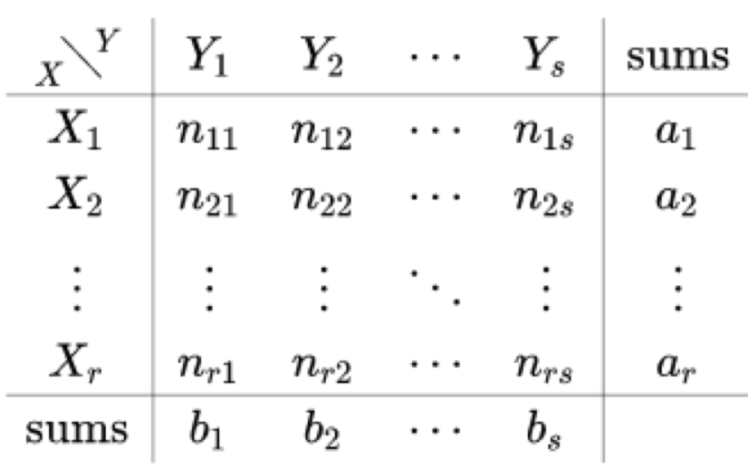

The problem with RI is that for random clustering results, RI is not 0. ARI adjusts for randomness.
Using a Contingency Table, $n_{ij}$ denotes the number of samples that belong to both $X_i$ and $Y_j$.

**Formula**:
$$
\begin{aligned}
ARI
&= \frac{\sum_{ij} \binom{n_{ij}}{2} - [\sum_i \binom{a_i}{2} \sum_j \binom{b_j}{2}] / \binom{n}{2}}{ \frac{1}{2} [\sum_i \binom{a_i}{2} + \sum_j \binom{b_j}{2}] - [\sum_i \binom{a_i}{2} \sum_j \binom{b_j}{2}] / \binom{n}{2} } \\
\end{aligned}
$$

*   Here $a_i$ is the row sum of $X_i$, and $b_j$ is the column sum of $Y_j$.
*   Understanding the formula structure: $ARI = \frac{\text{Index} - \text{Expected Index}}{\text{Max Index} - \text{Expected Index}}$.

**Explanation**:

*   ARI can be negative.
*   ARI = 1 means perfect clustering.
*   ARI $\approx$ 0 means random clustering.

## 3. Other Clusterings

Besides K-means, there are many other methods:

*   **Hierarchical clustering**
*   **Graph based clustering**
*   **Density based clustering**
*   **Probabilistic clustering**

# 16: GMM & EM Algorithm

## 1. Mixture Models and GMM Basics

### 1.1 Concept of Mixture Models

In unsupervised clustering, we do not have class labels $z$. A mixture model introduces a **Latent Variable** $z$ to model the marginal distribution of the observed data $x$:
$$
p(x) = \sum_{z} p(x, z) = \sum_{z} p(x|z)p(z)
$$

### 1.2 Gaussian Mixture Model (GMM)

GMM is the most common mixture model. It assumes that the data are generated by a linear combination of $K$ Gaussian distributions.

**Probability Density Function (PDF):**
$$
p(x) = \sum_{k=1}^{K} \pi_k \mathcal{N}(x | \mu_k, \Sigma_k)
$$

**Parameter definitions:**

* $x$: A $d$-dimensional feature vector.

* $\pi_k$: Mixing coefficients, i.e., the prior probability $p(z=k)$.

  *   Constraints: $\sum_{k=1}^{K} \pi_k = 1$ and $0 \le \pi_k \le 1$.

* $\mu_k$: The mean of the $k$-th Gaussian component.

* $\Sigma_k$: The covariance matrix of the $k$-th Gaussian component.

* $\mathcal{N}(x | \mu_k, \Sigma_k)$: Multivariate Gaussian distribution, with formula:
  $$
  \mathcal{N}(x | \mu_k, \Sigma_k) = \frac{1}{(2\pi)^{d/2}|\Sigma_k|^{1/2}} \exp \left( -\frac{1}{2} (x - \mu_k)^T \Sigma_k^{-1} (x - \mu_k) \right)
  $$

## 2. MLE for GMM 

### 2.1 Log-Likelihood Function

* The log-likelihood is

Given dataset $X = \{x^{(1)}, \dots, x^{(N)}\}$, the log-likelihood function of GMM is:
$$
\log \mathcal{L}(\boldsymbol{\Theta}) = \ln p(\mathbf{X} \mid \boldsymbol{\pi}, \boldsymbol{\mu}, \boldsymbol{\Sigma}) = \sum_{n=1}^{N} \ln \left( \sum_{k=1}^{K} \pi_k \mathcal{N} \left( \mathbf{x}^{(n)} \mid \boldsymbol{\mu}_k, \boldsymbol{\Sigma}_k \right) \right)
$$

where $\mathbf{X} = \{\mathbf{x}^{(1)}, \dots, \mathbf{x}^{(N)}\}$, $\boldsymbol{\Theta} = \{\boldsymbol{\pi}, \boldsymbol{\mu}, \boldsymbol{\Sigma}\}$, $\boldsymbol{\pi} = \{\pi_1, \dots, \pi_K\}$, $\boldsymbol{\mu} = \{\boldsymbol{\mu}_1, \dots, \boldsymbol{\mu}_K\}$, and $\boldsymbol{\Sigma} = \{\boldsymbol{\Sigma}_1, \dots, \boldsymbol{\Sigma}_K\}$.

**Difficulty:** Because there is a summation inside the logarithm ($\ln \sum$), a closed-form solution cannot be obtained directly. Setting the derivatives to 0 gives a system of mutually dependent equations.

### 2.2 Introducing "Responsibility"

Define $\gamma(z_{nk})$ as the **posterior probability** (i.e., responsibility) of the $k$-th Gaussian component for the $n$-th sample:
$$
\gamma(z_{nk}) = p(z^{(n)}=k | x^{(n)}) = \frac{\pi_k \mathcal{N}(x^{(n)} | \mu_k, \Sigma_k)}{\sum_{j=1}^{K} \pi_j \mathcal{N}(x^{(n)} | \mu_j, \Sigma_j)}
$$
Let $N_k = \sum_{n=1}^{N} \gamma(z_{nk})$ be the effective number of samples assigned to the $k$-th cluster.

### 2.3 Derivation of Parameter Update Formulas (Detailed Steps)

#### (1) Derivation with respect to the mean $\mu_k$

Goal: Differentiate $\ln p(X)$ with respect to $\mu_k$ and set it to 0.
Using the chain rule, note that $\mu_k$ appears only in the $k$-th component:
$$
\begin{aligned}
\frac{\partial \ln p(X)}{\partial \mu_k}
&= \sum_{n=1}^{N} \frac{\partial}{\partial \mu_k} \ln \left( \sum_{j=1}^{K} \pi_j \mathcal{N}(x^{(n)} | \mu_j, \Sigma_j) \right) \\
& = \sum_{n=1}^{N} \frac{1}{\sum_{j=1}^{K} \pi_j \mathcal{N}(x^{(n)}|\dots)} \cdot \frac{\partial}{\partial \mu_k} (\pi_k \mathcal{N}(x^{(n)} | \mu_k, \Sigma_k))
\end{aligned}
$$

The derivative of a Gaussian distribution with respect to the mean is known to be $\mathcal{N}(x|\mu, \Sigma) \Sigma^{-1}(x-\mu)$, so:
$$
= \sum_{n=1}^{N} \underbrace{\frac{\pi_k \mathcal{N}(x^{(n)} | \mu_k, \Sigma_k)}{\sum_{j=1}^{K} \pi_j \mathcal{N}(x^{(n)} | \mu_j, \Sigma_j)}}_{\gamma(z_{nk})} \cdot \Sigma_k^{-1}(x^{(n)} - \mu_k) = 0
$$

$$
\sum_{n=1}^{N} \gamma(z_{nk}) \Sigma_k^{-1}(x^{(n)} - \mu_k) = 0
$$

$$
\mu_k \sum_{n=1}^{N} \gamma(z_{nk}) = \sum_{n=1}^{N} \gamma(z_{nk}) x^{(n)}
$$

**Result:**
$$
\mu_k = \frac{1}{N_k} \sum_{n=1}^{N} \gamma(z_{nk}) x^{(n)}
$$

#### (2) Derivation with respect to the covariance $\Sigma_k$

Similarly, differentiating with respect to $\Sigma_k$ and setting the derivative to 0 gives:
$$
\begin{aligned}\frac{\partial \mathcal{L}}{\partial \mathbfit{\Sigma }_{k}}&=\sum _{n=1}^{N}\frac{\partial }{\partial \mathbfit{\Sigma }_{k}}\ln \left(\sum _{j=1}^{K}\pi _{j}\mathcal{N}(\mathbf{x}^{(n)}|\mathbfit{\mu }_{j},\mathbfit{\Sigma }_{j})\right)\\ &=\sum _{n=1}^{N}\frac{1}{\sum _{j=1}^{K}\pi _{j}\mathcal{N}(\mathbf{x}^{(n)}|\dots )}\cdot \frac{\partial }{\partial \mathbfit{\Sigma }_{k}}\left[\pi _{k}\mathcal{N}(\mathbf{x}^{(n)}|\mathbfit{\mu }_{k},\mathbfit{\Sigma }_{k})\right]\\ &=\sum _{n=1}^{N}\underbrace{\frac{\pi _{k}\mathcal{N}(\mathbf{x}^{(n)}|\mathbfit{\mu }_{k},\mathbfit{\Sigma }_{k})}{\sum _{j=1}^{K}\pi _{j}\mathcal{N}(\mathbf{x}^{(n)}|\mathbfit{\mu }_{j},\mathbfit{\Sigma }_{j})}}_{\gamma _{k}^{(n)}}\frac{\partial }{\partial \mathbfit{\Sigma }_{k}}\ln \mathcal{N}(\mathbf{x}^{(n)}|\mathbfit{\mu }_{k},\mathbfit{\Sigma }_{k})\\ 0&=\sum _{n=1}^{N}\gamma _{k}^{(n)}\left[-\frac{1}{2}\mathbfit{\Sigma }_{k}^{-1}+\frac{1}{2}\mathbfit{\Sigma }_{k}^{-1}(\mathbf{x}^{(n)}-\mathbfit{\mu }_{k})(\mathbf{x}^{(n)}-\mathbfit{\mu }_{k})^{\top }\mathbfit{\Sigma }_{k}^{-1}\right]\\ \sum _{n=1}^{N}\gamma _{k}^{(n)}\mathbfit{\Sigma }_{k}^{-1}&=\sum _{n=1}^{N}\gamma _{k}^{(n)}\mathbfit{\Sigma }_{k}^{-1}(\mathbf{x}^{(n)}-\mathbfit{\mu }_{k})(\mathbf{x}^{(n)}-\mathbfit{\mu }_{k})^{\top }\mathbfit{\Sigma }_{k}^{-1}\\ N_{k}\mathbf{I}&=\left(\sum _{n=1}^{N}\gamma _{k}^{(n)}(\mathbf{x}^{(n)}-\mathbfit{\mu }_{k})(\mathbf{x}^{(n)}-\mathbfit{\mu }_{k})^{\top }\right)\mathbfit{\Sigma }_{k}^{-1}\\ \mathbfit{\Sigma }_{k}&=\frac{1}{N_{k}}\sum _{n=1}^{N}\gamma _{k}^{(n)}(\mathbf{x}^{(n)}-\mathbfit{\mu }_{k})(\mathbf{x}^{(n)}-\mathbfit{\mu }_{k})^{\top }\end{aligned}
$$

**Result:**
$$
\Sigma_k = \frac{1}{N_k} \sum_{n=1}^{N} \gamma(z_{nk}) (x^{(n)} - \mu_k)(x^{(n)} - \mu_k)^T
$$

#### (3) Derivation with respect to the mixing coefficient $\pi_k$ (Lagrange multiplier method)

Goal: Maximize $\ln p(X)$ under the constraint $\sum_{k=1}^{K} \pi_k = 1$.
Construct the Lagrangian:
$$
\mathcal{L} = \ln p(X) + \lambda \left( \sum_{k=1}^{K} \pi_k - 1 \right)
$$
Differentiate with respect to $\pi_k$:
$$
\frac{\partial \mathcal{L}}{\partial \pi_k} = \sum_{n=1}^{N} \frac{\mathcal{N}(x^{(n)} | \mu_k, \Sigma_k)}{\sum_{j=1}^{K} \pi_j \mathcal{N}(x^{(n)} | \mu_j, \Sigma_j)} + \lambda = 0
$$
Multiply both sides by $\pi_k$:
$$
\sum_{n=1}^{N} \underbrace{\frac{\pi_k \mathcal{N}(x^{(n)} | \mu_k, \Sigma_k)}{\sum_{j=1}^{K} \pi_j \mathcal{N}(x^{(n)} | \dots)}}_{\gamma(z_{nk})} + \lambda \pi_k = 0
$$

$$
N_k + \lambda \pi_k = 0
$$

Sum over all $k$ to solve for $\lambda$:
$$
\sum_{k=1}^{K} N_k + \lambda \sum_{k=1}^{K} \pi_k = 0 \implies \sum_{n=1}^{N} \underbrace{\sum_{k=1}^{K} \gamma(z_{nk})}_{1} + \lambda(1) = 0 \implies N + \lambda = 0 \implies \lambda = -N
$$
**Result:**
$$
\pi_k = \frac{N_k}{N} \text{, where } N_k = \sum_{n=1}^{N} \gamma(z_{nk})
$$

## 3. Comparison between GMM and K-Means

| Feature               | K-Means                                                      | GMM (EM Algorithm)                                           |
| :-------------------- | :----------------------------------------------------------- | :----------------------------------------------------------- |
| **Assignment method** | Hard Assignment                                              | Soft Assignment, probabilistic                               |
| **Model assumption**  | Assumes clusters are spherical (covariance is the identity matrix) | Can learn arbitrary ellipsoidal covariance                   |
| **Center update**     | Based only on the mean of data points belonging to that cluster | Based on the weighted mean of all data points (weights are responsibilities $\gamma$) |
| **Essence**           | Special case of GMM ($\Sigma \to 0$ or $\Sigma=I$)           | Probability density estimation                               |

> 1. **软分配变为硬分配 (E-Step 推导)**
>
> 在 GMM 中，数据点$x_{n}$属于第$k$个簇的概率（责任频率）为：
>
> $$
> \gamma (z_{nk})=\frac{\pi _{k}\mathcal{N}(x_{n}|\mu _{k},\Sigma _{k})}{\sum _{j=1}^{K}\pi _{j}\mathcal{N}(x_{n}|\mu _{j},\Sigma _{j})}
> $$
>
> 假设所有簇的权重相等 ($\pi_k = 1/K$)，且协方差矩阵相等并趋于 0（即 $\Sigma_k = \epsilon I$，其中 $\epsilon \to 0$）。代入高斯分布公式：
>
> $$
> \mathcal{N}(x_{n}|\mu _{k},\epsilon I)\propto \exp \left(-\frac{\|x_{n}-\mu _{k}\|{}^{2}}{2\epsilon }\right)
> $$
>
> 此时概率公式变为：
>
> $$
> \gamma (z_{nk})=\frac{\exp \left(-\frac{\|x_{n}-\mu _{k}\|{}^{2}}{2\epsilon }\right)}{\sum _{j=1}^{K}\exp \left(-\frac{\|x_{n}-\mu _{j}\|{}^{2}}{2\epsilon }\right)}
> $$
>
> - **当 $\epsilon \to 0$ 时**：指数项中距离最近的那个 $\mu _{k}$ 会占据绝对主导地位。
> - 如果 $x_{n}$ 距离 $\mu _{k}$ 最近，则 $\gamma(z_{nk}) \to 1$；对于其他所有 $j \neq k$，$\gamma(z_{nj}) \to 0$。
> - **结论**：概率性的“软分配”退化成了非黑即白的“硬分配”，这正是 K-Means 的分配逻辑。
>
> ---
>
> 2. **均值更新的等价性 (M-Step 推导)**
>
> 在 GMM 的 M 步中，簇中心$\mu _{k}$的更新公式为：
>
> $$
> \mu _{k}=\frac{\sum _{n=1}^{N}\gamma (z_{nk})x_{n}}{\sum _{n=1}^{N}\gamma (z_{nk})}
> $$
>
> - 在上述 $\epsilon \to 0$ 的极限条件下，$\gamma(z_{nk})$ 只有在 $x_{n}$ 属于簇 $k$ 时为 1，否则为 0。
> - 于是，分母变为“属于簇 $k$ 的样本总数 $N_{k}$”。
> - 分子变为“属于簇 $k$ 的样本特征之和”。
> - **结论**：更新公式变为 $\mu_k = \frac{1}{N_k} \sum_{x \in C_k} x$，这正是 K-Means 的质心计算方法。

### Algorithm for Fitting GMM, from MLE

**Initialize $\mu_k, \Sigma_k$, and $\pi_k, k = 1, \dots, K$. Iterate until convergence:**

- **Step 1: Evaluate the responsibilities given current parameters**

$$
\gamma _{k}^{(n)}=\frac{\pi _{k}\mathcal{N}(\mathbf{x}^{(n)}|\mu _{k},\Sigma _{k})}{\sum _{j=1}^{K}\pi _{j}\mathcal{N}(\mathbf{x}^{(n)}|\mu _{j},\Sigma _{j})},\quad k=1,\dots ,K,\quad n=1,\dots ,N.
$$
- **Step 2: Re-estimate the parameters given current responsibilities**

$$
\mu _{k}=\frac{1}{N_{k}}\sum _{n=1}^{N}\gamma _{k}^{(n)}\mathbf{x}^{(n)},
$$

$$
\Sigma _{k}=\frac{1}{N_{k}}\sum _{n=1}^{N}\gamma _{k}^{(n)}(\mathbf{x}^{(n)}-\mu _{k})(\mathbf{x}^{(n)}-\mu _{k})^{T},
$$

$$
\pi _{k}=\frac{N_{k}}{N},\text{\ with\ }N_{k}=\sum _{n=1}^{N}\gamma _{k}^{(n)}.
$$
- **Evaluate the log-likelihood and check for convergence**

$$
\ln p(\mathbf{X}|\pi ,\mu ,\Sigma )=\sum _{n=1}^{N}\ln \left(\sum _{k=1}^{K}\pi _{k}\mathcal{N}(\mathbf{x}^{(n)}|\mu _{k},\Sigma _{k})\right).
$$

This algorithm is actually the well-known **Expectation-Maximization (EM)** algorithm, where Steps 1 and 2 are called **E-step** and **M-step** respectively.

## 4. EM Algorithm

### 4.0 Latent Variable Models 

- **Definition:** A latent variable model is a statistical model that relates a set of observable variables to a set of latent variables.
- Some model variables may be unobserved, either at training or at testing time, or both. Variables which are always unobserved are called **latent variables**, or sometimes **hidden variables**.
- We may want to intentionally introduce latent variables to model complex dependencies between variables – this can actually simplify the model
- According to the type of latent variables, there are two types of LVMs,
  - LVM with continuous latent variables, *e.g.*, factor analysis
  - LVM with discrete latent variables, *e.g.*, mixture models

### 4.1 Log-Likelihood Decomposition

- We introduce a hidden (latent) variable $z$, indicating which Gaussian component generates the observation $\mathbf{x}$, with some probability.

- Let $z \sim \text{Categorical}(\boldsymbol{\pi})$, where $\boldsymbol{\pi} \geq 0, \quad \sum_k \pi_k = 1$

- Then:
  $$
  p(\mathbf{x})=\sum _{k=1}^{K}p(\mathbf{x},z=k)=\sum _{k=1}^{K}\underbrace{p(z=k)}_{\pi _{k}}\underbrace{p(\mathbf{x}\mid z=k)}_{\mathcal{N}(\mathbf{x}\mid \mathbfit{\mu }_{k},\mathbfit{\Sigma }_{k})}
  $$

$$
\begin{aligned}\ell (\mathbfit{\pi },\mathbfit{\mu },\mathbfit{\Sigma })&=\ln p(\mathbf{X}\mid \mathbfit{\pi },\mathbfit{\mu },\mathbfit{\Sigma })=\sum _{n=1}^{N}\ln p\left(\mathbf{x}^{(n)}\mid \mathbfit{\pi },\mathbfit{\mu },\mathbfit{\Sigma }\right)\\ &=\sum _{n=1}^{N}\ln \sum _{k=1}^{K}p\left(\mathbf{x}^{(n)},z^{(n)}=k\mid \mathbfit{\pi },\mathbfit{\mu },\mathbfit{\Sigma }\right)\\ &=\sum _{n=1}^{N}\ln \sum _{k=1}^{K}p\left(\mathbf{x}^{(n)}\mid z^{(n)}=k;\mathbfit{\mu },\mathbfit{\Sigma }\right)p(z^{(n)}=k\mid \mathbfit{\pi })\end{aligned}
$$
$$
\log p(\mathcal{D};\mathbfit{\theta })=\sum _{n=1}^{N}\log p\left(\mathbf{x}^{(n)};\mathbfit{\theta }\right)=\sum _{n=1}^{N}\log \left(\sum _{z^{(n)}}p\left(z^{(n)},\mathbf{x}^{(n)};\mathbfit{\theta }\right)\right)
$$

Key difficulty: once $z$ is marginalized out, $p(x;\theta)$ could be complex, e.g., a mixture distribution.

#### 1. Auxiliary Distribution of Latent Variables

We firstly introduce a new distribution w.r.t. each latent variable $z^{(n)}$, denoted as $q_n(z^{(n)})$.

We assume that the distributions w.r.t. different latent variables could be different, and they are independent, i.e.,

$$
q(\mathbf z)=\prod_{n=1}^{N}q_n\left(z^{(n)}\right), \text { where } \mathbf z=\left\{z^{(1)},z^{(2)},\ldots,z^{(N)}\right\}.
$$

Note that here we do not specify the parameter value of $q_n(z^{(n)})$, which will be learned later. And, be careful that $q_n\left(z^{(n)}\right)\ne p(z;\boldsymbol\pi).$

#### 2. Decomposition of Log Likelihood

We start from one pair of observed and latent variables, i.e., $\{x,z\}$. Utilizing $q(z)$, we have

$$
\begin{aligned}
\ln p(x;\theta)
&=\mathbb{E}_{q(z)}\left[\ln\left(\frac{p(x;\theta)\cdot q(z)}{q(z)}\right)\right] \\
&=\mathbb{E}_{q(z)}\left[\ln\left(\frac{p(x,z;\theta)}{q(z)}\cdot \frac{q(z)}{p(z\mid x;\theta)}\right)\right] \\
&=\mathbb{E}_{q(z)}\left[\ln\left(\frac{p(x,z;\theta)}{q(z)}\right)\right]
+\mathbb{E}_{q(z)}\left[\ln\left(\frac{q(z)}{p(z\mid x;\theta)}\right)\right].
\end{aligned}
$$

It is natural to extend the above decomposition to the log likelihood of the whole dataset $\mathcal{D}$, i.e.,

$$
\begin{aligned}
\ln p(\mathcal{D};\theta)
&=\sum_{n=1}^{N}\mathbb{E}_{q_n(z^{(n)})}\left[
\ln\left(\frac{p\left(x^{(n)},z^{(n)};\theta\right)}{q_n\left(z^{(n)}\right)}\right)
\right] \\
&\quad +\sum_{n=1}^{N}\mathbb{E}_{q_n(z^{(n)})}\left[
\ln\left(\frac{q_n\left(z^{(n)}\right)}{p\left(z^{(n)}\mid x^{(n)};\theta\right)}\right)
\right] \\
&=\mathcal{L}(q;\theta)
+\sum_{n=1}^{N}\operatorname{KL}\left(q_n\left(z^{(n)}\right)\middle\|p\left(z^{(n)}\mid x^{(n)};\theta\right)\right).
\end{aligned}
$$

#### 3. ELBO

**Theorem.**

$$
\ln p(\mathcal{D};\theta)\ge \mathcal{L}(q;\theta),\qquad \forall q,\theta.
$$

**Proof 1:** Since $\ln(\cdot)$ is concave, utilizing Jensen's inequality, we have

$$
\begin{aligned}
\mathbb{E}_{q(z)}\left[\ln\left(\frac{p(x,z;\theta)}{q(z)}\right)\right]
&\le \ln\mathbb{E}_{q(z)}\left(\frac{p(x,z;\theta)}{q(z)}\right) \\
&=\ln\sum_{k=1}^{K}q(z=k)\cdot \frac{p(x,z=k;\theta)}{q(z=k)} \\
&=\ln p(x;\theta).
\end{aligned}
$$

> ### Jensen's Inequality
>
> * If $f$ is Convex: $f(E[X]) \le E[f(X)]$
> * If $f$ is Concave, such as $\ln$: $f(E[X]) \ge E[f(X)]$

**Proof 2:** According to the non-negative property of KL divergence, we have
$$
\operatorname{KL}\left(q(z)\middle\|p(z\mid \mathcal{D};\theta)\right)\ge 0,
$$

where the equality holds only when

$$
q(z)=p(z\mid \mathcal{D};\theta).
$$

Utilizing the decomposition of the log likelihood, i.e., Eq. (1), we can prove the above theorem.

### 4.2 EM Algorithm 

#### 0. Maximizing the Lower Bound of Log Likelihood

Since learning $\theta$ by maximizing $\ln p(\mathcal{D};\theta)$ is difficult, we resort to maximizing its lower bound $\mathcal{L}(q;\theta)$ with some auxiliary distribution $q(z)$, i.e.,

$$
\max_{q(z),\theta}\mathcal{L}(q;\theta)
\equiv
\max_{q(z),\theta}\sum_{n=1}^{N}\mathbb{E}_{q_n(z^{(n)})}\left[
\ln\left(\frac{p\left(x^{(n)},z^{(n)};\theta\right)}{q_n\left(z^{(n)}\right)}\right)
\right],
$$

with the constraint

$$
\sum_{k=1}^{K}q_n\left(z^{(n)}=k\right)=1,\qquad \forall n.
$$

We adopt the coordinate descent algorithm to solve the above optimization problem, with the following alternative steps:

- Given $\theta$, update $q(z)$.
- Given $q(z)$, update $\theta$.The whole algorithm for fitting the latent variable model is called the Expectation-Maximization (EM) algorithm.

### 1. Expectation Maximization: E-Step

Given $\theta$, update $q(z)$ by solving the following sub-problem:

$$
\begin{aligned}
\max_{q(z)}\mathcal{L}(q;\theta)
&\equiv \max_{q(z)}\sum_{n=1}^{N}\mathbb{E}_{q_n(z^{(n)})}\left[
\ln\left(\frac{p\left(x^{(n)},z^{(n)};\theta\right)}{q_n\left(z^{(n)}\right)}\right)
\right] \\
&\equiv \max_{q(z)}\sum_{n=1}^{N}\mathbb{E}_{q_n(z^{(n)})}\left[
\ln\left(\frac{p\left(z^{(n)}\mid x^{(n)};\theta\right)\cdot p\left(x^{(n)};\theta\right)}{q_n\left(z^{(n)}\right)}\right)
\right] \\
&\equiv \max_{q(z)}\sum_{n=1}^{N}\mathbb{E}_{q_n(z^{(n)})}\left[
\ln\left(\frac{p\left(z^{(n)}\mid x^{(n)};\theta\right)}{q_n\left(z^{(n)}\right)}\right)+\ln p\left(x^{(n)};\theta\right)
\right] \\
&\equiv \max_{q(z)}\sum_{n=1}^{N}\mathbb{E}_{q_n(z^{(n)})}\left[
\ln\left(\frac{p\left(z^{(n)}\mid x^{(n)};\theta\right)}{q_n\left(z^{(n)}\right)}\right)
\right]+\text{constant} \\
&\equiv \min_{q(z)}\sum_{n=1}^{N}\mathbb{E}_{q_n(z^{(n)})}\left[
\ln\left(\frac{q_n\left(z^{(n)}\right)}{p\left(z^{(n)}\mid x^{(n)};\theta\right)}\right)
\right] \\
&\equiv \min_{q(z)}\sum_{n=1}^{N}\operatorname{KL}\left(q_n\left(z^{(n)}\right)\middle\|p\left(z^{(n)}\mid x^{(n)};\theta\right)\right),
\end{aligned}
$$

with the constraint

$$
\sum_{k=1}^{K}q_n\left(z^{(n)}=k\right)=1,\qquad \forall n.
$$

According to the property of KL divergence, it is easy to find the optimal solution, as follows:

$$
q_n^*\left(z^{(n)}\right)=p\left(z^{(n)}\mid x^{(n)};\theta\right).
$$

And this solution also satisfies the equality constraint.

It is interesting to see that:

- The optimal auxiliary distribution $q_n^*(z^{(n)})$ is exactly the posterior distribution $p(z^{(n)}\mid x^{(n)};\theta)$.
- Since $\operatorname{KL}\left(q^*(z)\middle\|p(z\mid \mathcal{D};\theta)\right)=0,$ then

$$
\ln p(\mathcal{D};\theta)=\mathcal{L}(q^*;\theta).
$$

It means that the gap between $\ln p(\mathcal{D};\theta)$ and its lower bound $\mathcal{L}(q^*;\theta)$ becomes $0$, given the current $\theta$.

### 2. Expectation Maximization: M-Step

Given $q(z)$, update $\theta$ by solving the following sub-problem:

$$
\begin{aligned}
\max_{\theta}\mathcal{L}(q;\theta)
&\equiv \max_{\theta}\sum_{n=1}^{N}\mathbb{E}_{q_n(z^{(n)})}\left[
\ln\left(\frac{p\left(x^{(n)},z^{(n)};\theta\right)}{q_n\left(z^{(n)}\right)}\right)
\right] \\
&\equiv \max_{\theta}\sum_{n=1}^{N}\mathbb{E}_{q_n(z^{(n)})}
\left[\log p\left(x^{(n)},z^{(n)};\theta\right)\right]
-
\underbrace{\mathbb{E}_{q_n(z^{(n)})}\left[\log q_n\left(z^{(n)}\right)\right]}_{\text{constant w.r.t. }\theta}.
\end{aligned}
$$

Substitute in

$$
q_n\left(z^{(n)}\right)=p\left(z^{(n)}\mid x^{(n)};\theta^{\mathrm{old}}\right).
$$

Then

$$
\theta^{\mathrm{new}}
=\arg\max_{\theta}\sum_{n=1}^{N}
\mathbb{E}_{p(z^{(n)}\mid x^{(n)};\theta^{\mathrm{old}})}
\left[\log p\left(z^{(n)},x^{(n)};\theta\right)\right].
$$

This is the expected complete data log-likelihood, which is easy to optimize.

### 4.3 EM Procedure

The EM algorithm alternates between making the bound tight at the current parameter values and then optimizing the lower bound.

If the current parameter value is $\theta^{\mathrm{old}}$:

**E-step:** Given $\theta^{\mathrm{old}}$, we update the auxiliary distribution $q(z)$ to make the bound tight:

$$
q(z)=\arg\max_{q(z)}\mathcal{L}\left(q,\theta^{\mathrm{old}}\right). \tag{2}
$$

It leads to

$$
q_n\left(z^{(n)}\right)=p\left(z^{(n)}\mid x^{(n)};\theta^{\mathrm{old}}\right),\qquad \forall n,
$$

which makes

$$
\log p\left(\mathcal{D};\theta^{\mathrm{old}}\right)
=\mathcal{L}\left(q;\theta^{\mathrm{old}}\right).
$$

**M-step:** Given $q(z)$ updated above, we update $\theta$ by optimizing the lower bound:
$$
\begin{aligned}
\theta^{\mathrm{new}}
&=\arg\max_{\theta}\mathcal{L}(q,\theta) \\
&=\arg\max_{\theta}\sum_{n=1}^{N}\mathbb{E}_{q_n(z^{(n)})}\left[
\log\frac{p\left(z^{(n)},x^{(n)};\theta\right)}{q_n\left(z^{(n)}\right)}
\right].
\end{aligned}
$$

### 4. EM Convergence

We can deduce that an iteration of EM will improve the log-likelihood by using the fact that the bound is tight at $\theta^{\mathrm{old}}$ after the E-step.

Let $q$ denote the $q_n$ after the E-step, i.e.,

$$
q_n\left(z^{(n)}\right)=p\left(z^{(n)}\mid x^{(n)};\theta^{\mathrm{old}}\right).
$$

Then

$$
\begin{aligned}
\log p\left(\mathcal{D};\theta^{\mathrm{new}}\right)
&\ge \mathcal{L}\left(q,\theta^{\mathrm{new}}\right)
&&\text{since }\log p(\mathcal{D};\theta)\ge \mathcal{L}(q,\theta)\text{ always holds} \\
&\ge \mathcal{L}\left(q,\theta^{\mathrm{old}}\right)
&&\text{since }\theta^{\mathrm{new}}=\arg\max_{\theta}\mathcal{L}(q,\theta) \\
&=\log p\left(\mathcal{D};\theta^{\mathrm{old}}\right)
&&\text{since }\log p\left(\mathcal{D};\theta^{\mathrm{old}}\right)=\mathcal{L}\left(q;\theta^{\mathrm{old}}\right).
\end{aligned}
$$

It tells that the log likelihood objective keeps increasing after each iteration of EM, until convergence.

### 5. EM Visualization

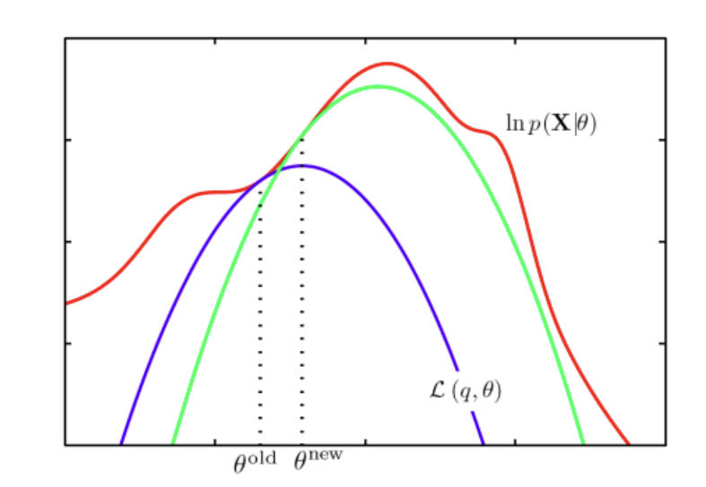

The EM algorithm involves alternately computing a lower bound on the log likelihood for the current parameter values and then maximizing this bound to obtain the new parameter values.

In the figure:

- The red curve denotes $\ln p(X\mid \theta)$.
- The lower-bound curve $\mathcal{L}(q,\theta)$ is made tight at $\theta^{\mathrm{old}}$.
- Maximizing the lower bound gives $\theta^{\mathrm{new}}$.

## 5. Applying the EM Algorithm to GMM

Apply the general EM framework to the GMM model.

Recall our model was:

$$
p(x;\theta)=\sum_z p(x,z;\theta)=\sum_z p(x\mid z;\theta)p(z\mid \theta). \tag{3}
$$

$$
p(z=k;\theta)=\pi_k,
\qquad
\sum_{k=1}^{K}\pi_k=1. \tag{4}
$$

$$
p(x\mid z=k;\theta)=\mathcal{N}(x;\mu_k,\Sigma_k). \tag{5}
$$

In this scenario, we have

$$
\theta=\{\pi_k,\mu_k,\Sigma_k\}_{k=1}^{K}.
$$

### 5.1 E-Step: Compute Responsibilities

Let the current parameters be

$$
\theta^{\mathrm{old}}=\left\{\pi_k^{\mathrm{old}},\mu_k^{\mathrm{old}},\Sigma_k^{\mathrm{old}}\right\}_{k=1}^{K}.
$$

**E-step:** For all $n$, set

$$
q_n\left(z^{(n)}\right)
=p\left(z^{(n)}\mid x^{(n)};\theta^{\mathrm{old}}\right),
$$

i.e.,

$$
\begin{aligned}
q_n\left(z^{(n)}=k\right)
&=p\left(z^{(n)}=k\mid x^{(n)};\theta^{\mathrm{old}}\right) \\
&=\frac{p\left(z^{(n)}=k\right)p\left(x^{(n)}\mid z^{(n)}=k\right)}{p\left(x^{(n)}\right)} \\
&=\frac{p\left(z^{(n)}=k\right)p\left(x^{(n)}\mid z^{(n)}=k\right)}
{\sum_{j=1}^{K}p\left(z^{(n)}=j\right)p\left(x^{(n)}\mid z^{(n)}=j\right)} \\
&=\frac{\pi_k^{\mathrm{old}}\mathcal{N}\left(x^{(n)}\mid \mu_k^{\mathrm{old}},\Sigma_k^{\mathrm{old}}\right)}
{\sum_{j=1}^{K}\pi_j^{\mathrm{old}}\mathcal{N}\left(x^{(n)}\mid \mu_j^{\mathrm{old}},\Sigma_j^{\mathrm{old}}\right)} \\
&\triangleq \gamma_k^{(n)}.
\end{aligned}
$$

Once we computed

$$
\gamma_k^{(n)}=p\left(z^{(n)}=k\mid x^{(n)}\right),
$$

we can compute the expected log likelihood as follows:

$$
\begin{aligned}
&\sum_n\mathbb{E}_{P(z^{(n)}\mid x^{(n)})}\left[
\ln\left(P\left(x^{(n)},z^{(n)}\mid \theta\right)\right)
\right] \\
&=\sum_n\sum_k\gamma_k^{(n)}\left(
\ln\left(P\left(z^{(n)}=k\mid \theta\right)\right)
+\ln\left(P\left(x^{(n)}\mid z^{(n)}=k,\theta\right)\right)
\right) \\
&=\sum_n\sum_k\gamma_k^{(n)}\left(
\ln(\pi_k)+\ln\left(\mathcal{N}\left(x^{(n)}\mid \mu_k,\Sigma_k\right)\right)
\right) \\
&=\sum_n\sum_k\gamma_k^{(n)}\ln(\pi_k)
+\sum_n\sum_k\gamma_k^{(n)}\ln\left(\mathcal{N}\left(x^{(n)}\mid \mu_k,\Sigma_k\right)\right),
\end{aligned}
$$

where

$$
\theta=\{\mu,\Sigma,\pi\}.
$$

Note that the above expectation is fully decomposed to each data $n$ and each cluster $k$, which will facilitate the parameter learning in the following maximization step.

### 5.2 M-Step: Maximize the Expected Function

We update the model parameters $\theta=\{\mu,\Sigma,\pi\}$ by maximizing the expected log likelihood, i.e.,

$$
\max_{\theta}
\sum_{n=1}^{N}\sum_{k=1}^{K}\gamma_k^{(n)}\ln(\pi_k)
+\sum_{n=1}^{N}\sum_{k=1}^{K}\gamma_k^{(n)}\ln\left(\mathcal{N}\left(x^{(n)}\mid \mu_k,\Sigma_k\right)\right), \\
\text{s.t. }\sum_{k=1}^{K}\pi_k= 1. 
$$

Following the derivations introduced in previous slides, it is easy to obtain the following solutions:

$$
\mu_k=\frac{1}{N_k}\sum_{n=1}^{N}\gamma_k^{(n)}x^{(n)},
$$

$$
\Sigma_k=\frac{1}{N_k}\sum_{n=1}^{N}\gamma_k^{(n)}
\left(x^{(n)}-\mu_k\right)
\left(x^{(n)}-\mu_k\right)^\top,
$$

$$
\pi_k=\frac{N_k}{N},
\qquad
N_k=\sum_{n=1}^{N}\gamma_k^{(n)}.
$$

Note: For instance, on page 9, we have

$$
\sum_{n=1}^{N}
\frac{\pi_k\mathcal{N}\left(x^{(n)}\mid \mu_k,\Sigma_k\right)}
{\sum_j\pi_j\mathcal{N}\left(x^{(n)}\mid \mu_j,\Sigma_j\right)}
\Sigma_k^{-1}\left(x^{(n)}-\mu_k\right)=0;
$$

here we directly have

$$
\sum_{n=1}^{N}\gamma_k^{(n)}\Sigma_k^{-1}\left(x^{(n)}-\mu_k\right)=0
$$

## 6. GMM Summary

Optimization uses the Expectation-Maximization algorithm, which alternates between two steps:

- **E-step:** Compute the posterior probability over $z$ given the current model, i.e., $p(z\mid x;\theta)$, which tells how much do we think each Gaussian generates each data point.
- **M-step:** Assuming that the data was really generated this way, update the parameters of each Gaussian component to maximize the probability that it would generate the data it is currently responsible for.

The figure illustrates soft responsibilities for each point and the resulting updated Gaussian components.

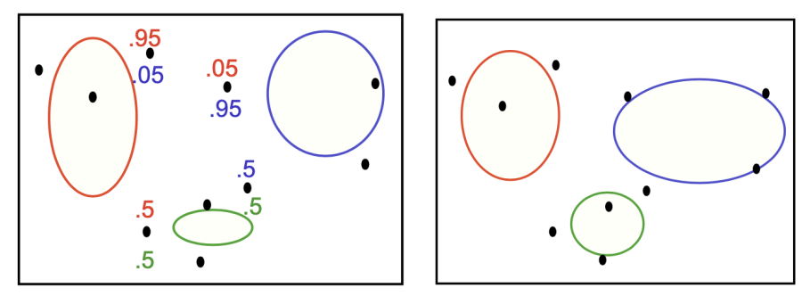

Elegant and powerful method for finding maximum likelihood solutions for models with latent variables.

**E-step:**

In order to adjust the parameters, we must first solve the inference problem: which Gaussian component generated each datapoint?

We cannot ensure, so it is a distribution over all possibilities.

$$
\gamma_k^{(n)}=p\left(z^{(n)}=k\mid x^{(n)};\boldsymbol\pi,\boldsymbol\mu,\boldsymbol\Sigma\right).
$$

**M-step:**

Each Gaussian gets a certain amount of posterior probability for each data point.

We fit each Gaussian to the weighted data points.

We can derive closed-form updates for all parameters.

### Advantages

*   **Flexibility:** Can fit complex data distributions (universal approximator).
*   **Soft clustering:** Provides probabilistic memberships, suitable for overlapping clusters.
*   **Density estimation:** It is not only clustering; it can also provide a probability density function.
*   **Handling missing values:** Can handle incomplete datasets.

### Disadvantages

*   **Local optimum:** The EM algorithm can only guarantee convergence to a local optimum, and the result depends on initialization (usually initialized with K-Means).
*   **Choice of K:** The number of Gaussian components $K$ must be specified in advance.
*   **Singularity problem:** If a cluster has only one point, the covariance matrix may be non-invertible (singular).
*   **Curse of dimensionality:** Performs poorly on high-dimensional data.

# HW3 T2 

# Derivation of the EM Algorithm for a Mixture of Discrete Multinomial Distributions (Based on Scalar Latent Variables)

## 1. Modeling and Introducing Latent Variables

**Observed data**: The dataset contains $N$ samples $\{x^{(1)}, \dots, x^{(N)}\}$.
Each sample $x^{(n)}$ is a $D \times M$ binary matrix (or vector), whose elements are denoted by $x_{ij}^{(n)}$.

*   $n = 1, \dots, N$
*   $i = 1, \dots, D$ (dimension/feature)
*   $j = 1, \dots, M$ (state/value)
*   Constraint: $\sum_{j=1}^M x_{ij}^{(n)} = 1$ (each feature must take exactly one state).

**Latent variable**: For each sample $x^{(n)}$, introduce a discrete latent variable $z^{(n)}$, indicating the mixture component (cluster) to which the sample belongs.
$$ z^{(n)} \in \{1, 2, \dots, K\} $$

**Joint probability distribution**:
According to the definition in the figure, the joint probability that sample $x^{(n)}$ and latent variable $z^{(n)}$ take value $k$ is:
$$ p(x^{(n)}, z^{(n)} = k) = \pi_k p(x^{(n)} | \mu_k) = \pi_k \prod_{i=1}^D \prod_{j=1}^M (\mu_{kij})^{x_{ij}^{(n)}} $$

where:

*   $\pi_k = p(z^{(n)} = k)$ is the mixing coefficient, satisfying $\sum_{k=1}^K \pi_k = 1$.
*   $\mu_{kij} = p(x_{ij}^{(n)}=1 | z^{(n)}=k)$ is the parameter, satisfying $\sum_{j=1}^M \mu_{kij} = 1$.

## 2. Complete-data Log-Likelihood Function

To use the EM algorithm, we first write the **complete-data log-likelihood function** containing the latent variables.
For a single sample $(x^{(n)}, z^{(n)})$, its log-likelihood can be expressed using the indicator function $\mathbb{I}(z^{(n)} = k)$ (which is 1 when $z^{(n)}=k$ and 0 otherwise):

$$
\ln p(x^{(n)}, z^{(n)}) = \sum_{k=1}^K \mathbb{I}(z^{(n)} = k) \ln \left( \pi_k \prod_{i=1}^D \prod_{j=1}^M (\mu_{kij})^{x_{ij}^{(n)}} \right)
$$
Summing over all $N$ samples gives the overall complete-data log-likelihood:

$$
\mathcal{L}_{complete} = \sum_{n=1}^N \sum_{k=1}^K \mathbb{I}(z^{(n)} = k) \left( \ln \pi_k + \sum_{i=1}^D \sum_{j=1}^M x_{ij}^{(n)} \ln \mu_{kij} \right)
$$

## 3. E-Step

The purpose of the E-step is to compute the posterior probability of latent variable $z^{(n)}$ given the observed data $x^{(n)}$ and current parameters $\theta^{old} = \{\pi^{old}, \mu^{old}\}$. We denote this posterior probability by $\gamma_{nk}$ (Responsibility).

$$
\gamma_{nk} = p(z^{(n)} = k | x^{(n)}, \theta^{old})
$$
By Bayes' rule:
$$
p(z^{(n)} = k | x^{(n)}) = \frac{p(x^{(n)} | z^{(n)} = k) p(z^{(n)} = k)}{\sum_{l=1}^K p(x^{(n)} | z^{(n)} = l) p(z^{(n)} = l)}
$$
Substitute the concrete distribution formula:
$$
\gamma_{nk} = \frac{\pi_k \prod_{i=1}^D \prod_{j=1}^M (\mu_{kij})^{x_{ij}^{(n)}}}{\sum_{l=1}^K \pi_l \prod_{i=1}^D \prod_{j=1}^M (\mu_{lij})^{x_{ij}^{(n)}}}
$$
The computed $\gamma_{nk}$ will be used in the M-step to compute the expected value of the indicator function $\mathbb{I}(z^{(n)} = k)$:
$$
\mathbb{E}[\mathbb{I}(z^{(n)} = k)] = 1 \cdot p(z^{(n)}=k | x^{(n)}) + 0 \cdot p(z^{(n)} \neq k | x^{(n)}) = \gamma_{nk}
$$

## 4. M-Step

The goal of the M-step is to maximize the Q function. The Q function is the expectation of the complete-data log-likelihood function with respect to the posterior distribution of the latent variables.

$$
Q(\theta, \theta^{old}) = \mathbb{E}_{Z|X, \theta^{old}} [\mathcal{L}_{complete}]
$$
Replace $\mathbb{E}[\mathbb{I}(z^{(n)} = k)]$ with $\gamma_{nk}$:

$$
Q(\theta, \theta^{old}) = \sum_{n=1}^N \sum_{k=1}^K \gamma_{nk} \left( \ln \pi_k + \sum_{i=1}^D \sum_{j=1}^M x_{ij}^{(n)} \ln \mu_{kij} \right)
$$
We need to maximize this Q function separately with respect to $\pi_k$ and $\mu_{kij}$, while satisfying their respective constraints.

### 4.1 Solving for the Mixing Coefficients $\pi_k$

Extract the part of the Q function related to $\pi_k$:
$$
Q_{\pi} = \sum_{n=1}^N \sum_{k=1}^K \gamma_{nk} \ln \pi_k
$$
Constraint: $\sum_{k=1}^K \pi_k = 1$.

Construct the Lagrangian function (with multiplier $\lambda$):
$$
\Lambda_{\pi} = \sum_{n=1}^N \sum_{k=1}^K \gamma_{nk} \ln \pi_k + \lambda \left( \sum_{k=1}^K \pi_k - 1 \right)
$$
Take the partial derivative with respect to $\pi_k$ and set it to 0:
$$
\frac{\partial \Lambda_{\pi}}{\partial \pi_k} = \sum_{n=1}^N \frac{\gamma_{nk}}{\pi_k} + \lambda = 0
$$
$$
\sum_{n=1}^N \gamma_{nk} = -\lambda \pi_k
$$

Sum both sides over $k$ (using $\sum_{k=1}^K \pi_k = 1$ and $\sum_{k=1}^K \gamma_{nk} = 1$):
$$
\sum_{k=1}^K \sum_{n=1}^N \gamma_{nk} = \sum_{k=1}^K (-\lambda \pi_k)
$$
$$
\sum_{n=1}^N \left( \sum_{k=1}^K \gamma_{nk} \right) = -\lambda \cdot 1
$$

$$
\sum_{n=1}^N 1 = N = -\lambda \implies \lambda = -N
$$

Substitute back to solve:
$$
\pi_k = \frac{\sum_{n=1}^N \gamma_{nk}}{N}
$$
Let $N_k = \sum_{n=1}^N \gamma_{nk}$, then $\pi_k = \frac{N_k}{N}$.

### 4.2 Solving for Component Parameters $\mu_{kij}$

Extract the part of the Q function related to $\mu_{kij}$ (for a specific $k$ and $i$):
$$
Q_{\mu} = \sum_{n=1}^N \gamma_{nk} \sum_{j=1}^M x_{ij}^{(n)} \ln \mu_{kij}
$$
Constraint: For any $k, i$, $\sum_{j=1}^M \mu_{kij} = 1$.

Construct the Lagrangian function (with multiplier $\beta_{ki}$):
$$
\Lambda_{\mu} = \sum_{n=1}^N \gamma_{nk} \sum_{j=1}^M x_{ij}^{(n)} \ln \mu_{kij} + \beta_{ki} \left( \sum_{j=1}^M \mu_{kij} - 1 \right)
$$
Take the partial derivative with respect to $\mu_{kij}$ and set it to 0:
$$
\frac{\partial \Lambda_{\mu}}{\partial \mu_{kij}} = \sum_{n=1}^N \gamma_{nk} \frac{x_{ij}^{(n)}}{\mu_{kij}} + \beta_{ki} = 0
$$
$$
\sum_{n=1}^N \gamma_{nk} x_{ij}^{(n)} = -\beta_{ki} \mu_{kij}
$$

Sum both sides over $j$ (using $\sum_{j=1}^M \mu_{kij} = 1$ and $\sum_{j=1}^M x_{ij}^{(n)} = 1$):
$$
\sum_{j=1}^M \sum_{n=1}^N \gamma_{nk} x_{ij}^{(n)} = \sum_{j=1}^M (-\beta_{ki} \mu_{kij})
$$
$$
\sum_{n=1}^N \gamma_{nk} \left( \sum_{j=1}^M x_{ij}^{(n)} \right) = -\beta_{ki} \cdot 1
$$

$$
\sum_{n=1}^N \gamma_{nk} \cdot 1 = -\beta_{ki}
$$
$$
N_k = -\beta_{ki}
$$

Substitute back to solve:
$$
\mu_{kij} = \frac{\sum_{n=1}^N \gamma_{nk} x_{ij}^{(n)}}{N_k}
$$

---

## 5. Conclusion: EM Algorithm Iteration Equations

**E-Step (evaluate responsibilities):**
$$ \gamma_{nk} = \frac{\pi_k \prod_{i=1}^D \prod_{j=1}^M (\mu_{kij})^{x_{ij}^{(n)}}}{\sum_{l=1}^K \pi_l \prod_{i=1}^D \prod_{j=1}^M (\mu_{lij})^{x_{ij}^{(n)}}} $$

**M-Step (parameter update):**
Compute the effective sample count: $N_k = \sum_{n=1}^N \gamma_{nk}$

Update the mixing coefficients:
$$ \pi_k^{new} = \frac{N_k}{N} $$

Update the component parameters:
$$ \mu_{kij}^{new} = \frac{\sum_{n=1}^N \gamma_{nk} x_{ij}^{(n)}}{N_k} $$

# 17: Principal Component Analysis (PCA)

## 1. Preliminary: Projection onto a Subspace

Before introducing PCA, we first need to define how data are projected from a high-dimensional space onto a low-dimensional subspace.

### 1.1 Notation Definition

*   **Dataset**: $D = \{x^{(1)}, ..., x^{(N)}\}$, where $x^{(n)} \in \mathbb{R}^D$, and $D$ is the original dimension.
*   **Mean vector (Mean)**: $\mu = \frac{1}{N} \sum_{n=1}^N x^{(n)} \in \mathbb{R}^D$.
*   **Subspace $S$**: Spanned by $K$ orthonormal basis vectors $\{u_k\}_{k=1}^K$, where $u_k \in \mathbb{R}^D$.
    *   **Orthonormality**: $\|u_k\| = 1$, and when $i \neq j$, $u_i^T u_j = 0$. That is, $U^T U = I_K$.
    *   **Basis matrix**: $U = [u_1, ..., u_K] \in \mathbb{R}^{D \times K}$.

### 1.2 Projection and Reconstruction

For any data point $x \in \mathbb{R}^D$, we can approximate (reconstruct) it as:

$$
\tilde{x} = \mu + \text{Proj}_S (x - \mu) = \mu + \sum_{k=1}^K z_k u_k
$$
Or in matrix form:
$$
\tilde{x} = \mu + Uz
$$
where:

1.  **$z$ (Representation/Code)**: The coordinate representation of $x$ in the low-dimensional subspace.
    $$
    z_k = u_k^T (x - \mu) \implies z = U^T(x - \mu) \in \mathbb{R}^K
    $$
2.  **$\tilde{x}$ (Reconstruction)**: The reconstruction of $x$ in the original space (the projected point).
    $$
    \tilde{x} = \mu + U U^T (x - \mu) \in \mathbb{R}^D
    $$

### 1.3 Orthogonal Theorem

**Theorem**: The error vector $x - \tilde{x}$ is orthogonal to the subspace $S$. That is:
$$
\begin{aligned}
U^T (x - \tilde{x})
&= 0 \\
\end{aligned}
$$
**Derivation**:

1. By definition:
   $$
   x - \tilde{x} = x - (\mu + Uz) = (x - \mu) - Uz
   $$
2.  Substitute $z = U^T(x - \mu)$:
    $$
    x - \tilde{x} = (x - \mu) - U U^T (x - \mu)
    $$
3.  Left-multiply by $U^T$:
    $$
    \begin{aligned} U^T(x - \tilde{x}) &= U^T(x - \mu) - U^T U U^T (x - \mu) \\ &= U^T(x - \mu) - I \cdot U^T (x - \mu) \quad (\because U^T U = I) \\ &= z - z = 0 \end{aligned}
    $$

## 2. Dimensionality Reduction

*   **Goal**: Find a low-dimensional data vector to represent the original high-dimensional data vector.
*   **PCA**: A typical **Unsupervised** linear dimensionality reduction method.
*   **Input**: Dataset $D \in \mathbb{R}^D$.
*   **Output**: Basis vectors $\{u_k\}_{k=1}^K$ and new representations $z^{(n)} \in \mathbb{R}^K$ ($K < D$).
*   **Uses**:
    *   Visualization
    *   Alleviate overfitting
    *   Reduce computational cost

## 3. Derivations of PCA

The goal of PCA is to find the best subspace $U$. What does "best" mean? There are two equivalent interpretations.

### 3.1 Derivation 1: Maximal Variance

**Intuition**: A good projection should preserve as much information as possible. In other words, the projected data should be as spread out as possible (larger variance is better).

**Objective function**:
Find $U$ such that the variance of the reconstructed data $\tilde{x}$ is maximized:
$$
\max_{U, U^T U = I} \frac{1}{N} \sum_{n=1}^N \|\tilde{x}^{(n)} - \tilde{\mu}\|^2
$$
**Derivation steps**:

1. **Compute the reconstruction mean $\tilde{\mu}$**:
   $$
   \tilde{\mu} = \frac{1}{N} \sum \tilde{x}^{(n)} = \mu + U(\frac{1}{N} \sum z^{(n)}) = \mu + U \cdot U^T (\underbrace{\frac{1}{N}\sum x^{(n)}}_{\mu} - \mu) = \mu
   $$
   That is, the center of the reconstructed data is still $\mu$.
   
2. **Simplify the objective function**:
   $$
   \begin{aligned} \text{Var} &= \frac{1}{N} \sum_{n=1}^N \|\tilde{x}^{(n)} - \mu\|^2 \\ &= \frac{1}{N} \sum_{n=1}^N \|Uz^{(n)}\|^2 \quad (\because \tilde{x} - \mu = Uz) \\ &= \frac{1}{N} \sum_{n=1}^N (Uz^{(n)})^T (Uz^{(n)}) \\ &= \frac{1}{N} \sum_{n=1}^N z^{(n)T} \underbrace{U^T U}_{I} z^{(n)} \\ &= \frac{1}{N} \sum_{n=1}^N \|z^{(n)}\|^2 \end{aligned}
   $$
   This shows that: 
   
   **maximizing the variance of the reconstructed data $\iff$ maximizing the variance of the low-dimensional representation $z$**.
   
3. **Introduce the covariance matrix**:
   Substitute $z^{(n)} = U^T(x^{(n)} - \mu)$:
   $$
   \begin{aligned} J(U) &= \frac{1}{N} \sum_{n=1}^N \|U^T(x^{(n)} - \mu)\|^2 \\ &= \frac{1}{N} \sum_{n=1}^N \text{Trace}\left( (U^T(x^{(n)} - \mu)) (U^T(x^{(n)} - \mu))^T \right) \quad (\text{using } \|v\|^2 = \text{Tr}(vv^T)) \\ &= \frac{1}{N} \sum_{n=1}^N \text{Trace}\left( U^T (x^{(n)} - \mu)(x^{(n)} - \mu)^T U \right) \\ &= \text{Trace}\left( U^T \left[ \frac{1}{N} \sum_{n=1}^N (x^{(n)} - \mu)(x^{(n)} - \mu)^T \right] U \right) \end{aligned}
   $$
   Define the **Empirical Covariance Matrix** $\Sigma$:
   
   $$
   \Sigma = \frac{1}{N} \sum_{n=1}^N (x^{(n)} - \mu)(x^{(n)} - \mu)^T
   $$
   **Final optimization problem**:
   $$
   \max_{U} \text{Trace}(U^T \Sigma U) \quad \text{s.t.} \quad U^T U = I
   $$

### 3.2 Derivation 2: Minimal Reconstruction Error

**Intuition**: A good projection should minimize the distance (error) between the reconstructed point $\tilde{x}$ and the original point $x$.

**Objective function**:
$$
\min_{U, U^T U = I} \frac{1}{N} \sum_{n=1}^N \|x^{(n)} - \tilde{x}^{(n)}\|^2
$$

### 3.3 Equivalence Proof

Using the Pythagorean Theorem, we can prove that the two objectives above are equivalent.

$$
\|x^{(n)} - \mu\|^2 = \| (x^{(n)} - \tilde{x}^{(n)}) + (\tilde{x}^{(n)} - \mu) \|^2
$$
Since $x - \tilde{x}$ is orthogonal to subspace $S$, while $\tilde{x} - \mu$ lies in subspace $S$ (because $\tilde{x} = \mu + Uz$), the two vectors are orthogonal. The cross-term is 0.
$$
\|x^{(n)} - \mu\|^2 = \underbrace{\|x^{(n)} - \tilde{x}^{(n)}\|^2}_{\text{Reconstruction Error}} + \underbrace{\|\tilde{x}^{(n)} - \mu\|^2}_{\text{Projected Variance}}
$$
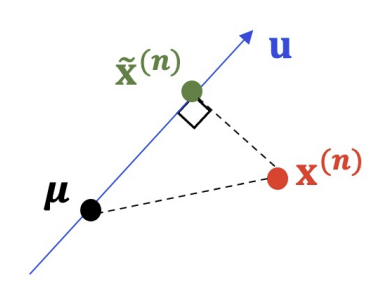

Sum over all samples and divide by $N$:
$$
\text{Total Variance (Constant)} = \text{Reconstruction Error} + \text{Projected Variance}
$$

*   Since the total variance of the original data is constant, **minimizing reconstruction error $\iff$ maximizing projected variance**.

## 4. PCA Algorithm Solution

We need to solve the optimization problem:
$$
\max_{U} \text{Trace}(U^T \Sigma U) \quad \text{s.t.} \quad U^T U = I
$$

### 4.1 Lagrangian Multiplier

Construct the Lagrangian function $L(U, \Lambda)$, where $\Lambda$ is a diagonal matrix composed of Lagrange multipliers (corresponding to the $K$ constraints):

$$
L(U, \Lambda) = \text{Trace}(U^T \Sigma U) + \text{Trace}(\Lambda^T(I - U^T U))
$$
where $\Lambda = \text{diag}([\lambda_1, ..., \lambda_K])$.*

### 4.2 Solving the Optimal Solution

> $\frac{\partial \text{Trace}(AXB)}{\partial X} = A^T B^T$ → $\frac{\partial \text{Trace}(U^T \Sigma U)}{\partial U} = 2\Sigma U$.
>
> $\frac{\partial \text{Trace}(XAX^T)}{\partial X} = X(A + A^T)$ and $$
> \text{Trace}(\Lambda U^{T}U)=\text{Trace}(U\Lambda U^{T})
> $$ → $\frac{\partial \text{Trace}(\Lambda^T(I - U^T U))}{\partial U} = -2U\Lambda$.

Differentiate with respect to $U$ and set the derivative to 0:
$$
\frac{\partial L}{\partial U} = 2\Sigma U - 2U\Lambda = 0
$$

$$
\Sigma U = U \Lambda
$$

For a single column vector $u_k$ (the $k$-th column of $U$) and the corresponding $\lambda_k$:
$$
\Sigma u_k = \lambda_k u_k
$$
**Conclusion**:

1.  The optimal solution $u_k$ is an **Eigenvector** of the covariance matrix $\Sigma$.
2.  The corresponding $\lambda_k$ is an **Eigenvalue** of $\Sigma$.

### 4.3 Which Eigenvectors Should Be Selected?

Substitute the optimal solution into the objective function:
$$
\text{Trace}(U^T \Sigma U) = \sum_{k=1}^K u_k^T \Sigma u_k = \sum_{k=1}^K u_k^T (\lambda_k u_k) = \sum_{k=1}^K \lambda_k \underbrace{u_k^T u_k}_{1} = \sum_{k=1}^K \lambda_k
$$
**Strategy**: To maximize the objective function, we need to choose the eigenvectors corresponding to the **largest $K$ eigenvalues**.

### 4.4 Algorithm Summary

1.  **Centering**: Compute the mean $\mu$, and center the data $x^{(n)} \leftarrow x^{(n)} - \mu$.
2.  **Compute covariance**: $\Sigma = \frac{1}{N} \sum_{n=1}^N x^{(n)} {x^{(n)}}^T$ (or matrix form $\frac{1}{N} X X^T$).
3.  **Eigen-decomposition (SVD)**: Perform eigenvalue decomposition on $\Sigma$ to obtain eigenvalues $\{\lambda_i\}$ and eigenvectors $\{q_i\}$.
4.  **Sort and select**: Sort eigenvalues from largest to smallest, and select the top $K$ eigenvectors to form matrix $U = [q_1, ..., q_K]$.
5.  **Transform**: Compute the new representation $z^{(n)} = U^T (x^{(n)} - \mu)$.

> ### Examples
>
> - Suppose that we have a set of 5 points in 2-dimensional space
>
> $$
> X=\left(\begin{matrix}-1&-1&0&2&0\\ -2&0&0&1&1\end{matrix}\right),
> $$
>
> of which the mean column vector is $\mu =\left[\begin{matrix}0\\ 0\end{matrix}\right].$
> - We calculate its covariance matrix as
>
> $$
> \Sigma =\frac{1}{5}XX^{\top }=\frac{1}{5}\left(\begin{matrix}6&4\\ 4&6\end{matrix}\right).
> $$
>
> - SVD decomposition: we obtain
>
> $$
> \mathbf{q}_{1}=\left[\begin{matrix}\frac{1}{\sqrt{2}}\\ \frac{1}{\sqrt{2}}\end{matrix}\right],\mathbf{q}_{2}=\left[\begin{matrix}-\frac{1}{\sqrt{2}}\\ \frac{1}{\sqrt{2}}\end{matrix}\right],\lambda _{1}=2,\lambda _{2}=\frac{2}{5}.
> $$
> - Thus, we set $\mathbf{U} = \mathbf{q}_1$
> - The new representation is $\mathbf{U}^{\top }X=\left(\frac{-3}{\sqrt{2}}\quad \frac{-1}{\sqrt{2}}\quad 0\quad \frac{3}{\sqrt{2}}\quad \frac{1}{\sqrt{2}}\right).$

## 5. Properties & Applications

### 5.1 Decorrelation

The new features $z$ obtained by PCA are decorrelated.
Compute the covariance matrix of $z$:
$$
\begin{aligned} \text{Cov}(z) &= \text{Cov}(U^T(x-\mu)) \\ &= U^T \text{Cov}(x) U \\ &= U^T \Sigma U \\ &= U^T Q \Lambda_{all} Q^T U \end{aligned}
$$
Since $U$ consists of the first $K$ columns of $Q$, and the eigenvector matrix is orthogonal, 

- $U^T Q = [I_K, 0]$
- $Q^{T}U=\left[\begin{matrix}I_{K}\\ 0\end{matrix}\right]$

the final result is:
$$
\text{Cov}(z) = \text{diag}(\lambda_1, ..., \lambda_K)
$$
This is a **diagonal matrix**, meaning that different dimensions of $z$ have no correlation.

### Why is Decorrelation Useful?

- **Data Whitening (Preprocessing)**
  - We can scale each component by $1/\sqrt{\lambda_i}$ to get $\tilde{\mathbf{z}}$.
  - $\text{Cov}(\tilde{\mathbf{z}}) = \mathbf{I}$ (Identity Matrix).
  - Essential for algorithms assuming i.i.d. Gaussian inputs (e.g., certain layers in CNNs, ICA).
- **Interpretability & Information Compression**
  - Each dimension $z_{k}$ carries unique information (variance $\lambda _{k}$).
  - No redundancy: We can drop dimensions with small $\lambda _{k}$ without losing information contained in other dimensions.

- **Handles Highly Correlated Features**
  - **Problem:** In Linear Regression, highly correlated features make $(X^T X)^{-1}$ unstable (ill-conditioned).
  - **Solution:** PCA transforms features into orthogonal axes.
  - **Result:** Principal Component Regression (PCR) yields stable coefficient estimates.
- **Accelerating Optimization**
  - **Problem:** Correlated features create elongated loss landscapes (narrow valleys), causing Gradient Descent to oscillate.
  - **Solution:** Decorrelated inputs make the loss surface more spherical.
  - **Result:** Faster convergence with larger learning rates.

### 5.2 Application: Face Recognition (Eigenfaces)

*   Data: $N$ face images, each flattened into a high-dimensional vector.
*   PCA: Extract "Eigenfaces", namely the eigenvectors of the covariance matrix.
*   Effect: Using only the first few eigenfaces (such as Top-3) can achieve high classification accuracy, and the visualized eigenfaces have facial contour features.

### 5.3 Variants

PCA can only handle linear data structures. For nonlinear data, there are the following variants:

*   **Kernel PCA**: Uses the kernel trick to handle nonlinearity (Bishop Chapter 12.3).
*   **Probabilistic PCA**: A probabilistic generative model perspective (Bishop Chapter 12.2).
*   **Nonlinear PCA**: Nonlinear PCA.
*   **Robust PCA**: PCA robust to outliers.