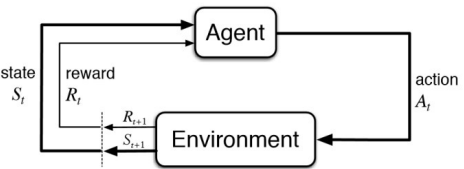
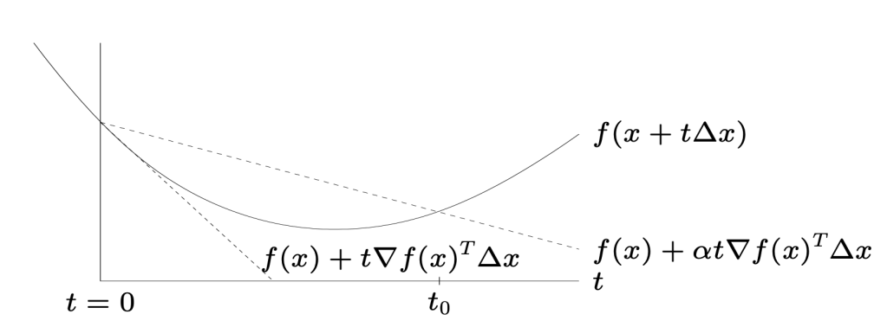

# DDA 3020

# 1 Introduction

## 1.1 ML Paradigms

|                | Supervised Learning (with labels) | Unsupervised Learning (without labels) |
| -------------- | --------------------------------- | -------------------------------------- |
| **Discrete**   | Classification                    | Clustering                             |
| **Continuous** | Regression                        | Dimensionality Reduction               |

- **RL**

## 1.2 ML Workflow

1. **Collecting data**

2. **Preprocessing data**

   |                      | Supervised                 | Unsupervised        |
   | -------------------- | -------------------------- | ------------------- |
   | $D_{\mathrm{train}}$ | $\{(x_i, y_i)\}_{i=1}^{n}$ | $\{x_i\}_{i=1}^{n}$ |
   | $D_{\mathrm{test}}$  | $\{(x_i, y_i)\}_{i=1}^{m}$ | $\{x_i\}_{i=1}^{m}$ |

   where $$x_i = [x_i^{(1)}, \ldots, x_i^{(j)}, \ldots, x_i^{(D)}]^\top, \quad i = 1, \ldots, N.$$

3. **Determining**: ,  optimization method

   - **Hypothesis space** $\mathcal{H}$, e.g., $w^\top x$
     - **Hypothesis** $h$
   - **Target function (cost)** $t: \mathcal{X} \to \mathcal{Y}$, e.g., $(h(x)-y)^2$

4. **Training**

   > Example: $$h^* = \arg\min_{h \in \mathcal{H}} \frac{1}{n} \sum_{(x_i, y_i) \in D_{\mathrm{train}}} (h(x_i) - y_i)^2.$$

5. **Testing**

   > Example: $$\frac{1}{m} \sum_{(x_i, y_i) \in D_{\mathrm{test}}} (h^*(x_i)-y_i)^2.$$

6. **Improving the performance**

# 2: Probability and Information Theory

## 1. Probability, Events, Random Variables 

### 1.1 Basics
*   **Random Experiment**: A process whose outcome is uncertain. 
*   **Sample Space, $S$**: The set of all possible outcomes of a random experiment.
    *   e.g., tossing a coin twice: $S = \{(H, H), (H, T), (T, H), (T, T)\}$.
*   **Event, $A$**: A subset of the sample space $S$ ($A \subseteq S$).
    *   e.g., “at least one head occurs”: $A = \{(H, H), (H, T), (T, H)\}$.

### 1.2 Probability Axioms and Properties
For events $A,B \subseteq S$:
1. **Non-negativity**: $P(A) \ge 0$

2. **Normalization**: $P(S) = 1$

3.  **Addition Rule**:
    
    * If $A \cap B = \emptyset$ (mutually exclusive), then $P(A \cup B) = P(A) + P(B)$
    
      > $P(A \cup B) = P(A) + P(B) - P(A \cap B)$

### 1.3 Random Variables
*   **Definition**: A function that maps the sample space $S$ to the real space $\mathbb{R}$, $X: S \to \mathbb{R}$.
    *   e.g.: define $X$ as the number of “tails” in two coin tosses.
    *   $X((H,H))=0, X((H,T))=1, X((T,T))=2$.
*   **State Space, $\mathcal{X}$**: The output space of $X$, e.g. $\{0, 1, 2\}$.
*   **Types**:
    *   **Discrete**: The state space is finite or countable.
    *   **Continuous**: The state space is uncountable (such as a real interval).

## 2. Discrete Random Variables

### 2.1 Probability Mass Function (PMF)
Describes the probability that the random variable $X$ takes a specific value $x$:
$$ P(X=x), \quad x \in \mathcal{X} $$
**Properties**:
1.  $P(X=x) \ge 0$
2.  $\sum_{x \in \mathcal{X}} P(X=x) = 1$

### 2.2 Joint Probability, Marginal Probability, and Conditional Probability
Suppose there are two random variables $X$ and $Y$.

*   **Joint Probability**: $P(X=x, Y=y)$
*   **Marginal Probability**:
    $$ P(X=x) = \sum_{y \in \mathcal{Y}} P(X=x, Y=y) $$
    $$ P(Y=y) = \sum_{x \in \mathcal{X}} P(X=x, Y=y) $$
*   **Conditional Probability**:
    $$ P(X=x | Y=y) = \frac{P(X=x, Y=y)}{P(Y=y)} $$
*   **Multiplication Rule**:
    $$ P(X=x, Y=y) = P(X=x | Y=y)P(Y=y) = P(Y=y | X=x)P(X=x) $$

### 2.3 Bayes' Rule
Derived by combining the definition of conditional probability and the multiplication rule:
$$
\begin{aligned}
P(Y=y | X=x) 
&= \frac{P(X=x | Y=y)P(Y=y)}{P(X=x)} \\
&= \frac{P(X=x | Y=y)P(Y=y)}{\sum_{y' \in \mathcal{Y}} P(X=x | Y=y')P(Y=y')}
\end{aligned}
$$

> Example: Medical Diagnosis
>
> * **Setup**:
>
>   *   $y=1$: has cancer, $y=0$: does not have cancer.
>   *   $x=1$: test positive, $x=0$: test negative.
>
> * **Known Data**:
>
>   *   Prior: $P(y=1) = 0.13$
>   *   Likelihood: $P(x=1 | y=1) = 0.8$.
>   *   False Positive: $P(x=1 | y=0) = 0.1$.
>
> * Posterior $P(y=1 | x=1)$?
>
> * **Calculation**:
>   $$
>   \begin{aligned}
>   P(y=1 | x=1) &= \frac{P(x=1 | y=1)P(y=1)}{P(x=1 | y=1)P(y=1) + P(x=1 | y=0)P(y=0)} \\
>   &= \frac{0.8 \times 0.13}{0.8 \times 0.13 + 0.1 \times (1 - 0.13)} \\
>   &= \frac{0.104}{0.104 + 0.087} \\
>   &= \frac{0.104}{0.191} \approx 0.5445
>   \end{aligned}
>   $$
>
> * **Conclusion**: Even if the test is positive, the probability of having cancer is only about 54%, because the prior probability is relatively low and false positives exist.

### 2.4 Independence
$$
X \perp Y \iff P(X, Y) = P(X)P(Y)
$$

> Example: **Parameter Count Analysis**
> Suppose $X$ has 3 states and $Y$ has 4 states.
>
> *   **When not independent**: Defining the joint distribution $P(X, Y)$ requires $(3 \times 4) - 1 = 11$ free parameters (subtract 1 because the total sum is 1).
> *   **When independent**: It requires $(3-1) + (4-1) = 2 + 3 = 5$ free parameters. Independence greatly reduces the number of model parameters.

### 2.5 Expectation and Variance
*   **Expectation/Mean**: $$ E[X] = \sum_{x \in \mathcal{X}} x P(X=x) $$
*   **Expectation of a Function**: $$ E[f(X)] = \sum_{x \in \mathcal{X}} f(x) P(X=x) $$
*   **Variance**:  $$ Var(X) = E[(X - E[X])^2] = E[X^2] - (E[X])^2 $$
*   **Standard Deviation**: $$ Std = \sqrt{Var(X)} $$

## 3. Continuous Random Variables

### 3.1 Probability Density Function (PDF)
For continuous variables, the probability at a single point is $P(X=x)=0$. We use the PDF $p(x)$.
*   **Interval Probability**: $$ P(a < X < b) = \int_{a}^{b} p(x) dx $$
*   **Infinitesimal Interpretation**: $$ P(x < X < x + dx) \approx p(x)dx $$
*   **CDF**: $$ F_X(x) = P(X < x) = \int_{-\infty}^{x} p(s) ds $$
    $$ p(x) = \frac{d}{dx}F_X(x) $$

### 3.2 Expectation and Variance of Continuous Variables
*   **Expectation**: $\mu = E[X] = \int x p(x) dx$
*   **Moments**: $M_k = E[X^k] = \int x^k p(x) dx$
*   **Variance**: $Var(X) = E[X^2] - (E[X])^2$ 

## 4. Popular Distributions

### 4.1 Bernoulli Distribution
Suitable for binary variables $x \in \{0, 1\}$ (such as tossing a coin).
*   **Parameter**: $\mu$ (represents the probability that $x=1$).
*   **Formula**:
    $$ Bern(x|\mu) = \mu^x (1-\mu)^{1-x} $$
*   **Properties**:
    *   $E[x] = \mu$
    *   $Var[x] = \mu(1-\mu)$

### 4.2 Binomial Distribution
Conduct $N$ independent Bernoulli trials; $m$ is the number of times $x=1$ (heads) occurs.
*   **Parameters**: $N$ (number of trials), $\mu$ (probability of success in a single trial).
*   **Formula**:
    $$ Bin(m|N, \mu) = \binom{N}{m} \mu^m (1-\mu)^{N-m} $$
    where the combination number is $\binom{N}{m} = \frac{N!}{(N-m)!m!}$.
*   **Properties**:
    *   $E[m] = N\mu$
    *   $Var[m] = N\mu(1-\mu)$

### 4.3 Gaussian / Normal Distribution (cont. RV)
The most common continuous distribution.
*   **Univariate Gaussian Distribution**:
    $$ \mathcal{N}(x|\mu, \sigma^2) = \frac{1}{\sqrt{2\pi\sigma^2}} \exp\left( -\frac{(x-\mu)^2}{2\sigma^2} \right) $$
    *   $\mu$: mean (Mean)
    *   $\sigma^2$: variance (Variance)
*   **Multivariate Gaussian Distribution (D-dimensional vector x)**:
    $$ \mathcal{N}(\mathbf{x}|\boldsymbol{\mu}, \Sigma) = \frac{1}{(2\pi)^{D/2} |\Sigma|^{1/2}} \exp\left( -\frac{1}{2} (\mathbf{x} - \boldsymbol{\mu})^T \Sigma^{-1} (\mathbf{x} - \boldsymbol{\mu}) \right) $$
    *   $\boldsymbol{\mu}$: $D$-dimensional mean vector.
    *   $\Sigma$: $D \times D$ covariance matrix (Covariance Matrix).
    *   $|\Sigma|$: determinant of the covariance matrix.

## 5. Information Theory

### 5.1 Information
Defined by Shannon, quantifying the uncertainty of an event.
*   For a discrete random variable $X$, the probability of taking value $x_k$ is $p_k$.

$$
I(x_k) = \log \frac{1}{p_k} = -\log(p_k)
$$

*   **Unit**: If the base is 2, the unit is bit (bit).
*   **Intuition**: The smaller the probability (the more surprising), the larger the information content.

### 5.2 Entropy
Entropy is the expected value of information, representing the average uncertainty of the source.
$$
H(X) = E[I(x)] = -\sum_{x \in \mathcal{X}} p(x) \log p(x)
$$

* **Entropy of a Binary Source**:
  If $X \in \{0, 1\}$ and $P(X=1)=p$, then:
  $$
  H(X) = -p \log p - (1-p) \log (1-p)
  $$

### 5.3 Cross Entropy
Measures the average number of bits required to encode events from the true distribution $P$ using distribution $Q$.
$$
H_{P,Q}(X) = -\sum_{x \in \mathcal{X}} P(x) \log Q(x)
$$

* **Entropy of a Binary Source**:

​	If $P(X=1)=p$ and $Q(X=1)=q$, then:

$$
H_{P,Q}(X) = -p \log q - (1-p) \log (1-q)
$$

* **Properties**:
  1.  Non-negativity: $H_{P,Q}(X) \ge 0$
  2.  $H_{P,Q}(X) \ge H(P)$, with equality if and only if $P=Q$.

> Proof
>
> Recall Jensen's inequality: If $f$ is a convex function , then $f(E[X]) \le E[f(X)]$.
> $$
> \begin{aligned}
> H(P, Q) &= -\sum_{x \in \mathcal{X}} P(x) \log Q(x) \\
> \text{Since } & 0 \leq Q(x) \leq 1, \text{ it follows that } \log Q(x) \leq 0 \\
> \text{Since } & P(x) \geq 0, \text{ then } P(x) \log Q(x) \leq 0 \\
> \text{Therefore, } & H(P, Q) = -\sum P(x) \log Q(x) \geq 0
> \end{aligned}
> $$
>
> $$
> \begin{aligned}
> H(P, Q) - H(P) &= -\sum_{x} P(x) \log Q(x) - \left( -\sum_{x} P(x) \log P(x) \right) \\
> &= \sum_{x} P(x) \log \frac{P(x)}{Q(x)} = D_{KL}(P\|Q) \\
> &= \sum_{x} P(x) \left( -\log \frac{Q(x)}{P(x)} \right) \\
> &\geq -\log \left( \sum_{x} P(x) \frac{Q(x)}{P(x)} \right) \quad (\text{Jensen's Inequality, } -\log \text{ is convex}) \\
> &= -\log \left( \sum_{x} Q(x) \right) = -\log(1) = 0 \\
> \therefore H(P, Q) &\geq H(P) \quad (\text{Equality holds iff } P = Q \text{ almost everywhere})
> \end{aligned}
> $$

### 5.4 Relative Entropy / KL Divergence (Kullback-Leibler Divergence)
Measures the distance (or difference) between two distributions $P$ and $Q$.
*   **Discrete Form**:
    $$ D_{KL}(P||Q) = \sum_{x} P(x) \log \frac{P(x)}{Q(x)} $$
*   **Continuous Form**:
    $$ D_{KL}(P||Q) = \int p(x) \log \frac{p(x)}{q(x)} dx $$
*   **Properties**:
    1.  **Non-negativity**: $D_{KL}(P||Q) \ge 0$ (can be proved by Jensen's inequality).
    2.  **Asymmetry**: $D_{KL}(P||Q) \neq D_{KL}(Q||P)$.

$$
H_{P,Q}(X) = H(P) + D_{KL}(P||Q)
$$

> This means: cross entropy = entropy of the true distribution + difference between the two distributions (KL divergence). In machine learning, because the true distribution $P$ of the training data is fixed (that is, $H(P)$ is a constant), **minimizing cross entropy is equivalent to minimizing KL divergence**.

# DDA3020 Lecture 03: Linear Algebra

## 1. Vector, Matrix, and their Norms

### 1.1 Scalar
*   **Definition**: A simple numerical value (a real number), such as $15$ or $-3.2$.
*   **Notation**: Italic letters, such as $x$ or $a$.
*   **Operation symbols**:
    *   Summation: $\sum_{i=1}^m x_i = x_1 + x_2 + \dots + x_m$
    *   Product: $\prod_{i=1}^m x_i = x_1 \cdot x_2 \cdot \dots \cdot x_m$

### 1.2 Vector
*   **Definition**: An ordered list of scalars, called attributes.
*   **Notation**: Bold lowercase letters, such as $\mathbf{x}$ or $\mathbf{w}$. Usually represented as a column vector:
    $$ \mathbf{a} = \begin{bmatrix} a_1 \\ a_2 \end{bmatrix} $$
*   **Indexing**: $x^{(j)}$ or $x_j$ denotes the value of the $j$-th dimension of vector $\mathbf{x}$.
    *   *Note*: Do not confuse it with exponentiation. $(x^{(j)})^2$ denotes the square of the $j$-th element.

### 1.3 Matrix
*   **Definition**: A rectangular array of numbers arranged in rows and columns.
*   **Notation**: Bold uppercase letters, such as $\mathbf{X}$ or $\mathbf{W}$.
    $$ \mathbf{X} = \begin{bmatrix} x_{1,1} & x_{1,2} \\ x_{2,1} & x_{2,2} \end{bmatrix} $$
*   **Indexing**: $x_{i,j}$ denotes the element in the $i$-th row and $j$-th column.

### 1.4 Vector and Matrix Operations
Assume $\mathbf{x}, \mathbf{y}$ are vectors, $\mathbf{X}, \mathbf{W}$ are matrices, and $a$ is a scalar.

1.  **Addition and subtraction**: Add or subtract corresponding elements.
2.  **Scalar multiplication**: Multiply each element by the scalar, $a\mathbf{x}$.
3.  **Transpose**: Swap rows and columns.
    *   Vector transpose: $\mathbf{x}^\top = [x_1, x_2]$
    *   Matrix transpose: $(\mathbf{X}^\top)_{i,j} = \mathbf{X}_{j,i}$
4.  **Dot Product**: $$ \mathbf{x} \cdot \mathbf{y} = \mathbf{x}^\top \mathbf{y} = \sum_{i} x_i y_i $$
5.  **Trace**: $$ \text{tr}(\mathbf{X}) = \sum_{i=1}^n x_{i,i} $$
6.  **Matrix-vector multiplication**: $\mathbf{X}\mathbf{w}$, whose result is a vector.
7.  **Matrix-matrix multiplication**: $\mathbf{X}\mathbf{W}$.
    *   $(\mathbf{X}\mathbf{W})_{i,j} = \sum_{k} x_{i,k} w_{k,j}$ 

### 1.5 Vector Norms
The norm $\lVert \cdot \rVert$ is used to measure the size (length) of a vector. It must satisfy:

1. **Positivity:** $\lVert x \rvert = 0 \iff x = 0$
2. **Homogeneity:** $\lVert \lambda x \rVert = |\lambda| \lVert x \rVert$ 
3. **Triangle Inequality: ** $\lVert x + y \rVert \le \lVert x \rVert + \lVert y \rVert$

*   **$\ell_2$-norm (Euclidean norm)**:
    $$ \lVert \mathbf{x} \rVert_2 = \sqrt{\sum_{i=1}^d x_i^2} $$
*   **$\ell_1$-norm (Manhattan distance)**:
    $$ \lVert \mathbf{x} \rVert_1 = \sum_{i=1}^d |x_i| $$
*   **$\ell_p$-norm ($p \ge 1$)**:
    $$ \lVert \mathbf{x} \rVert_p = \left( \sum_{i=1}^d |x_i|^p \right)^{1/p} $$
*   **$\ell_0$-norm**:
    $$ \lVert \mathbf{x} \rVert_0 = \text{number of nonzero elements in } \mathbf{x} $$

### 1.6 Matrix Norms

**sub-multiplicative property:** $\lVert \mathbf{X}\mathbf{Y} \rVert \le \lVert \mathbf{X} \rVert \lVert \mathbf{Y} \rVert$

*   **Frobenius norm**:
    $$ \lVert \mathbf{X} \rVert_F = \sqrt{\sum_{i=1}^m \sum_{j=1}^n x_{i,j}^2} $$
*   **Spectral Norm**:
    $$ \lVert \mathbf{X} \rVert_2 = \sigma_{\max}(\mathbf{X}) $$
    *   SVD: $\mathbf{X} = \mathbf{U}\mathbf{\Sigma}\mathbf{V}^\top$, where $\mathbf{\Sigma} = \text{diag}(\sigma_1, \sigma_2, \dots)$.

## 2. Matrix Inverse, Determinant, Independence

### 2.1 Matrix Inverse
*   **Definition**: For a $d \times d$ square matrix $\mathbf{A}$, if there exists a matrix $\mathbf{B}$ such that $\mathbf{AB} = \mathbf{BA} = \mathbf{I}$, then $\mathbf{A}$ is invertible (invertible/nonsingular), and $\mathbf{B} = \mathbf{A}^{-1}$.
*   **Formula**:
    $$ \mathbf{A}^{-1} = \frac{1}{\det(\mathbf{A})} \text{adj}(\mathbf{A}) $$
    *   **$\det(\mathbf{A})$**: Determinant.
    *   **$\text{adj}(\mathbf{A})$**: Adjugate matrix, i.e. the transpose of the cofactor matrix $\mathbf{C}$ ($\mathbf{C}^\top$).
    *   **Cofactor**: $C_{i,j} = M_{i,j} \times (-1)^{i+j}$, where $M_{i,j}$ is the determinant of the submatrix obtained by removing the $i$-th row and $j$-th column.

### 2.2 Computation Based on SVD
For matrix $\mathbf{A}$, perform singular value decomposition (SVD): $\mathbf{A} = \mathbf{U}\mathbf{\Sigma}\mathbf{V}^\top$, where $\mathbf{\Sigma} = \text{diag}(\sigma_1, \sigma_2, \dots)$.
*   **Inverse matrix**: $\mathbf{A}^{-1} = \mathbf{V}\mathbf{\Sigma}^{-1}\mathbf{U}^\top$, where $\mathbf{\Sigma}^{-1} = \text{diag}(\sigma_1^{-1}, \sigma_2^{-1}, \dots)$.
*   **Determinant**: $\det(\mathbf{A}) = \prod_i \sigma_i$ (the product of all singular values).

### 2.3 Linear Dependence and Independence
*   **Linearly Dependent**: There exist coefficients $\beta_1, \dots, \beta_m$, not all zero, such that:
    $$ \beta_1 \mathbf{x}_1 + \dots + \beta_m \mathbf{x}_m = 0 $$
*   **Linearly Independent**: The above equality holds only when $\beta_1 = \dots = \beta_m = 0$.

## 3. Systems of Linear Equations

Consider the system of equations $\mathbf{X}\mathbf{w} = \mathbf{y}$, where $\mathbf{X} \in \mathbb{R}^{m \times d}$.
*   $m$: Number of equations (number of samples).
*   $d$: Number of unknowns (feature dimension).

### 3.1 Square / Even-determined System
*   **Condition**: $m = d$ (the number of equations equals the number of unknowns), and $\mathbf{X}$ is invertible (rows/columns are linearly independent).
*   $$ \mathbf{w} = \mathbf{X}^{-1}\mathbf{y} $$

### 3.2 Over-determined System
* **Condition**: $m > d$ (the number of equations is greater than the number of unknowns). Usually, there is no exact solution.
* **Goal**: Find an approximate solution.
*   **Solution (Left-Inverse)**:
    $$ \mathbf{w} = \mathbf{X}^\dagger \mathbf{y} = (\mathbf{X}^\top \mathbf{X})^{-1}\mathbf{X}^\top \mathbf{y} $$
*   **Derivation**:
    1.  Define a left inverse $\mathbf{B}$ satisfying $\mathbf{B}\mathbf{X} = \mathbf{I}$.
    2.  For an over-determined matrix $\mathbf{X}$, its left inverse is usually computed as $\mathbf{X}^\dagger = (\mathbf{X}^\top \mathbf{X})^{-1}\mathbf{X}^\top$ (assuming $\mathbf{X}^\top \mathbf{X}$ is invertible).
    3.  Left-multiply both sides of the equation by $\mathbf{X}^\dagger$:
        $$ \begin{aligned} \mathbf{X}\mathbf{w} &\approx \mathbf{y} \\ \mathbf{X}^\dagger \mathbf{X} \mathbf{w} &= \mathbf{X}^\dagger \mathbf{y} \\ \mathbf{I} \mathbf{w} &= (\mathbf{X}^\top \mathbf{X})^{-1}\mathbf{X}^\top \mathbf{y} \\ \mathbf{w} &= (\mathbf{X}^\top \mathbf{X})^{-1}\mathbf{X}^\top \mathbf{y} \end{aligned} $$
    *   *Note*: This usually corresponds to the Least Squares Solution.

### 3.3 Under-determined System
*   **Condition**: $m < d$ (the number of unknowns is greater than the number of equations). Usually, there are infinitely many solutions.
*   **Goal**: Find a particular solution satisfying the constraint (e.g., a solution of the form $\mathbf{w} = \mathbf{X}^\top \mathbf{a}$).
*   **Solution (Right-Inverse)**:
    $$ \mathbf{w} = \mathbf{X}^\dagger \mathbf{y} = \mathbf{X}^\top (\mathbf{X}\mathbf{X}^\top)^{-1} \mathbf{y} $$
*   **Derivation**:
    1.  Define a right inverse $\mathbf{B}$ satisfying $\mathbf{X}\mathbf{B} = \mathbf{I}$.
    2.  For an under-determined matrix $\mathbf{X}$, its right inverse is usually computed as $\mathbf{X}^\dagger = \mathbf{X}^\top (\mathbf{X}\mathbf{X}^\top)^{-1}$ (assuming $\mathbf{X}\mathbf{X}^\top$ is invertible).
    3.  To choose one solution from infinitely many solutions, we restrict the search space and assume that $\mathbf{w}$ can be expressed as a linear combination of the row vectors of $\mathbf{X}$, i.e. let $\mathbf{w} = \mathbf{X}^\top \mathbf{a}$ ($\mathbf{a}$ is an auxiliary vector).
    4.  Substitute into the original equation $\mathbf{X}\mathbf{w} = \mathbf{y}$:
        $$ \begin{aligned} \mathbf{X}(\mathbf{X}^\top \mathbf{a}) &= \mathbf{y} \\ (\mathbf{X}\mathbf{X}^\top) \mathbf{a} &= \mathbf{y} \end{aligned} $$
    5.  Solve for $\mathbf{a}$:
        $$ \mathbf{a} = (\mathbf{X}\mathbf{X}^\top)^{-1} \mathbf{y} $$
    6.  Substitute back to obtain $\mathbf{w}$:
        $$ \mathbf{w} = \mathbf{X}^\top \mathbf{a} = \mathbf{X}^\top (\mathbf{X}\mathbf{X}^\top)^{-1} \mathbf{y} $$

# 04: Basic Optimization

## 1. Convex Set

### 1.1 Affine Set

*   **Definition of an affine line**: Given two points $x_1, x_2$, every point $x$ on the line passing through these two points can be written as:
    $$ x = \theta x_1 + (1 - \theta)x_2, \quad \theta \in \mathbb{R} $$
*   **Definition of an affine set**: If a set contains the entire line through any two points in the set, then the set is an affine set.
*   **Example**: The solution set of a linear system $\{x | Ax = b\}$ is an affine set.

### 1.2 Convex Set

*   **Definition of a line segment**: Given two points $x_1, x_2$, every point $x$ on the line segment between them can be written as:
    $$ x = \theta x_1 + (1 - \theta)x_2, \quad 0 \le \theta \le 1 $$
*   **Definition of a convex set**: If a set contains the line segment between any two points in the set, then the set is a convex set $C$.
    $$ x_1, x_2 \in C, 0 \le \theta \le 1 \implies \theta x_1 + (1 - \theta)x_2 \in C $$
*   **Intuition**: The line segment connecting any two points inside the set also lies inside the set (no indentation).

## 2. Convex Function

### 2.1 Definition

A function $f: \mathbb{R}^n \to \mathbb{R}$ is convex if and only if its domain $\text{dom} f$ is a convex set and it satisfies:
$$
f(\theta x + (1 - \theta)y) \le \theta f(x) + (1 - \theta)f(y)
$$

*   **Scope**: $\forall x, y \in \text{dom} f, \quad 0 \le \theta \le 1$.
*   **Concave**: If $-f$ is convex, then $f$ is concave.
*   **Strictly Convex**: The above inequality becomes strict ($<$), with $x \neq y$ and $0 < \theta < 1$.

### 2.2 Common Examples

*   **Convex functions on $\mathbb{R}$**:
    *   Affine function: $ax + b$
    *   Exponential function: $e^{ax}$
    *   Power function: $x^\alpha$ ($\alpha \ge 1$ or $\alpha \le 0$)
    *   Negative entropy: $x \log x$
*   **Convex functions on $\mathbb{R}^n$**:
    *   Affine function: $f(x) = a^\top x + b$
    *   Norm: $\ell_p$ norm $\lVert x \rVert_p$ ($p \ge 1$)
*   **Convex functions on matrix space $\mathbb{R}^{m \times n}$**:
    *   Affine function: $f(X) = \text{tr}(A^\top X) + b = \sum \sum a_{ij}x_{ij} + b$
    *   Spectral norm (largest singular value): $f(X) = \lVert X \rVert_2 = \sigma_{\max}(X)$

### 2.3.1 First-order condition

If $f$ is differentiable (gradient $\nabla f(x)$ exists), then $f$ is convex if and only if:
$$
f(y) \ge f(x) + \nabla f(x)^\top (y - x), \quad \forall x, y \in \text{dom} f
$$

*   **Geometric meaning**: The first-order Taylor approximation (tangent line / tangent plane) of a convex function always lies below the function (a global underestimator).

### 2.3.2 Second-order condition

If $f$ is twice differentiable (Hessian matrix $\nabla^2 f(x)$ exists), then $f$ is convex if and only if:
$$
\nabla^2 f(x) \succeq 0, \quad \forall x \in \text{dom} f
$$

*   **Explanation**: $\succeq 0$ means the Hessian matrix is a **positive semidefinite matrix (Positive Semi-Definite, PSD)**.
*   **Strict convexity**: If $\nabla^2 f(x) \succ 0$ (positive definite), then $f$ is strictly convex.

#### Example: Quadratic Function and Least Squares

1.  **Quadratic function**: $f(x) = \frac{1}{2}x^\top P x + q^\top x + r$
    *   Gradient: $\nabla f(x) = Px + q$
    *   Hessian: $\nabla^2 f(x) = P$
    *   Conclusion: The function is convex if and only if $P \succeq 0$.
2.  **Least squares**: $f(x) = \lVert Ax - b \rVert_2^2$
    *   Gradient: $\nabla f(x) = 2A^\top(Ax - b)$
    *   Hessian: $\nabla^2 f(x) = 2A^\top A$
    *   Conclusion: Since for any $A$, its Gram matrix $A^\top A$ is always positive semidefinite, the least-squares objective function is always convex.

### 2.4 Jensen's Inequality

If $f$ is convex, then:
$$
f(\mathbb{E}[z]) \le \mathbb{E}[f(z)]
$$

*   $z$: Random variable.
*   Basic form: $f(\theta x + (1-\theta)y) \le \theta f(x) + (1-\theta)f(y)$ is a special case.

## 3. Convex Optimization Problem

### 3.1 Standard Form

$$
\begin{aligned}
\text{minimize} \quad & f_0(x) \\
\text{subject to} \quad & f_i(x) \le 0, \quad i = 1, \dots, m \\
& h_i(x) = 0, \quad i = 1, \dots, p
\end{aligned}
$$

*   $x \in \mathbb{R}^n$: Optimization variable.
*   $f_0$: Objective function (Cost function).
*   $f_i$: convex Inequality constraints.
*   $h_i$: Equality constraints.

### 3.2 Specific Requirements for a Convex Optimization Problem

An optimization problem is convex only if it satisfies:

1. The objective function $f_0$ is convex.

2. The inequality constraint functions $f_1, \dots, f_m$ are convex.

   → **Equality constraint functions must be affine**: $h_i(x) = a_i^\top x - b_i = 0$ (i.e. $Ax = b$).

### 3.3 Local vs Global Optima

**Theorem**: Any local optimum of a convex optimization problem is also a global optimum.

> **Proof by contradiction**:
>
> 1. Suppose $x$ is a local optimum but not a global optimum. This means there exists a feasible solution $y$ such that $f_0(y) < f_0(x)$.
>
> 2. Since $x$ is a local optimum, there exists a radius $r > 0$ such that within the neighborhood $\lVert z - x \rVert_2 \le r$, we have $f_0(z) \ge f_0(x)$.
>
> 3. Construct the point $z = \theta y + (1 - \theta)x$, with $\theta = \frac{r}{2\lVert y - x \rVert_2}$.
>
>    *   This guarantees that $z$ lies on the line segment between $x$ and $y$, and that $z$ is very close to $x$ ($\lVert z - x \rVert_2 = 0.5r < r$), so $z$ is inside the local neighborhood of $x$.
>
> 4. By the property of convex functions:
>    $$ f_0(z) \le \theta f_0(y) + (1 - \theta)f_0(x) $$
>
> 5. Since we assumed $f_0(y) < f_0(x)$, substituting into the inequality gives:
>    $$
>    f_0(z) < \theta f_0(x) + (1 - \theta)f_0(x) = f_0(x)
>    $$
>
> 6. **Contradiction**: We have derived $f_0(z) < f_0(x)$, but this contradicts the fact that $x$ is a local optimum (i.e. within the neighborhood, $f_0(z) \ge f_0(x)$).
>
> 7. Therefore, the assumption is false, and $x$ must be a global optimum.
>

## 4. Unconstrained Minimization: Gradient Descent

### 4.1 General Descent Method

Iterative update formula:
$$
x^{(k+1)} = x^{(k)} + t^{(k)}\Delta x^{(k)}
$$

*   $\Delta x^{(k)}$: Search direction.
*   $t^{(k)} > 0$: Step size.
*   **Descent condition**: It must satisfy $f(x^{(k+1)}) < f(x^{(k)})$.
*   **Search direction**: Choose the negative gradient direction $\Delta x = -\nabla f(x)$.
    *   Based on first-order Taylor expansion: $f(x^+) \approx f(x) + t\nabla f(x)^\top \Delta x$.
        *   To decrease the function value, it must satisfy **$\nabla f(x)^\top \Delta x < 0$**.
    *   Reason: $\nabla f(x)^\top (-\nabla f(x)) = -\lVert \nabla f(x) \rVert_2^2 < 0$, which guarantees descent.

*   **Stopping criterion**: Usually stop when the gradient is sufficiently small, $\lVert \nabla f(x) \rVert_2 \le \epsilon$.

### 4.3 Line Search

1.  **Exact Line Search**:
    $$
    t = \arg\min_{t>0} f(x + t\Delta x)
    $$
2.  **Backtracking Line Search** (inexact, commonly used):
    *   Parameters: $\alpha \in (0, 0.5), \beta \in (0, 1)$.
    *   Initialize $t = 1$.
    *   Repeat $t := \beta t$ until the Armijo condition is satisfied:
        $$
         f(x + t\Delta x) < f(x) + \alpha t \nabla f(x)^\top \Delta x
        $$
        

## 5. Constrained Minimization: Lagrangian Duality and KKT 

Consider a general optimization problem (note the change in x notation here):
$$
\begin{aligned}
\min_{x} \quad & f(x) \\
\text{s.t.} \quad & h_i(x) \le 0, \quad i = 1, \dots, m \\
& \ell_j(x) = 0, \quad j = 1, \dots, r
\end{aligned}
$$

### 5.1 Lagrangian Function

$$
L(x, u, v) = f(x) + \sum_{i=1}^m u_i h_i(x) + \sum_{j=1}^r v_j \ell_j(x)
$$

*   $u_i$: Lagrange multiplier corresponding to an inequality constraint (Lagrange multiplier), requiring $u_i \ge 0$.
*   $v_j$: Lagrange multiplier corresponding to an equality constraint.

### 5.2 Lagrangian Dual Function (Dual Function)

$$
g(u, v) = \min_{x \in \mathbb{R}^n} L(x, u, v)
$$

*   $g(u, v)$ is a concave function of $(u, v)$ (even if the primal problem is not convex).
*   It is a lower bound on the optimal primal value $p^*$.

### 5.3 Dual Problem

$$
\begin{aligned}
\max_{u, v} \quad & g(u, v) \\
\text{s.t.} \quad & u \ge 0
\end{aligned}
$$

### 5.4 KKT Conditions (Karush-Kuhn-Tucker Conditions)

For a convex optimization problem (and assuming Slater's condition holds), the necessary and sufficient conditions for $x^*$ and $(u^*, v^*)$ to be the optimal solutions of the primal and dual problems respectively are the KKT conditions:

1.  **Stationarity**: The gradient of the Lagrangian with respect to $x$ is 0.
    $$
    0 \in \partial f(x) + \sum_{i=1}^m u_i \partial h_i(x) + \sum_{j=1}^r v_j \partial \ell_j(x)
    $$
    (If differentiable, then $\nabla f(x) + \sum u_i \nabla h_i(x) + \sum v_j \nabla \ell_j(x) = 0$)
2.  **Complementary Slackness**:
    $$
    u_i \cdot h_i(x) = 0, \quad \forall i
    $$
    
    *   This means that if a constraint is inactive ($h_i(x) < 0$), then the multiplier $u_i$ must be 0; if the multiplier $u_i > 0$, then the constraint must hold with equality ($h_i(x) = 0$).
3.  **Primal Feasibility**:
    $$
    h_i(x) \le 0, \quad \ell_j(x) = 0, \quad \forall i, j
    $$
4.  **Dual Feasibility**:
    $$
    u_i \ge 0, \quad \forall i
    $$

## 6. Optimization and Machine Learning

*   **Applications of convex minimization**: Linear Regression, Logistic Regression (Logistic Regression), Support Vector Machine (SVM).
*   **Applications of gradient descent**: Linear Regression, Logistic Regression, Neural Networks.
*   **Applications of Lagrangian methods and KKT**: SVM, K-Means, Gaussian Mixture Model (GMM), Principal Component Analysis (PCA).
*   **Learning goal**: Given an ML model, be able to determine:
    1.  Is it a convex optimization problem or a non-convex optimization problem?
    2.  Are there local/global optima?
    3.  Which optimization method should be used?

